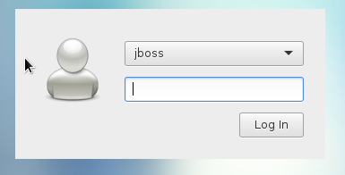
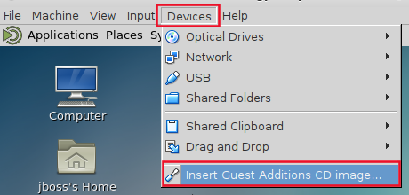
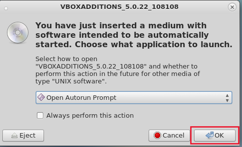
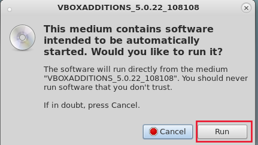
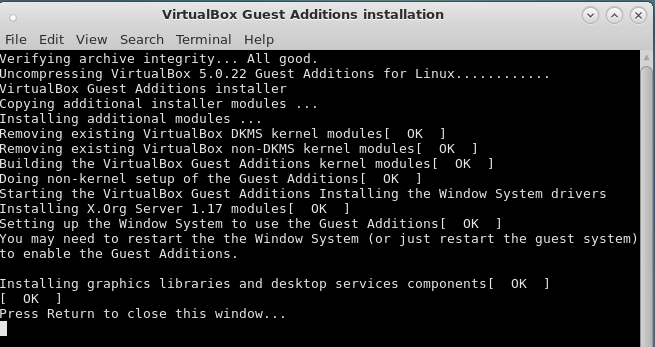
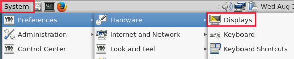
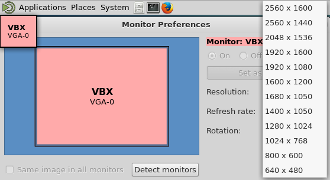

:scrollbar:
:data-uri:
:toc2:
:numbered:

==  Environment Setup Lab

Assets for this course include a virtual machine preinstalled with the required tools. This VM is provided in VDI format and can be run on your local workstation using VirtualBox. You run the exercises for the labs in this course entirely within the VM.

.Prerequisites
* Installation of the 64-bit link:https://www.virtualbox.org/wiki/Downloads[VirtualBox application] on your local workstation.
+
NOTE:  64 bit Virtual Box is mandatory.  32 bit Virtual Box will not work for this course.

* A minimum of two 64-bit CPUs and 2 GB RAM dedicated to the VM used in the course

.Lab Assets

There is one lab asset used in this course:

* https://github.com/gpe-mw-training/bxms-advanced-infrastructure-lab[*bxms-advanced-infrastructure-lab*]: A project of resources that are cloned and imported into BPM Central
+
This project contains the BPM Suite KIE projects used in the labs, as well as an AngularJS web application to test integration with Red Hat SSO.

== Lab Virtual Machine
In this section you install the course VirtualBox virtual machine on your local workstation.

=== Acquire
If you are participating in an on-site Instructore Led Training (ILT), the instructor will pass around a thumb drive with the course virtual machine.

If you are taking this course remotely, then you'll have to gain access to the course virtual machine through different means.

There are two methods: either download VirtualBox directly or use BitTorrent.

If you are familiar with BitTorrent and have a BitTorrent client, this method is usually much faster and more reliable.

Download the `gpte-bxms-advanced-infrastructure-630.vdi` VirtualBox image using one of the two methods:

* Direct: Download `gpte-bxms-advanced-infrastructure-630.vdi` directly from https://drive.google.com/open?id=0B8mmXW6hJKdiaVpndWxFV3Nmbkk

* BitTorrent: Download `gpte-bxms-advanced-infrastructure-630.torrent` found at https://github.com/gpe-mw-training/bxms-advanced-infrastructure-lab-etc/raw/master/etc/gpte-bpms-advanced-630.vdi.torrent. Using your BitTorrent client, open the torrent file and download `gpte-bxms-advanced-infrastructure-630.vdi`.

=== VM Operating System Credentials

* The default username/password for the VM is `jboss/jboss`.
* The `jboss` operating system user has `sudo` access.

=== Install

. Install VirtualBox on your local workstation by following instructions here: https://www.virtualbox.org/wiki/Downloads.
+
[NOTE]
The `gpte-bxms-advanced-infrastructure-630.vdi` is a 64-bit VM, so make sure that the `amd64` version of VirtualBox is installed and that virtualization is enabled in your host machine's BIOS. Refer to VirtualBox's online documentation for assistance in configuring it for your workstation.

. Start VirtualBox and navigate to: *Machine -> New*.
. In the *Create Virtual Machine* panel, populate its fields:
* *Name:* `gpte-bxms-advanced-infrastructure`
* *Type:* `Linux`
* *Version:* `Red Hat (64-bit)`
. Click *Next*.
. In the *Memory* panel, specify `4096 MB` of RAM and click *Next*.
. In the *Hard Disk* panel:
.. Select *Use an existing virtual hard disk file*.
.. Browse your hard drive and select the previously downloaded `gpte-bxms-advanced-infrastructure-630.vdi` image.
.. Click *Create*.
. Click *Start*.
The virtual machine should start and display the `MATE` window manager login.
+
Enter a userId of `jboss` and a password of `jboss`.
+

. Recommended:  Enable <<vbga>> so as to leverage the full display resolution of your host machine.

=== VM Components

The `gpte-bxms-advanced-infrastructure-630.vdi` VM image has these characteristics:

* VirtualBox VDI format, built with VirtualBox version 5.0.14
* Operating system: CentOS 7
* Graphical environment: MATE
* Java JDK: OpenJDK 8
* Maven version 3.2.5
* MariaDB version 5.5.x

== BPMS Business-Central and Kie-server

The virtual machine comes with a script that will install and configure BPMS Business-Central and Kie-server. +
The script will install a separate instance of Business-Central and Kie-server. This reflects a realistic installation setup where Business-Central is used at design time, where Kie-server is used as process/rules execution runtime.

=== Review

. In the virtual machine, open a terminal window.
. Ensure you are using the _jboss_ operating system user and change to the `/home/jboss/lab` directory.
. Review the `install-bpms.sh` shell script.  Notice that the script will create two instances of BPMS:
.. `home/jboss/lab/bpms/bc` : Business-Central workbench and DashBuilder. No Kie-server.
.. `home/jboss/lab/bpms/kieserver` : Kie-server execution runtime, no Business-Central nor DashBuilder.
. Also notice that the script itself delegates to the `install-bpms-instance.sh` script in the `/opt/install/scripts/bpms` directory.
. As part of the installation, a number of system properties have been set in the `standalone.conf` file in `home/jboss/lab/bpms/bc/bin` and `home/jboss/lab/bpms/kieserver/bin`. +
Review these system property values as they give a good idea of the system properties that should be set for a BPMS installation.
. The Kie-server instance is configured with a port-offset of 150 - the HTTP port will be 8230 rather than 8080. This allows to run both the Business-Central as the Kie-server instance concurrently.
. The installed instances are configured to use the built-in H2 database. As part of the labs you will complete the configuration to point to MariaDB instead.

. Based on your review of the provided scripts and configuration files, try to answer the following questions:
.. What two users will be configured for both the `kieserver` and `business-central` environments and what will be their passwords ?
.. Where will you be able to find all of the Java system properties that define the runtime behavior of the `kieserver` and `business-central` environments ?
.. Once started, what network interfaces of the virtual machine would you expect your `kieserver` and `business-central` runtimes to bind to ?
.. Is a MySQL JDBC driver jar file already included in the virtual machine ?

ifdef::showscript[]

1) jboss / bpms  & admin / admin    :   found in install-bpms-instance.sh
2) $JBOSS_HOME/bin/standalone.conf
3) All of them:   0.0.0.0           :   found in install-bpms.sh
4) yes : /usr/share/java/mysql-connector-java.jar   :    found in install-bpms-instance.sh

endif::showscript[]

=== Install
To install the BPMS instances on the virtual machines:

. If not already there, change to the `/home/jboss/lab` directory, and execute the `install-bpms.sh` script.
+
-----
./install-bpms.sh
-----

. The script should complete without errors.
. The Kie-server instance is configured as an unmanaged instance. If you would like to use the Business-Central instance as a controller for Kie-server, uncomment the following lines:
.. `home/jboss/lab/bpms/bc/bin/standalone.conf`
+
----
#JAVA_OPTS="$JAVA_OPTS -Dorg.kie.server.user=jboss"
#JAVA_OPTS="$JAVA_OPTS -Dorg.kie.server.pwd=bpms"
----
.. `home/jboss/lab/bpms/bc/bin/standalone.conf`
+
----
#JAVA_OPTS="$JAVA_OPTS -Dorg.kie.server.controller=http://127.0.0.1:8080/business-central/rest/controller"
#JAVA_OPTS="$JAVA_OPTS -Dorg.kie.server.controller.user=kieserver"
#JAVA_OPTS="$JAVA_OPTS -Dorg.kie.server.controller.pwd=kieserver1!"
----

== Appendix

[[vbga]]
=== Virtual Box Guest Additions
The default display resolution of the virtual machine is rather low (1042 x 768) .
The small display can lead to a frustrating experience as you're trying to work through the labs of this course.

Virtual Box allows virtual machines to use the full resolution of a hosts display via its `Guest Additions`.

Assuming you are using a host laptop with high resolution, enabling your Virtual Box environment to make use of `Guest Additions` is highly recommended.

Do so as follows:

==== Install `Guest Additions` for your host

===== Linux
The Virtual Box install available from https://www.virtualbox.org/wiki/Linux_Downloads comes pre-installed with `Guest Additions`.

No futher tasks needed if you've installed Virtual Box from the above download site.

===== OSX

===== Windows

==== Enable `Guest Additions` in the virtual machine

. Ensure the virtual machine is started.
. In the top panel of the virtual box window, click `Devices -> Insert Guest Additions CD Image`.
+

. You will be prompted with an option to run the contents of the `Guest Additions` CD.
+
Ensure that `Open Autorun Prompt`option from the drop-down is selected and click `OK`.
+

. The next prompt will ask whether you choose to run the `Guest Additions` software.  Click `Run`.
+

. You will be prompted for the password of the `root` operating system user.
+
Enter `jboss` and click `Authenticate`.
. A terminal window in the VM should automatically pop-up and begin to build the `Guest Additions kernel modules` in the VM.
+
Give it a minute or two.  Eventually you will be prompted to `Press Return to close the window`.
+

. Bounce your virtual machine

==== Increase screen resolution of VM

. Once the VM is restarted, navigate to the following in the virtual machine: `System -> Preferences -> Hardware -> Displays`
+

. Click the `Resolution` selection drop down.
+
Notice that you now have many more resolution options.  Select the highest display resolution provided by your host operating system.
+

. At the bottom of the `Monitor Preferences` pop-up, click:  `Apply`.

ifdef::showscript[]
endif::showscript[]
