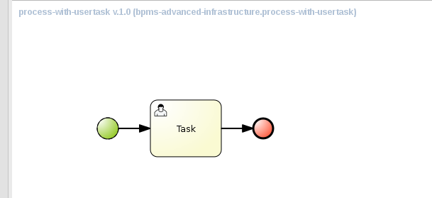
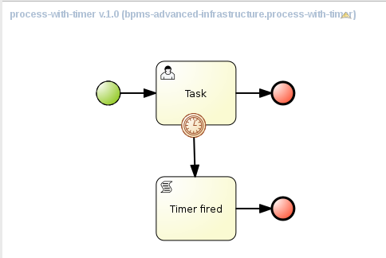

:scrollbar:
:data-uri:
:toc2:

= BxMS Database Schema Lab

.Goals

* Configure BPMS Business-Central and Kie-server to use MariaDB rather than the built-in H2 database.
* Understand the database schema of BPMS.

:numbered:

== Before you start

Install BxMS Business Central and Kie-server as detailed in the Environment Setup Lab instructions.

== Configure BPMS Business-Central to use MariaDB

The installation as performed by the `install-bpms.sh` installation script yields an installation of Business-Central configured to use the built-in H2 database, which is not supported for production useage.

Several configuration steps must be performed to configure Business-Central to use MariaDB instead.
These same steps in this lab can conceptually be followed to configure BPM Suite to run on https://access.redhat.com/articles/704703[other supported relational databases].

In this lab we will also configure Business-Central to use the Quartz scheduler library to implement timers and timer based functionalities in Business-Central.

=== Define the datasources

As a first step, we need to add datasource definitions to the application server configuration.

This can be done in several ways. In this lab we will create the datasources using the JBoss EAP CLI (Command Line Interface)

. Make sure BPMS (Business-Central) is shut down
. Open a terminal window, navigate to the `bin` directory of the Business-Central installation, and start the application server in _admin_ mode.
+
----
$ cd ~/lab/bpms/bc/bin
$ ./standalone.sh --admin-only
----
. Open a second terminal window, navigate to the `bin` directory of the Business-Central installation, and start the EAP CLI.
+
----
$ cd ~/lab/bpms/bc/bin
$ ./jboss-cli.sh --connect
[standalone@localhost:9999 /]
----
. At the EAP CLI prompt, enter the following command:
+
----
[standalone@localhost:9999 /] module add --name=com.mysql --resources=/usr/share/java/mysql-connector-java.jar --dependencies=javax.api,javax.transaction.api
----
+
This will configure a EAP module for the JDBC driver which was installed on the virtual machine with RPM. The JDBC driver is copied to the `com.mysql` module.
. At the EAP CLI prompt, enter the following command:
+
----
[standalone@localhost:9999 /] /subsystem=datasources/jdbc-driver=mysql:add(driver-xa-datasource-class-name=com.mysql.jdbc.jdbc2.optional.MysqlXADataSource,driver-name=mysql,driver-module-name=com.mysql
----
+
This command configures the JDBC driver, using the driver module as source.
. At the EAP CLI prompt, enter the following command:
+
----
[standalone@localhost:9999 /] data-source add --name=jbpmDS --jndi-name="java:jboss/datasources/jbpmDS" --driver-name=mysql --user-name=jboss --password=jboss --exception-sorter-class-name=org.jboss.jca.adapters.jdbc.extensions.mysql.MySQLExceptionSorter --valid-connection-checker-class-name=org.jboss.jca.adapters.jdbc.extensions.mysql.MySQLValidConnectionChecker --connection-url="jdbc:mysql://${mysql.host.ip}:${mysql.host.port}/${mysql.bpms.schema}?transformedBitIsBoolean=true&sessionVariables=storage_engine=InnoDB"
----
+
This command creates the datasource that will be used by the BPMS engine. The datasource uses the driver we configured in the previous step.
+
Note that the connection URL to the database instance uses system property placeholders, rather than hard-coding the values.
. Finally, we need to enable the datasource we just created. At the EAP CLI prompt, enter the following command:
+
----
[standalone@localhost:9999 /] /subsystem=datasources/data-source=jbpmDS:enable
----
. Quartz needs its own datasource definition. Still at the At the EAP CLI prompt, enter the following commands:
+
----
[standalone@localhost:9999 /] data-source add --name=quartzDS --jta=false --jndi-name="java:jboss/datasources/quartzDS" --driver-name=mysql --user-name=jboss --password=jboss --exception-sorter-class-name=org.jboss.jca.adapters.jdbc.extensions.mysql.MySQLExceptionSorter --valid-connection-checker-class-name=org.jboss.jca.adapters.jdbc.extensions.mysql.MySQLValidConnectionChecker --connection-url="jdbc:mysql://${mysql.host.ip}:${mysql.host.port}/${mysql.bpms.schema}?transformedBitIsBoolean=true&sessionVariables=storage_engine=InnoDB"
[standalone@localhost:9999 /] /subsystem=datasources/data-source=quartzDS:enable
----
. Exit from the CLI prompt (type `exit`), and shut down the application server.
. If you want to review the changes you made to the server configuration file, open `/home/jboss/lab/bpms/bc/standalone/configuration/standalone.xml` in a text editor, and review the `datasources` subsystem.

=== Modify application configuration files

The persistence unit defined in `persistence.xml` of the Business-Central application still refers to the H2 datasource. We need to point the persistence unit to the MariaDB datasource, and change the Hibernate dialect.

. Open a terminal, and `cd` to the directory containing the `persistence.xml` of the Business-Central application:
+
----
$ cd ~/lab/bpms/bc/standalone/deployments/business-central.war/WEB-INF/classes/META-INF/
----
. Modify the `persistence.xml` file using `sed`:
+
----
$ sed -i s@java:jboss/datasources/ExampleDS@java:jboss/datasources/jbpmDS@ persistence.xml
$ sed -i s@org.hibernate.dialect.H2Dialect@org.hibernate.dialect.MySQL5Dialect@ persistence.xml
----
. After these changes, the `persistence.xml` file should look like:
+
----
<persistence version="2.0"
             xmlns="http://java.sun.com/xml/ns/persistence" xmlns:orm="http://java.sun.com/xml/ns/persistence/orm"
             xmlns:xsi="http://www.w3.org/2001/XMLSchema-instance"
             xsi:schemaLocation="http://java.sun.com/xml/ns/persistence http://java.sun.com/xml/ns/persistence/persis
tence_2_0.xsd
                      http://java.sun.com/xml/ns/persistence/orm http://java.sun.com/xml/ns/persistence/orm_2_0.xsd">

  <persistence-unit name="org.jbpm.domain" transaction-type="JTA">
    <provider>org.hibernate.ejb.HibernatePersistence</provider>
    <jta-data-source>java:jboss/datasources/jbpmDS</jta-data-source>
    <mapping-file>META-INF/Taskorm.xml</mapping-file>
    <mapping-file>META-INF/JBPMorm.xml</mapping-file>
    <mapping-file>META-INF/Executor-orm.xml</mapping-file>
    <mapping-file>META-INF/Servicesorm.xml</mapping-file>
    <mapping-file>META-INF/TaskAuditorm.xml</mapping-file>
[...]
    <properties>
      <property name="hibernate.dialect" value="org.hibernate.dialect.MySQL5Dialect" />

      <property name="hibernate.max_fetch_depth" value="3" />
      <property name="hibernate.hbm2ddl.auto" value="update" />
      <property name="hibernate.show_sql" value="false" />

      <!-- BZ 841786: AS7/EAP 6/Hib 4 uses new (sequence) generators which seem to cause problems -->
      <property name="hibernate.id.new_generator_mappings" value="false" />
      <property name="hibernate.transaction.jta.platform" value="org.hibernate.service.jta.platform.internal.JBossAppServerJtaPlatform" />
    </properties>
  </persistence-unit>
----
. The Dashboard application also has a reference to the H2 datasource that needs to be changed. In a terminal, and `cd` to the directory containing the `jboss-web.xml` of the Dashboard application:
+
----
$ cd ~/lab/bpms/bc/standalone/deployments/dashbuilder.war/WEB-INF/
----
. Change the reference to `ExampleDS` using `sed`:
+
----
$ sed -i s@java:jboss/datasources/ExampleDS@java:jboss/datasources/jbpmDS@ jboss-web.xml
----
. After the change, the `jboss-web.xml` file should look like:
+
----
<jboss-web>
    <context-root>/dashbuilder</context-root>
    <resource-ref>
        <res-ref-name>jdbc/dashbuilder</res-ref-name>
        <res-type>javax.sql.DataSource</res-type>
        <jndi-name>java:jboss/datasources/jbpmDS</jndi-name>
    </resource-ref>

    <!--
        Use by default the JBoss EAP security domain.
        In order to access as superuser to the Dashboard Builder app you must create a user with login="root".
        (Users can be registered using the bin/add-user.sh command)

        If you choose to use a custom security domain then you should define it into the
        <jboss-eap-home>/standalone/configuration/standalone.xml file.
     -->
    <security-domain>other</security-domain>

</jboss-web>
----

ifdef::showscript[]
=== Understand the Configuration

.  Notice that the _persistence.xml_ that you just modified includes the following property:
+
-----
<property name="hibernate.hbm2ddl.auto" value="update" />
-----
.. What are the alternative values for this property ?
.. Why would the value currently being used be ideal for a production environment ?
.. What does this value imply about the state of the BPMS schema in the database that our runtime will connect to ?

1.a : create-drop, create, validate, none
1.b : so that

endif::showscript[]

=== Create the tables in the MariaDB database

Creating the BPMS database tables in the database is not strictly necessary. The BPMS engine leverages JPA, and as such the database tables can be created on the fly at server startup. However it is recommended to use the provided DDL scripts to create the database upfront, as these DDL scripts also contain definitions for indexes that won't be created if we let JPA handle the database creation. +
Also, in an enterprise environment the user associated with the datasource often won't have create table privileges, which makes it mandatory to create the tables upfront. +
If we use quartz as implementation for timers, we need also to create the Quartz tables (these cannot be created automatically at server startup).

The DDL scripts for BPMS are included in the _BPMS Supplementary Tools_ package, which can be downloaded from the CSP. It contains DDL scripts for MySQL and PostgreSQL, as wel as DB2, Oracle, SQLServer and Sybase.

The DDL scripts for MySQL/MariaDB have been added to the lab virtual machine, in the `/opt/install/scripts/bpms/ddl` directory.

. In a terminal window, login into MariaDB:
+
----
$ mysql --user=root
----
. Create the database for Business-Central, and grant privileges to the `jboss` user (this is the user we defined in the datasource). Once done, exit from the mysql prompt.
+
----
MariaDB [(none)]> CREATE DATABASE IF NOT EXISTS bpmsbc;
MariaDB [(none)]> GRANT ALL ON bpmsbc.* TO 'jboss'@'localhost' IDENTIFIED BY 'jboss';
MariaDB [(none)]> GRANT ALL ON bpmsbc.* TO 'jboss'@'%' IDENTIFIED BY 'jboss';
MariaDB [(none)]> exit
----
. Create the BPMS database tables using the ddl scripts:
+
----
$ mysql --user=jboss --password=jboss bpmsbc < /opt/install/scripts/bpms/ddl/mysql5-jbpm-schema.sql
$ mysql --user=jboss --password=jboss bpmsbc < /opt/install/scripts/bpms/ddl/mysql5-dashbuilder-schema.sql
$ mysql --user=jboss --password=jboss bpmsbc < /opt/install/scripts/bpms/ddl/quartz_tables_mysql.sql
----

=== Check the installation

Now we can start the Business-Central instance and validate our configuration.

. In a terminal window, `cd` to `home/jboss/lab/bpms/bc`.
. Open the `bin/standalone.conf` file for editing:
+
----
$ pluma bin/standalone.conf
----
. In the `standalone.conf`, the system properties for the MariaDB database have already been added (around line 77). +
However, to configure the BPMS engine to use Quartz, we need to point the `org.quartz.properties` system variable to the Quartz properties file.
.. A Quartz properties has been provided on the virtual machine in the `/opt/install/scripts/bpms/quartz` directory. +
Review the `quartz.properties` configuration file. More details on how to configure quartz can be found at http://www.quartz-scheduler.org/documentation. BPMS uses version 1.8.5 of the Quartz library.

.. At the end of the file, add the following line:
+
----
JAVA_OPTS="$JAVA_OPTS -Dorg.quartz.properties=/opt/install/scripts/bpms/quartz/quartz.properties"
----
+
Save the file.
. To start the server:
+
----
$ ./bin/standalone.sh
----
. The server should start without errors.

== Configure BxMS Kie-Server to use MariaDB

The steps required to configure Kie-server to use MariaDB rather than the built-in H2 database are similar to what we needed to do for Business-Central.

The difference lies in the fact that there is no `persistence.xml` configuration file we need to adapt. With Kie-server, the persistence unit is built programmatically when the BPM extension is started. Configuration is provided through system properties.

. Repeat the steps to create the tables in a new schema in the MariaDB called: `bpmskieserver` .
+
As Kie-server does not use Dashbuilder, there is no need to import the dashboard tables.
. Repeat the steps performed previously to define a driver module datasource for the KIE-server installation (located at: `/home/jboss/lab/bpms/kieserver`). +
Remember that a port offset of 150 is used to launch Kie-server. So to connect to the server from the CLI, use the following command:
+
----
$ ./jboss-cli.sh --connect --controller=127.0.0.1:10149
----

. Open the `/home/jboss/lab/bpms/kieserver/bin/standalone.conf` file for editing. At the bottom of the file, add the following lines:
+
----
JAVA_OPTS="$JAVA_OPTS -Dorg.kie.server.persistence.ds=java:jboss/datasources/jbpmDS"
JAVA_OPTS="$JAVA_OPTS -Dorg.kie.server.persistence.dialect=org.hibernate.dialect.MySQL5Dialect"
JAVA_OPTS="$JAVA_OPTS -Dorg.quartz.properties=/opt/install/scripts/bpms/quartz/quartz.properties"
----
+
Save the file.
. Start the server and make sure there are no errors in the logs

== The BPMS Database Schema

In the second part of this we will explore the BPMS database schema. We'll use some very simple example processes to illustrate where and how data is stored in the BPMS database.

=== Preparation

. Clone the lab project from github. +
In a terminal window, `cd` to the `lab` folder and issue the following command:
+
----
$ cd ~/lab
$ git clone https://github.com/gpe-mw-training/bxms-advanced-infrastructure-lab
----
. Build and install the project kjar into the local maven repository:
+
----
$ cd ~/lab/bxms-advanced-infrastructure-lab/process-kjar
$ mvn clean install
----
+
Research the following question:  What is the URL to the supported Red Hat Maven repository where the BPM dependencies used to build this kie-project came from ?

. Create a user `user1` belonging to group `group1` in Kie-server. We will use this user to work with User Tasks in our sample processes. +
In a terminal window, `cd` to the `bin` dirrectory of Kie-server, and issue the following command:
+
----
$ cd ~/lab/bpms/kieserver/bin
$ ./add-user.sh -u user1 -p user -g kie-server,group1 -a -s -sc /home/jboss/lab/bpms/kieserver/standalone/configuration
----
. Start the Kie-server, and deploy the kjar we built in the previous step using `curl`.
+
----
$ curl -X PUT -H "Accept:application/json" -H "Content-Type:application/json" --user jboss:bpms -d '{ "release-id" : { "group-id" : "com.redhat.gpte.bpms-advanced-infrastructure", "artifact-id" : "process-kjar", "version" : "1.0" } }' "http://localhost:8230/kie-server/services/rest/server/containers/container1"
----
+
You should recieve a response like this:
+
----
{
  "type" : "SUCCESS",
  "msg" : "Container container1 successfully deployed with module com.redhat.gpte.bpms-advanced-infrastructure:process-kjar:1.0.",
  "result" : {
    "kie-container" : {
      "status" : "STARTED",
      "messages" : [ ],
      "container-id" : "container1",
      "release-id" : {
        "version" : "1.0",
        "group-id" : "com.redhat.gpte.bpms-advanced-infrastructure",
        "artifact-id" : "process-kjar"
      },
      "resolved-release-id" : {
        "version" : "1.0",
        "group-id" : "com.redhat.gpte.bpms-advanced-infrastructure",
        "artifact-id" : "process-kjar"
      },
      "config-items" : [ ]
    }
  }
}
----

The kjar that you just deployed contains 2 very simple processes.

* `process-with-usertask` : this process has a User Task assigned to group1. The process takes a process variable `var` of type `String`, which is passed to the user task.
+

* `process-with-timer` : this is essentially the same process, but now with a timer attached to the User Task node. The timer fires after 5 minutes.
+

=== Exploring the BPMS Database schema

. In a terminal window, log into the MariaDB database, using the `bpmskieserver` schema.
+
----
$ mysql --user=jboss --password=jboss bpmskieserver
----
. The BPMS database schema consists of 53 tables.
+
----
MariaDB [bpmskieserver]> show tables;
----
+
----
+--------------------------------+
| Tables_in_bpmskieserver        |
+--------------------------------+
| attachment                     |
| audittaskimpl                  |
| bamtasksummary                 |
| booleanexpression              |
| content                        |
[...]
| requestinfo                    |
| sessioninfo                    |
| task                           |
| task_comment                   |
| taskdef                        |
| taskevent                      |
| taskvariableimpl               |
| variableinstancelog            |
| workiteminfo                   |
+--------------------------------+
53 rows in set (0.00 sec)
----
+
The tables starting with `qrtz_` are used by the Quartz scheduler. +
At this point in time all the tables are empty.
. Start an instance of the `process-with-usertask` process, using curl. The process instance will progress to the creation of the User Task, and will then be persisted in the database.
+
----
$ curl -X POST -H "Accept: application/json" -H "Content-Type: application/json" --user jboss:bpms -d '{ "var" : "before user task" }'  "http://localhost:8230/kie-server/services/rest/server/containers/container1/processes/bpms-advanced-infrastructure.process-with-usertask/instances"
----
. The process instance state is stored in the `processinstanceinfo` table.
+
----
MariaDB [bpmskieserver]> select * from processinstanceinfo \G
----
+
----
*************************** 1. row ***************************
              InstanceId: 1
    lastModificationDate: 2016-08-14 18:27:38
            lastReadDate: 2016-08-14 18:27:38
               processId: bpms-advanced-infrastructure.process-with-usertask
processInstanceByteArray: �z  pRuleFlow
 J Horg.drools.core.marshalling.impl.SerializablePlaceholderResolverStrategyM�sr java.util.ArrayListx��� I sizexp   w   t before user taskxR�
RuleFlow2bpms-advanced-infrastructure.process-with-usertask (B
var     ` jprocessStartEventr)
%_2C168008-BB85-4E11-8B79-97BDA4BEA059zprocess-with-usertask�
               startDate: 2016-08-14 18:27:38
                   state: 1
                 OPTLOCK: 2
1 row in set (0.00 sec)
----
+
Note that the process variables are stored as a byte array in the `processInstanceByteArray` column, which is of type BLOB.
. The kjar uses `PER_REQUEST` runtime strategy. So for each request a new _ksession_ is created and disposed of at the end of the request. Session state is not stored. You can check this by querying the `sessioninfo` table:
+
----
MariaDB [bpmskieserver]> select * from sessioninfo;
----
+
----
Empty set (0.00 sec)
----
. A User Task has been created, and its state stored in the `task` table:
+
----
MariaDB [bpmskieserver]> select * from task \G
----
+
----
*************************** 1. row ***************************
                id: 1
          archived: 0
 allowedToDelegate: NULL
       description:
          formName: NULL
              name: Task
          priority: 0
   subTaskStrategy: NoAction
           subject:
    activationTime: 2016-08-14 18:27:38
         createdOn: 2016-08-14 18:27:38
      deploymentId: container1
documentAccessType: 0
 documentContentId: 1
      documentType: java.util.HashMap
    expirationTime: NULL
   faultAccessType: NULL
    faultContentId: -1
         faultName: NULL
         faultType: NULL
  outputAccessType: NULL
   outputContentId: -1
        outputType: NULL
          parentId: -1
    previousStatus: 0
         processId: bpms-advanced-infrastructure.process-with-usertask
 processInstanceId: 1
  processSessionId: 1
          skipable: 1
            status: Ready
        workItemId: 1
          taskType: NULL
           OPTLOCK: 1
  taskInitiator_id: NULL
    actualOwner_id: NULL
      createdBy_id: NULL
1 row in set (0.00 sec)
----
+
The task has not been claimed nor started, so the actual owner is still `NULL`. +
As with process instances, the state of the task variables is stored as a byte array, in the `content` table:
+
----
MariaDB [bpmskieserver]> select * from content \G
----
+
----
*************************** 1. row ***************************
     id: 1
content: �z
 J Horg.drools.core.marshalling.impl.SerializablePlaceholderResolverStrategyd�sr java.util.ArrayListx��� I sizexp   w   t truet Taskt before user taskt group1xRO

        Skippable

NodeName

taskVar

GroupId
1 row in set (0.00 sec)
----
. Users and groups are stored in the `organizationalentity` table. The BPMS engine stores only a reference to users and groups, not the relationship between both. Users and groups are added to the table when 'seen' for the first time by the engine.
+
----
MariaDB [bpmskieserver]> select * from organizationalentity;
----
+
----
+-------+----------------+
| DTYPE | id             |
+-------+----------------+
| User  | Administrator  |
| Group | Administrators |
| Group | group1         |
+-------+----------------+
3 rows in set (0.00 sec)
----
. The potential owners of a task are stored in the `peopleassignments_potowners` table. In our case, the User Task is assigned to `group1`, so this table contains one row:
+
----
MariaDB [bpmskieserver]> select * from peopleassignments_potowners;
----
+
----
+---------+-----------+
| task_id | entity_id |
+---------+-----------+
|       1 | group1    |
+---------+-----------+
1 row in set (0.00 sec)
----
. The BPMS database schema contains a number of audit tables, where state changes are stored. +
For processes these tables are `processinstancelog`, `nodeinstancelog` and `variableinstancelog`, for storing audit around process instances, node transitions and process variable value changes. +
To see what is stored in these tables, use the following queries:
+
----
MariaDB [bpmskieserver]> select * from processinstancelog \G
MariaDB [bpmskieserver]> select * from nodeinstancelog \G
MariaDB [bpmskieserver]> select * from nodeinstancelog \G
----
. For tasks, the audit tables are `audittaskimpl` and `taskvariableimpl`:
+
----
MariaDB [bpmskieserver]> select * from audittaskimpl \G
MariaDB [bpmskieserver]> select * from taskvariableimpl \G
----
. We can now claim and start the task. This will change the task status, which is stored in the `task` status. +
.. Before claiming the task:
+
----
MariaDB [bpmskieserver]> select id,status,actualOwner_id from task;
----
+
----
+----+--------+----------------+
| id | status | actualOwner_id |
+----+--------+----------------+
|  1 | Ready  | NULL           |
+----+--------+----------------+
----
.. Claim the task with curl:
+
----
$ curl -X PUT -H "Accept: application/json" -H "Content-Type: application/json" --user user1:user "http://localhost:8230/kie-server/services/rest/server/containers/container1/tasks/1/states/claimed"
----
+
----
MariaDB [bpmskieserver]> select id,status,actualOwner_id from task;
----
+
----
+----+----------+----------------+
| id | status   | actualOwner_id |
+----+----------+----------------+
|  1 | Reserved | user1          |
+----+----------+----------------+
----
+
----
MariaDB [bpmskieserver]> select * from organizationalentity;
----
+
----
+-------+----------------+
| DTYPE | id             |
+-------+----------------+
| User  | Administrator  |
| Group | Administrators |
| Group | group1         |
| Group | kie-server     |
| User  | user1          |
+-------+----------------+
----
.. Start the task:
+
----
$ curl -X PUT -H "Accept: application/json" -H "Content-Type: application/json" --user user1:user "http://localhost:8230/kie-server/services/rest/server/containers/container1/tasks/1/states/started"
----
+
----
MariaDB [bpmskieserver]> select id,status,actualOwner_id from task;
----
+
----
+----+------------+----------------+
| id | status     | actualOwner_id |
+----+------------+----------------+
|  1 | InProgress | user1          |
+----+------------+----------------+
1 row in set (0.00 sec)
----
.. Complete the task:
+
----
$ curl -X PUT -H "Accept: application/json" -H "Content-Type: application/json" --user user1:user -d '{ "taskVar" : "after the user task" }' "http://localhost:8230/kie-server/services/rest/server/containers/container1/tasks/1/states/completed"
----
. Once the task is completed, the process instance reaches an end node, and completes. +
As a result the data in the `processinfo` table for this process instance is purged:
+
----
MariaDB [bpmskieserver]> select * from processinstanceinfo;
----
+
----
Empty set (0.00 sec)
----
. The process log tables (`processinstancelog`, `nodeinstancelog`, `variableinstancelog`) are not cleared when a process instance completes.
+
----
MariaDB [bpmskieserver]> select * from processinstancelog \G
----
+
----
*************************** 1. row ***************************
                        id: 1
            correlationKey: NULL
                  duration: 21112997
                  end_date: 2016-08-15 00:19:30
                externalId: container1
             user_identity: jboss
                   outcome: NULL
   parentProcessInstanceId: -1
                 processId: bpms-advanced-infrastructure.process-with-usertask
processInstanceDescription: process-with-usertask
         processInstanceId: 1
               processName: process-with-usertask
            processVersion: 1.0
                start_date: 2016-08-14 18:27:38
                    status: 2
1 row in set (0.00 sec)
----
+
The task tables (`task`, `peopleassignments_*`, `content`, `audittaskimpl`, `taskvariableimpl`) are also not cleared when the task completes or the process instance finishes.
. In our installation, timers are managed by the Quartz library, and also stored in the database. To see this in action, start an instance of the `process-with-timer` process:
+
----
$ curl -X POST -H "Accept: application/json" -H "Content-Type: application/json" --user jboss:bpms -d '{ "var" : "before user task" }'  "http://localhost:8230/kie-server/services/rest/server/containers/container1/processes/bpms-advanced-infrastructure.process-with-timer/instances"
----
+
The timer definition has been stored in the `qrtz_triggers` table:
+
----
MariaDB [bpmskieserver]> select * from qrtz_triggers \G
----
+
----
*************************** 1. row ***************************
  TRIGGER_NAME: 5-2-1_trigger
 TRIGGER_GROUP: jbpm
      JOB_NAME: 5-2-1
     JOB_GROUP: jbpm
   IS_VOLATILE: 0
   DESCRIPTION: NULL
NEXT_FIRE_TIME: 1471214932454
PREV_FIRE_TIME: -1
      PRIORITY: 5
 TRIGGER_STATE: WAITING
  TRIGGER_TYPE: SIMPLE
    START_TIME: 1471214932454
      END_TIME: 0
 CALENDAR_NAME: NULL
 MISFIRE_INSTR: 0
      JOB_DATA:
1 row in set (0.00 sec)
----
. If you wait a couple of minutes (the timer delay has been set to 5 minutes), the timer will fire, and the row in the `qrtz_triggers` table is removed.

=== Behavior with different Session Strategies

==== PER_PROCESS_INSTANCE

When using `PER_PROCESS_INSTANCE` runtime strategy, the same ksession will be used during the lifetime of the process instance. In this case the session state wil be persisted into the `sessioninfo` database table and linked to the process instance. Every request for a process instance will start with rehydrating a ksession from the persisted state. To illustrate this:

.. In a terminal window, `cd` to: `/home/jboss/lab/bxms-advanced-infrastructure-lab/process-kjar/`.
.. Open the `src/main/resources/META-INF/kie-deployment-descriptor.xml` for editing.
.. In the file, replace `<runtime-strategy>PER_REQUEST</runtime-strategy>` with `<runtime-strategy>PER_PROCESS_INSTANCE</runtime-strategy>`. +
Save the file.
.. Open the `pom.xml` file for editing.
.. In the file, change the version of the project to `1.1`. +
Save the file.
.. Rebuild the project:
+
----
$ mvn clean install
----
.. Deploy the newly built kjar.
+
----
$ curl -X PUT -H "Accept:application/json" -H "Content-Type:application/json" --user jboss:bpms -d '{ "release-id" : { "group-id" : "com.redhat.gpte.bpms-advanced-infrastructure", "artifact-id" : "process-kjar", "version" : "1.1" } }' "http://localhost:8230/kie-server/services/rest/server/containers/container2"
----
.. Create an instance of the `process-with-usertask` process.
+
----
$ curl -X POST -H "Accept: application/json" -H "Content-Type: application/json" --user jboss:bpms -d '{ "var" : "before user task" }'  "http://localhost:8230/kie-server/services/rest/server/containers/container2/processes/bpms-advanced-infrastructure.process-with-usertask/instances"
----
.. Check that a row has been inserted in the `sessioninfo` table:
+
----
MariaDB [bpmskieserver]> select * from sessioninfo \G
----
+
----
*************************** 1. row ***************************
                  id: 17
lastModificationDate: 2016-08-15 04:46:19
      rulesByteArray: �w|
 R  h     B#
MAIN   (���������@ "
MAINR5
DEFAULT"*
&org.drools.core.reteoo.InitialFactImpl "h
           startDate: 2016-08-15 04:46:19
             OPTLOCK: 2
1 row in set (0.00 sec)
----
.. The `contextmappinginfo` table links the persisted ksession to the process instance:
+
----
MariaDB [bpmskieserver]> select * from contextmappinginfo;
----
+
----
+-----------+------------+-------------+------------+---------+
| mappingId | CONTEXT_ID | KSESSION_ID | OWNER_ID   | OPTLOCK |
+-----------+------------+-------------+------------+---------+
|         1 | 6          |          17 | container2 |       0 |
+-----------+------------+-------------+------------+---------+
1 row in set (0.00 sec)
----
+
The `context_id` column contains the id of the processinstance.
.. When the process instance completes, the matching rows in the `sessioninfo` and `contextmappinginfo` tables are deleted. +
You can verify this by completing the User Task of the process created above.

==== SINGLETON
When using "SINGLETON" runtime strategy, one ksession is shared by all process instances of a deployment. The session state is kept in memory as long as the server is up. When shutting down the server, the session state is serialized to disk. +
So in this case the `sessioninfo` table will not be used.

ifdef::showscript[]

1)  hibernate.hbm2ddl.auto system property  ?
2)  ~/.m2/repository ownership set to:   temp / users
3)  what if the same database was used for both biz central, kie-server and dashbuilder ?

endif::showscript[]
