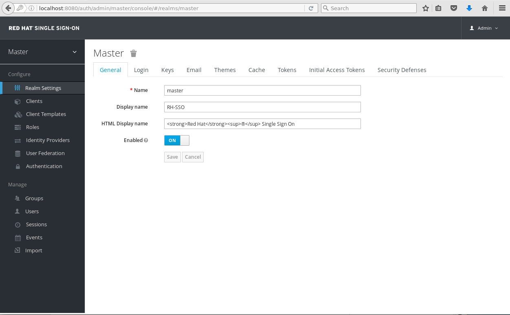
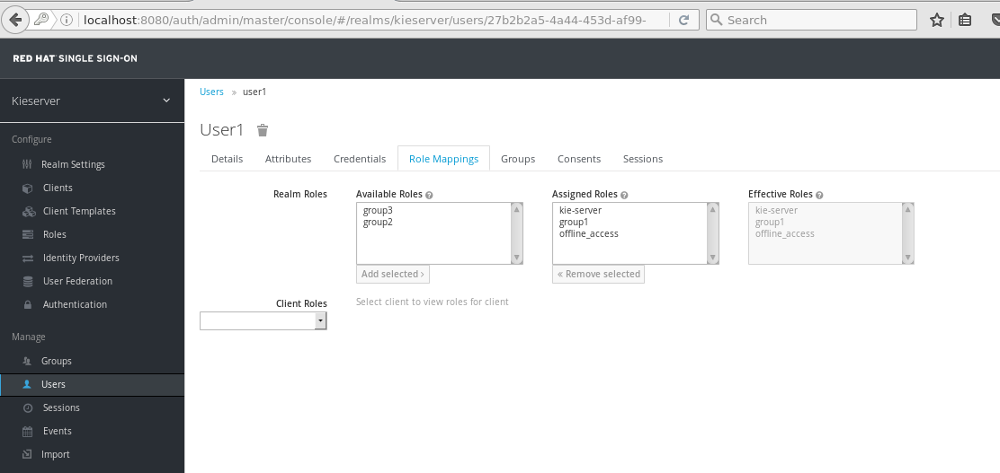
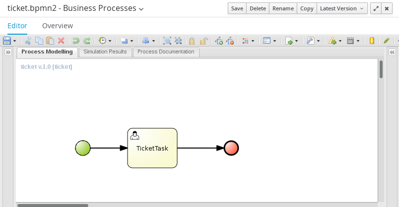
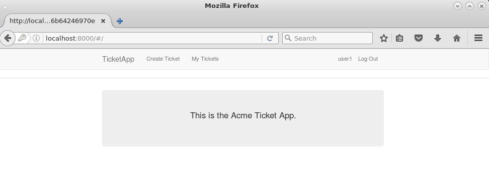

:scrollbar:
:data-uri:
:toc2:

== Single Sign-On Lab

The out-of-the-box installations of Business Central and Process Server use properties files to manage users and roles. This makes it easier to get started with the JBoss BPM Suite platform, but it is not suitable for an enterprise deployment.

In most enterprises, users and roles are managed centrally, using a central user directory such as LDAP. You can configure Business Central and Process Server to use a central user directory for authentication and authorization. Both components delegate the handling of authentication and authorization to the security subsystem of the underlying application server, which is based on JAAS.

As a result, if you want to use, for example, an LDAP server for authentication and authorization, you must configure the application server to use a login module implementation for LDAP rather than for the default server.

A few issues remain, especially in the case of Process Server. Process Server is a runtime component meant to be used as a remote business rules and process execution engine. It is typically accessed over the REST/HTTP remote API, although there is also a JMS-based API that can be useful in integration scenarios. The REST/HTTP API uses Basic authentication. That means the Process Server client, such as a front-end GUI application, must include the user's username and password with every request. The client applications must know or have access to the usernames and passwords. Moreover, with Basic authentication, the username and password are passed in the clear as unencrypted base64-encoded text.

Process Server does allow for authentication as a _system user_, which can perform operations on behalf of the real user. In this case, the username is passed in as a query parameter in the REST calls. In other words, if Process Server is configured to bypass the real user, the front end needs to know only the username and password of the system user.

Although this approach is more practical, it is still not a good solution. The system user password must be hard-coded in the client application, and you cannot restrict access to Process Server based on the real user.

A better solution to this problem is to use a single sign-on, or SSO, solution:

image::images/sso_dataflow.gif[]

In this approach, a user who accesses the front-end application is redirected to the Red Hat Single Sign-On server, where authentication occurs. When the login succeeds, the Red Hat Single Sign-On server issues a token. This token contains the username and the roles attributed to this user. Whenever the front-end application accesses the Process Server back end, the token is passed to the server as an HTTP header and the server verifies the token. If the token is valid, the user is granted access.

Red Hat Single Sign-On is an integrated SSO and IdM solution for browser applications and RESTful web services. It is built on top of the OAuth 2.0, Open ID Connect, JSON Web Token (JWT), and SAML 2.0 specifications.

The upstream project of Red Hat Single Sign-On is Keycloak: http://keycloak.jboss.org/.

.Goal

* Configure Process Server to use Red Hat Single Sign-On for authentication and authorization

:numbered:

== Install Red Hat Single Sign-On

The VM comes with a script that does the following:

* Installs a Red Hat Single Sign-On instance
* Configures Red Hat Single Sign-On to use MariaDB for persistence
* Creates the database schema in MariaDB
* Creates an initial `admin` user
* Configures Red Hat Single Sign-On to use a port offset of `300`, to avoid port conflicts with the JBoss BPM Suite instances

In this section, you install and start the Red Hat Single Sign-On server:

. In the VM, open a terminal and change to the `/home/jboss/lab` directory.
. Execute the `install-rhsso.sh` script as user `jboss`.
. Review the `install-rhsso.sh` script, which delegates to the `install-rhsso-instance.sh` script in the `/opt/install/scripts/rhsso` directory.
. Change to the `/home/jboss/lab/rhsso/bin` directory and launch the server:
+
[source,text]
----
$ cd /home/jboss/lab/rhsso/bin
$ ./standalone.sh
----

. When the server has started, open a browser and navigate to `localhost:8380/auth/admin`.
. Log in with user `admin:admin`.
* Expect the server start screen to look similar to this:
+

== Configure Red Hat Single Sign-On Manually

=== Create Realm

The first step in configuring Red Hat Single Sign-On is to create a SSO realm for your application.

. On the Red Hat Single Sign-On screen, hover over the *Realm* list and click *Add realm*:
+

. Enter `kieserver` in the *Name* field, and leave the *Enabled* option set to `ON`:
+

. Click *Create*.
. On the *Kieserver* realm page, click the *Login* tab.
. Set *Require SSL* to `none` and click *Save*:
+

+
[NOTE]
On a production system, Red Hat strongly recommends that you use SSL for all communication between the applications and the Red Hat Single Sign-On server.

=== Create Clients

For each of the applications involved--the Process Server back end and the front-end application--you need to create a client configuration in your realm. You also create a client that `curl` uses to access the Process Server REST API from the command line.

. In the left navigation panel on the *Kieserver* realm page, click *Clients*.
* A number of client configurations are predefined. Leave these as is.
. Create the front-end client:
.. Click *Create* in the upper right.
.. Set the field values as follows:
* *Client Id*: Enter `frontend`.
* *Client Protocol*: Leave as `openid-connect`.
* *Client Template*: Leave blank.
* *Root URL*: Leave blank.
.. Click *Save*.
. Enter the client settings:
.. On the `frontend` client page, click the *Settings* tab.
.. Set the field values as follows:
* *Access Type*: Enter `public`.
* *Valid Redirect URIs*: Add `localhost:8000/*`.
* *Web Origins*: Add `localhost:8000`.
+
image::images/rhsso-server-client-frontend-settings.png[]
+
[NOTE]
http://localhost:8000 is the URI of the AngularJS front-end application that you use to test your setup.

.. Click *Save*.
. Create the `kieserver` client:
.. Follow the steps for creating the front-end client, but enter `kieserver` as the client ID.
.. Click the *Settings* tab and enter `bearer only` in the *Access Type* field.

* A `bearer only` client is used for web services that do not initiate a login, but require a valid token to grant access.
.. Click *Save*.
. Create the `curl` client:
.. Follow the steps for creating the front-end client, but enter `curl` as the client ID.
.. Click the *Settings* tab and set the following values:
** *Access Type*: Enter `public`.
** *Valid Redirect URIs*: Add `localhost`.
.. Click *Save*.
* The `curl` client lets you obtain a valid token from the Red Hat Single Sign-On server using curl. This token can then be used to access the Process Server REST API.
* Red Hat recommends that you do not use `curl` for a production system, and that if you do use it, at least restrict its use to select users.

=== Create Roles

The user's roles determine authorization. To access the Process Server REST APIs, a user must have the `kie-server` role.

Here, you create the `kie-server` role along with some application-specific roles for use within Process Server.

. On the *Kieserver* realm page, in the left navigation panel, click *Roles*.
. Click *Add Role* at the upper right.
. Set the role name as `kie-server`.
. Click *Save*.
. Repeat these steps to create application roles such as `group1` and `group2`.

=== Create Users

The next step is to create some users.

. On the *Kieserver* realm page, in the left navigation panel, click *Users*.
. Add a user:
.. Click *Add User* at the upper right.
.. On the *Add user* page, enter a username such as `user1`, and leave the other fields as is.
.. Click *Save*:
+
image::images/rhsso-server-create-user.png[]

. Set the user's password:
.. Click the *Credentials* tab for the newly created user.
.. Enter a value such as `user` for the user password, and enter it again to confirm.
.. Switch the *Temporary* setting to `Off`.
* Setting *Temporary* to `Off` prevents the user from having to change the password at first login. In a production environment, Red Hat recommends that you leave this setting `On`.

.. Click *Reset password*:
+
image::images/rhsso-server-create-user-password.png[]
. Assign user roles:
.. Click the *Role Mappings* tab.
.. Make sure the user has the `kie-server` role and one or more application roles.
.. Click *Save*:
+

. Repeat these steps to create more users.

=== Import Red Hat Single Sign-On Configuration

Rather than entering the Red Hat Single Sign-On assets--realms, clients, users, and roles--by hand, you can import them at startup from one or more JSON files.

The VM's `/opt/install/scripts/rhsso/import` directory contains JSON files for the `kieserver` realm and the users defined for this realm. All users have the password `user`.

In this section, you import these JSON files into the Red Hat Single Sign-On server to replace the assets you created manually.

. Shut down the Red Hat Single Sign-On server by pressing *Ctrl+C* in the terminal window where you started Red Hat Single Sign-On.
. Restart the Red Hat Single Sign-On server with the following environment variables:
+
[source,text]
----
$ ./standalone.sh -Dkeycloak.migration.action=import -Dkeycloak.migration.provider=dir -Dkeycloak.migration.strategy=OVERWRITE_EXISTING -Dkeycloak.migration.dir=/opt/install/scripts/rhsso/import
----

. Log in to the server with user `admin:admin`.
. Verify that the import of the `kieserver` realm is successful.

== Configure Process Server

=== Install Red Hat Single Sign-On Client Adapter for JBoss EAP 7

In this section, you install the Red Hat Single Sign-On client adapter on the Process Server instance. The installation adds a new security domain that Process Server uses instead of the out-of-the-box security domain that employs properties files for user and role configuration.

. If the Process Server instance is running, shut it down by pressing *Ctrl+C* in the terminal window where you started JBoss BPM Suite.

. Unzip the RHT SSO adapter for JBoss EAP 7 (provided in your lab environment) to the `/home/jboss/lab/bpms/kieserver` directory:
+
[source,text]
----
$ unzip /opt/install/scripts/rhsso/resources/rh-sso-7.0.0-eap7-adapter.zip -d /home/jboss/lab/bpms/kieserver/
----

. Start the `kie-server` instance in admin-only mode:
.. In a terminal window, `cd` to `/home/jboss/lab/bpms/kieserver/bin`.
.. Run the following:
+
[source,text]
----
$ ./standalone.sh --admin-only
----

. Using the JBoss EAP CLI, execute the Red Hat Single Sign-On adapter installation script:
.. In a new terminal window, change to the `/home/jboss/lab/bpms/kieserver/bin` directory.
.. Run the following:
+
[source,text]
----
$ ./jboss-cli.sh -c --controller=localhost:10140 --file=adapter-install.cli
{"outcome" => "success"}
{"outcome" => "success"}
{"outcome" => "success"}
{"outcome" => "success"}
$ ./jboss-cli.sh -c --controller=localhost:10140 ":shutdown"
{"outcome" => "success"}
----

=== Configure Process Server WAR `web.xml`

In this section, you configure the Process Server application to use the Red Hat Single Sign-On security domain.

. Edit `/home/jboss/lab/bpms/kieserver/standalone/depoyments/kie-server.war/WEB-INF/web.xml`:
.. Open the file.
.. Replace:
+
[source,xml]
----
<login-config>
  <auth-method>BASIC</auth-method>
  <realm-name>KIE Server</realm-name>
</login-config>
----
+
with:
+
[source,xml]
----
<login-config>
  <auth-method>KEYCLOAK</auth-method>
  <realm-name>KIE Server</realm-name>
</login-config>
----

.. Save the file.
. Log in to the Red Hat Single Sign-On server as user `admin:admin` and select the *Kieserver realm*.
. Install the JSON file:
.. Go the *Clients* section, open the `kieserver` client, and click the *Installation* tab.
.. Select the `Keycloak OIDC JSON` format and click *Download*:
+
image::images/rhsso-server-realm-installation.png[]

.. Save the file on your file system.
. Copy the downloaded JSON configuration file to the `/home/jboss/lab/bpms/kieserver/standalone/depoyments/kie-server.war/WEB-INF/` directory.
. Edit `/home/jboss/lab/bpms/kieserver/standalone/depoyments/kie-server.war/WEB-INF/keycloak.json`:
.. Open the file.
.. Replace the IP address of the server in the `auth-server-url` element with `127.0.0.1`.
.. Add the following block after `"resource": "kieserver"`, making sure to add a comma after `"resource": "kieserver"`:
+
[source,json]
----
  "enable-cors" : true,
  "cors-max-age" : 1000,
  "cors-allowed-methods" : "POST, PUT, DELETE, GET",
  "principal-attribute" : "preferred_username"
----

* After the changes, expect the file contents to look similar to this:
+
[source,json]
----
{
  "realm": "kieserver",
  "realm-public-key": "MIIBIjANBgkqhkiG9w0BAQEFAAOCAQ8AMIIBCgKCAQEAlS0cEyV82QlRnJmNPEtgwmwsX084PigUVigPhMpKgXhQr6ZF959v+y5eE9ZPX+7iU6p8niwU26aothHXgLESTKZo4Viq6L309aooUvYrlABR6d9I7o99tRsF/fTO5Pedvk6iJIJQxElYzL4WzuWSxh4g/jYkTTW7PNSIna9jzA4r+V+xGjcxU6UjAJPznH8bn1ttf7tFO4U6wVujTR7+E+wSAG71qtYKEPrywyv3lJ2anhmSm5ZLZyzPvtQaIyrk+7vr1vmhtADSvlDoo6zaOF6F+SnOwovSWTVy0ivy+Lj/BQ5gCIpSFNomowUj0y12EYtqbXfSoT0NcBT3ZSPTowIDAQAB",
  "bearer-only": true,
  "auth-server-url": "http://127.0.0.1:8380/auth",
  "ssl-required": "none",
  "resource": "kieserver",
  "enable-cors" : true,
  "cors-max-age" : 1000,
  "cors-allowed-methods" : "POST, PUT, DELETE, GET",
  "principal-attribute" : "preferred_username"
}
----

** The `enable-cors` setting enables CORS support by the Red Hat Single Sign-On adapter. It handles preflight requests and sets the required HTTP headers. This is especially important when accessing the Process Server APIs through JavaScript in a browser, as is the case for the AngularJS client application. For a good overview of  CORS, refer to http://www.html5rocks.com/en/tutorials/cors/.
** The `principal-attribute` defines the attribute to use for the principal name of the logged-in user. By default, this is the generated user ID. When set to `preferred_username`, the username is used instead.
. Restart the Process Server instance:
.. In a terminal window, `cd` to `/home/jboss/lab/bpms/kieserver/bin`.
.. Execute the startup script:
+
[source,text]
----
$ ./standalone.sh
----

. To test that Basic authentication no longer works, try in a browser to navigate to `localhost:8230/kie-server/services/rest/server`.
* Expect to receive a 401 (Unauthorized) HTTP status code.

. To verify the correct setup, open a terminal window and use `curl` to retrieve a bearer token:
+
[source,text]
----
$ export TKN=$(curl -X POST 'http://127.0.0.1:8380/auth/realms/kieserver/protocol/openid-connect/token' \
 -H "Content-Type: application/x-www-form-urlencoded" \
 -d "username=user1" \
 -d 'password=user' \
 -d 'grant_type=password' \
 -d 'client_id=curl'| sed 's/.*access_token":"//g' | sed 's/".*//g')
----
+
[source,text]
----
$ echo $TKN
----
* Expect to see the value of the token received from the Red Hat Single Sign-On server.

. Use `curl` to access the same resource as you tried earlier with the browser, and supply the bearer token in an Authorization header:
+
[source,text]
----
$ curl -X GET 'http://127.0.0.1:8230/kie-server/services/rest/server' \
-H "Accept: application/json" \
-H "Authorization: Bearer $TKN"
----

* Expect to see a response from the Process Server similar to this:
+
[source,json]
----
{
  "type" : "SUCCESS",
  "msg" : "Kie Server info",
  "result" : {
    "kie-server-info" : {
      "version" : "6.5.0.Final-redhat-2",
      "name" : "kie-server-127.0.0.1",
      "location" : "http://127.0.0.1:8230/kie-server/services/rest/server",
      "capabilities" : [ "BRM", "BPM-UI", "BPM", "KieServer" ],
      "messages" : [ {
        "severity" : "INFO",
        "timestamp" : 1471471094671,
        "content" : [ "Server KieServerInfo{serverId='kie-server-127.0.0.1', version='6.5.0.Final-redhat-2', location='http://127.0.0.1:8230/kie-server/services/rest/server'}started successfully at Wed Aug 17 23:58:14 CEST 2016" ]
      } ],
      "id" : "kie-server-127.0.0.1"
    }
  }
}
----
* The first `curl` command obtains a token from the Red Hat Single Sign-On for `user1`, using the curl client, and extracts the token value from the response.
* The second `curl` command calls the Process Server REST API, passing the token as an Authorization header. The Red Hat Single Sign-On security subsystem on Process Server verifies the validity of the token and extracts the user ID and roles. If the user in the token has the correct roles (`kie-server`), access is granted.

=== Deploy Test Archive on Process Server

To demonstrate how a client application can interact with Process Server using Red Hat Single Sign-On to manage security, a process archive is included in the lab project--which you cloned in the previous module--in the `ticket-kjar` folder.

This process has a simplified ticket handling process definition, with one human task. Users can create ticket process instances and assign them to one or more groups. This creates a human task that can be claimed and completed by users belonging to the assigned groups:

To deploy this process archive, you need to build it with Maven and deploy it to the local Maven repository.

. In a terminal window, change to the `/home/jboss/lab/bxms-advanced-infrastructure-lab/ticket-kjar` directory and build and install the project in the local Maven repository.
+
[source,text]
----
$ cd ~/lab/bxms-advanced-infrastructure-lab/ticket-kjar
$ mvn clean install
----

. Obtain an OpenID Connect access token:
+
[source,text]
----
$ export TKN=$(curl -X POST 'http://127.0.0.1:8380/auth/realms/kieserver/protocol/openid-connect/token' \
 -H "Content-Type: application/x-www-form-urlencoded" \
 -d "username=user1" \
 -d 'password=user' \
 -d 'grant_type=password' \
 -d 'client_id=curl'| sed 's/.*access_token":"//g' | sed 's/".*//g')
----

. Deploy the ticket process kjar on Process Server:
+
[source,text]
----
$ curl -X PUT 'http://localhost:8230/kie-server/services/rest/server/containers/ticket-app' \
-H "Accept: application/json" \
-H "Content-type: application/json" \
-H "Authorization: Bearer $TKN" \
-d '{"release-id" : {"group-id" : "com.redhat.gpte.bpms-advanced-infrastructure", "artifact-id" : "ticket-kjar", "version" : "1.0" } }'
----
* Expect the response to look similar to this:
+
[source,json]
----
{
  "type" : "SUCCESS",
  "msg" : "Container ticket-app successfully deployed with module com.redhat.gpte.bpms-advanced-infrastructure:ticket
-kjar:1.0.",
  "result" : {
    "kie-container" : {
      "status" : "STARTED",
      "messages" : [ ],
      "container-id" : "ticket-app",
      "release-id" : {
        "version" : "1.0",
        "group-id" : "com.redhat.gpte.bpms-advanced-infrastructure",
        "artifact-id" : "ticket-kjar"
      },
      "resolved-release-id" : {
        "version" : "1.0",
        "group-id" : "com.redhat.gpte.bpms-advanced-infrastructure",
        "artifact-id" : "ticket-kjar"
      },
      "config-items" : [ ]
    }
  }
}
----

=== Test with AngularJS Client Application

To test the integration of Process Server with Red Hat Single Sign-On, the lab project contains an AngularJS application in the `angularjs-ticket-app` folder.

This application lets you do the following:

* Create process instances of the ticket-handling process model described in the previous module, and assign the tasks to groups.
* Get the list of tasks assigned to the logged-in user or a group to which the user belongs.
* Claim, start, and complete tasks.

==== Run and Access Ticket Application From Python Web Server

In this section, you run the ticket-handling application within the built-in Python HTTP server.

. In the VM, open a terminal window.
Change to the `/home/jboss/lab/bxms-advanced-infrastructure-lab/angularjs-ticket-app/` directory.
. Start the Python HTTP server:
+
[source,text]
----
$ cd `~/lab/bxms-advanced-infrastructure-lab/angularjs-ticket-app/`
$ python -m SimpleHTTPServer
Serving HTTP on 0.0.0.0 port 8000 ...
----
. Open a browser window and navigate to `http://localhost:8000` to access the application.

* As part of the application bootstrap, a login sequence is initiated with the Red Hat Single Sign-On server using the Red Hat Single Sign-On Javascript adapter, which is installed as a dependency in the AngularJS app. You are redirected to the Red Hat Single Sign-On login screen:
+

. Log in as one of the users that you created in the `kieserver` realm on the Red Hat Single Sign-On server--for example, `user1:user`.

* The browser window redirects to the AngularJS application, and access is granted to `user1`:
+

==== Interact with Processes and Tasks

In this section, you interact with the processes and tasks in your application.  *Create Ticket* launches a new process instance of the ticket process and *My Tickets* shows a paginated list of tasks assigned to the logged-in user.

. Create a ticket:
.. Click *Create Ticket*.
.. Fill in some values for *Project*, *Subject*, and *Description*.
* These are passed as process variables to the process instance.
.. Assign the ticket to `group1`, to which `user1` belongs.
.. Click *Create the ticket*.
* Expect to see a confirmation screen, with a ticket reference that corresponds to the process instance ID of the created process.

. View tickets, claim task, and start task:

.. Click *My Tickets*.
* Expect to see the new ticket in the list:
+

.. Click *Claim* and then *Start* to claim and start the task.
.. Click *View* to view the task.
* From there you can add comments, save the task, or complete it:
+
image::images/angular-ticket-screen.png[]

. Click *Log out* in the navigation bar so that you can log in as another user.
* This forces a logout on the Red Hat Single Sign-On server and causes a redirect to the Red Hat Single Sign-On login page.
+
[NOTE]
For more details on how AngularJS works, go to https://github.com/jboss-gpe-ref-archs/bpms_rhsso.

== Configure Business Central

The steps for integrating Business Central are similar to the steps for configuring Process Server.

. On the Red Hat Single Sign-On server, create a new client for the Business Central application in the `kieserver` realm, with the following properties:
** *Access type*: `confidential`
** *Root URL*: `http://127.0.0.1:8080`
** *Base URL*: `/business-central`
** *Valid redirection URIs*: `/business-central/*`
. On the Red Hat Single Sign-On server, create a `jboss` user with the following:
** *Password*: `bpms`
** *Assigned role*: `admin`
. On the Business Central server, install the Red Hat Single Sign-On adapter for JBoss EAP 7.
. As an alternative to configuring the web application with a `keycloak.json` JSON file in the web application's `WEB-INF` directory, add the configuration settings to the `keycloak` subsystem in the `standalone.xml` configuration file as follows:
.. Download the settings from the *Installation* tab of the client definition on the Red Hat Single Sign-On server and choose the *Keycloak OIDC JBoss Subsystem XML* format.
.. Add the XML snippet to the `keycloak` subsystem definition in the `standalone.xml` configuration file of the JBoss BPM Suite application server.
.. Change the name of the `secure-deployment` to `business-central.war`.
.. Change the `auth-server-url` value to `http://127.0.0.1:8380/auth`.
.. Add the `<principal-attribute>preferred_username</principal-attribute>` element.

. When you are done, verify that the subsystem definition looks similar to this:
+
[source,xml]
----
<subsystem xmlns="urn:jboss:domain:keycloak:1.1">
  <secure-deployment name="business-central.war">
    <realm>kieserver</realm>
    <realm-public-key>MIIBIjANBgkqhkiG9w0BAQEFAAOCAQ8AMIIBCgKCAQEAr7vKaD7ghaWdfy/TxCUfE95+CWkf+Gb01Qjj+SXDrpHPCgH47LMLnoS4oIG5X/L8MP6LUtl+fxxW2bRX2JMnfmKOqrAl9mngsZOycVFHdruHysLmK8UK4FgD6J2yJ9LtVyHgK43tWkGYcm4zYAwqbgRSYdZqY/exFMhsiYVHmHinwoIB7eR0Q8b846kmqI79ZcrhZmYANgCCcte4g1foPzG7TSHTJ/qfktBXt8QYW/OuXB0pt+It4XbsaXyhYukfdkHdBlgyHS9j7tDWRXQhZK/YjKzSb/u3rw3lG9LojnXEf5cNLyunNakvRfWmhmpSUfc6svhv9eugzRSFfBFBwwIDAQAB</realm-public-key>
    <auth-server-url>http://127.0.0.1:8380/auth</auth-server-url>
    <ssl-required>NONE</ssl-required>
    <resource>bc</resource>
    <credential name="secret">138f6660-2ba0-4d95-9061-d0932157c02f</credential>
    <principal-attribute>preferred_username</principal-attribute>
  </secure-deployment>
</subsystem>
----
. In the `standalone.xml` configuration file, remove the `<single-sign-on>` element from the `undertow` subsystem.
. Start the Business Central instance.
. In a browser window, navigate to `http://127.0.0.1:8080/business-central`
* You are redirected to the Red Hat Single Sign-On login screen.

. Log in as the `jboss:bpms` user.
* After successfully logging in, you are redirected to the Business Central home page.

== Use External NIC (Optional)

Thus far, you set up optimal security for your web application and Business Central using Red Hat Single Sign-On. In this setup, all components are bound to the `localhost` loopback of your VM.

As an option exercise, try to reproduce what you have done--but this time, bind all the Java VMs to an external NIC of the VM (for example, `eth0`).

Use the browser on the host machine to interact with Red Hat Single Sign-On and the `angularjs-ticket-app` in the VM.
