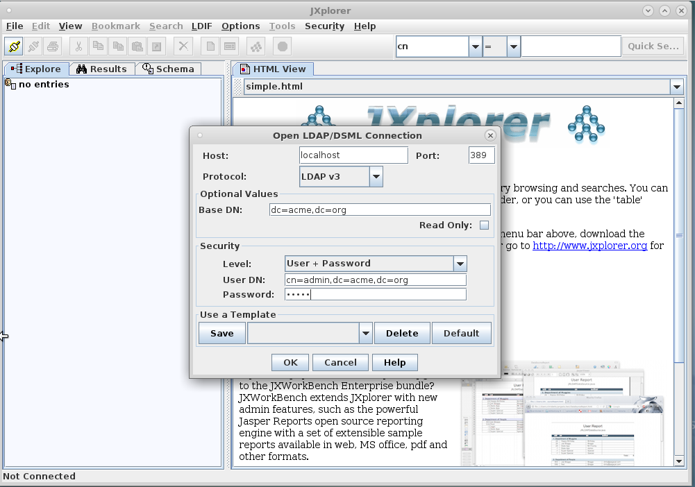

:scrollbar:
:data-uri:
:toc2:

== LDAP Lab

The out-of-the-box installations of Business Central and Process Server use properties files to manage users and roles. This makes it easier to get started with the JBoss BPM Suite platform, but it is not suitable for an enterprise deployment.

In most enterprises, users and roles are managed centrally, using a central user directory such as LDAP. You can configure Business Central and Process Server to use a central user directory for authentication and authorization. Both components delegate the handling of authentication and authorization to the security subsystem of the underlying application server, which is based on JAAS.

As a result, if you want to use, for example, an LDAP server for authentication and authorization, you must configure the application server to use a login module implementation for LDAP rather than for the default server.

.Goal

* Configure Business Central and Process Server to use an LDAP server for authentication and authorization

:numbered:

== Configure LDAP Server

In this first part of the lab, you configure an LDAP server to use secure communications with TLS, and add users and groups.

OpenLDAP, an open-source LDAP server, is installed and enabled on the VM. It is configured as follows:

* Bind CN: `admin`
* Base DN: `dc=acme,dc=org`
* Bind password: `admin`
* Organizational units (OUs): `users` and `groups`.

The VM also contains JXplorer, an open-source LDAP browser.

=== Verify LDAP Installation

In this section, to verify that OpenLDAP is correctly installed and running, you use the JXplorer browser to connect to it.

. On the VM, open a terminal window, change to the lab directory, and launch JXplorer:
+
[source,text]
----
$ cd /home/jboss/lab
$ ./start-jxplorer.sh
----

. On the JXplorer main window, select *File > Connect* menu option.
. In the resulting window, enter these values:
* *Host* `localhost`
* *Port*: `389`
* *Protocol*: `LDAP v3`
* *Base DN*: `dc=acme,dc=org`
* *Security Level*: `User + Password`
* *User DN*: `cn=admin,dc=acme,dc=org`
* *Password*: `admin`
+

. Click *OK*.

* Expect to see the base structure of the LDAP tree.
* Note that the `users` and `groups` groups are empty:
+
image::images/jxplorer-tree.png[]

. Close JXplorer.

=== Configure OpenLDAP for TLS

In a real-world environment, the LDAP server requires secure communication over TLS/SSL. In this section, you set up the OpenLDAP server to use TLS. This involves creating certificates, including your own CA certificate, and importing them into the OpenLDAP certification store.

. In the VM, open a terminal window and change to the `ssl` directory in the lab folder:
+
[source,text]
----
$ cd /home/jboss/lab/ssl
----

* The `ssl` directory contains an `openssl` configuration file along with the required directories and supporting files to sign certificate requests with your own CA.

. Generate a private key and a CA certificate using `openssl`:
+
[source,text]
----
$ openssl genrsa -out private/acme-ca.key -des3 2048
$ openssl req -new -x509 -key private/acme-ca.key -days 365 -out acme-ca.crt -subj "/CN=ACME Certification Authority"
----
* When prompted for a passphrase, enter one and remember it. You use it again later in the lab.
+
[IMPORTANT]
If you change the names or location of the private key and CA certificate, you need to revise the corresponding values in the `ca.cnf` configuration file.

. Create a private key and a certificate signing request for the OpenLDAP server:
+
[source,text]
----
$ openssl genrsa -out ldap.key 2048
$ openssl req -new -key ldap.key -out ldap.csr -subj "/CN=localhost"
----
+
[IMPORTANT]
Make sure  that the CN of the certificate matches the hostname of the LDAP server. In the lab environment, you use `localhost`.

. Sign the certificate signing request with the CA certificate:
+
[source,text]
----
$ openssl ca -config ca.cnf -out ldap.crt -infiles ldap.csr
----

. Create a pkcs12 certificate archive from the signed certificate and the private key:
+
[source,text]
----
$ openssl pkcs12 -inkey ldap.key -in ldap.crt -export -out ldap.p12 -nodes -name 'LDAP-Certificate'
----

* When prompted for a passphrase, enter one and remember it. You use it again later in the lab.

. Import the LDAP server certificate into the certificate directory of the OpenLDAP server, and then create a certified database and a file that holds the password to the database:
+
[source,text]
----
$ sudo rm -rf /etc/openldap/certs/*
$ sudo sh -c "echo <pkcs12 passphrase> > /etc/openldap/certs/password"
$ sudo chown root:ldap /etc/openldap/certs/password
$ sudo chmod 640 /etc/openldap/certs/password
$ sudo modutil -force -create -dbdir /etc/openldap/certs
$ sudo chmod 644 /etc/openldap/certs/cert8.db /etc/openldap/certs/key3.db /etc/openldap/certs/secmod.db
$ sudo certutil -d /etc/openldap/certs -A -n "CA Certificate" -t TCu,Cu,Tuw -a -i /home/jboss/lab/ssl/acme-ca.crt
$ sudo modutil -dbdir /etc/openldap/certs -force -changepw 'NSS Certificate DB' -newpwfile /etc/openldap/certs/password
$ sudo pk12util -i /home/jboss/lab/ssl/ldap.p12 -d /etc/openldap/certs -k /etc/openldap/certs/password -w /etc/openldap/certs/password
----
* Replace "<pkcs12 passphrase>" with the passphrase of the pkcs12 certificate archive.
* When prompted for your password, enter the password for the `jboss` user.

. Configure the OpenLDAP server to use the certificate directory.
* The `/home/jboss/lab/ldif` directory contains a file named `tls.ldif`.

.. Review the `tls.ldif` file, noting the value of the `olcTLSCertificateFile` attribute, which matches the name of the certificate in the pkcs12 certificate file.

.. Apply the `tls.ldif` file to the OpenLDAP server:
+
[source,text]
----
$ sudo ldapmodify -H ldapi:// -Y EXTERNAL -f /home/jboss/lab/ldif/tls.ldif
----

. Restart the OpenLDAP server:
+
[source,text]
----
$ sudo systemctl restart slapd
----

. Verify the LDAP configuration with JXplorer:
.. Start JXplorer.
.. Click *Connect*, and in the resulting connection dialog enter these values:
* *Host*: `localhost`
* *Port*: `636`
* *Protocol*: `LDAP v3`
* *Base DN*: `dc=acme,dc=org`
* *Security Level*: `SSL + User + Password`
* *User DN*: `cn=admin,dc=acme,dc=org`
* *Password*: `admin`
+
image::images/jxplorer-login-ssl.png[]

.. Click *OK*.
.. In the resulting dialog, choose *Always*:
+
image::images/jxplorer-login-ca.png[]

* This imports the CA certificate in the truststore of the JXplore tool.

.. Verify that you can log in to the LDAP server.

=== Import Users and Roles into LDAP Server

Users and groups can be imported into the LDAP server with JXplorer.

. If JXplorer is not running and connected to the LDAP server, launch and connect it using the connection settings detailed in the previous section.

. In the JXplorer menu, click *LDIF -> Import File*, select the `home/jboss/ldap/ldif/users.ldif` file and click *Import*:
+
image::images/jxplorer-import.png[]

. Repeat the same procedure to import the `home/jboss/ldap/ldif/groups.ldif` file.
+
[NOTE]
The result is a LDAP schema where both users and groups exist on the LDAP server as first-class entries, and group membership is stored in attributes on the group. This schema conforms with RFC 2307 and is widely used in UNIX/Linux environments. Active Directory typically uses an alternative schema, where group membership is stored as attributes on the user.

== Configure Business Central

In this section, you configure Business Central to use LDAP rather than the default properties files for authentication and authorization.

The steps include configuring a security domain on the underlying JBoss EAP application server that points to the LDAP server, and configuring the Business Central application to use this security domain rather than the default one.

=== Launch JBoss BPM Suite in Admin Mode

. If a Business Central instance is running in JBoss BPM Suite, shut it down.

. Open a terminal window, change to the `bin` directory of the Business Central installation, and start the server in `admin` mode:
+
[source,text]
----
$ cd ~/lab/bpms/bc/bin
$ ./standalone.sh --admin-only
----

=== Create New Security Domain

. Open a second terminal window, navigate to the `bin` directory of the Business Central installation, and start the JBoss EAP CLI:
+
[source,text]
----
$ cd ~/lab/bpms/bc/bin
$ ./jboss-cli.sh --connect
[standalone@localhost:9990 /]
----

. At the JBoss EAP CLI prompt, enter the following commands:
+
[source,text]
----
[standalone@localhost:9990 /]/subsystem=security/security-domain=bpms:add(cache-type=default)
----
+
[source,text]
----
[standalone@localhost:9990 /]/subsystem=security/security-domain=bpms/authentication=classic:add(login-modules=[{"code"=>"org.jboss.security.auth.spi.LdapExtLoginModule","flag"=>"required","module-options"=>[("java.naming.provider.url"=>"ldaps://localhost:636"),("java.naming.factory.initial"=>"com.sun.jndi.ldap.LdapCtxFactory"),("java.naming.security.authentication"=>"simple"),("bindDN"=>"cn=admin,dc=acme,dc=org"),("bindCredential"=>"admin"),("baseCtxDN"=>"dc=acme,dc=org"),("baseFilter"=>"(uid={0})"),("rolesCtxDN"=>"dc=acme,dc=org"),("roleFilter"=>"(member={1})"),("roleNameAttributeID"=>"cn"),("roleRecursion"=>"0"),("roleAttributeIsDN"=>"true"),("searchScope"=>"SUBTREE_SCOPE")]}])
----

* These commands create a new security domain named `bpms`, which uses the `org.jboss.security.auth.spi.LdapExtLoginModule` JAAS login module implementation. This class is part of the login modules shipped with JBoss EAP. It uses searches to locate both the user to bind (during authentication) and the associated roles. Note that roles correspond to groups in LDAP.

* The login module has a number of properties to configure to match the LDAP schema structure. These properties are fully documented in the JavaDocs of the class. Pay particular attention to the following properties, and try to relate them to the LDAP schema:

** `baseFilter`: Search filter to locate the user to authenticate. The input username is substituted in the filter anywhere an "{0}" expression is seen. For the lab, you use `(uid={0})`, which means that the username used to log in corresponds to the UID attribute of the user.
** `roleNameAttributeID`: Role attribute that contains the name of the role. In the LDAP schema this is the `cn` attribute. This requires the `roleAttributeIsDN` to be set to `true`.
** `roleFilter`: Search filter used to locate the roles associated with the authenticated user. The input username is substituted into the filter anywhere a "{0}" expression is seen. The authenticated user DN is substituted into the filter anywhere a "{1}" is seen. In the LDAP, schema group memberships uses the `member` attribute that contains one or more DNs. Hence the role filter to use is `(member={1})`.
** `roleRecursion`: Recursion level for role searches. The LDAP schema does not contain subgroups, so you can leave this value as `0`.

. Exit from the CLI prompt (type `exit`), and shut down the application server.
+
[TIP]
If you want to review the changes you made to the server configuration file, open `/home/jboss/lab/bpms/bc/standalone/configuration/standalone.xml` in a text editor and review the `security` subsystem.

. Shut down the Business Central application server.

=== Switch to New Security Domain

In this section, you configure the Business Central application to use the `bpms` security domain instead of the default `other` domain, which uses properties files for users and roles.

. Open a terminal window and enter the following command:
+
[source,text]
----
$ sed -i "s'<security-domain>other</security-domain>'<security-domain>bpms</security-domain>'" /home/jboss/lab/bpms/bc/standalone/deployments/business-central.war/WEB-INF/jboss-web.xml
----

. If you completed the Single Sign-On lab, revert the authentication method used by the Business Central application to `BASIC`:
+
[source,text]
----
$ sed -i "s'<auth-method>KEYCLOAK</auth-method>'<auth-method>BASIC</auth-method>'" /home/jboss/lab/bpms/bc/standalone/deployments/business-central.war/WEB-INF/web.xml
----

. Create a certificate truststore containing the CA certificate using the JDK `keytool` utility and store the truststore in the application server's configuration directory:
+
[source,text]
----
$ keytool -importcert -file /home/jboss/lab/ssl/acme-ca.crt -alias acme-ca -keystore /home/jboss/lab/bpms/bc/standalone/configuration/truststore.jks
----
* When prompted for a passphrase, enter one and remember it. You use it again later in the lab.

. Configure the application server to use the truststore, replacing "<truststore password>" with the password for your truststore:
+
[source,text]
----
$ echo 'JAVA_OPTS="$JAVA_OPTS -Djavax.net.ssl.trustStore=/home/jboss/lab/bpms/bc/standalone/configuration/truststore.jks"' >> /home/jboss/lab/bpms/bc/bin/standalone.conf
$ echo 'JAVA_OPTS="$JAVA_OPTS -Djavax.net.ssl.trustStorePassword=<truststore password>"' >> /home/jboss/lab/bpms/bc/bin/standalone.conf
----

=== Restart Business Central and Verify LDAP Setup

. Restart the Business Central application:
+
[source,text]
----
$ cd /home/jboss/lab/bpms/bc/bin
$ ./standalone.sh
----

. Once the server is started up, open a web browser, navigate to `localhost:8080/business-central`, and log in with the `admin1/admin` user.
* Expect to be able to log in successfully.

. Log out and try to log in with one of the users created in the LDAP directory--for example, `user2/user`.

* Expect to be able to login successfully.

. Check the role of the user in Business Central:
+
image::images/business-central-ldap-user.png[]

* The user has only the `user` role, in line with the group definitions defined in the LDAP server (only roles pertinent to Business Central security are shown, so `group2` and `kie-server` are not displayed).

* Business Central is now configured to use LDAP for user authentication and authorization.

. Shut down Business Central--you do not need it for the remainder of this lab.

== Configure Process Server

The steps to configure Process Server to use LDAP instead of the default properties file for authentication and authorization are nearly identical to those for Business Central.

. Connect to the Process Server instance on the VM through the JBoss EAP CLI:
+
[source,text]
----
$ ./jboss-cli.sh --connect --controller=127.0.0.1:10140
----
* The Process Server instance on the VM uses a port offset of `150`.

. Make the necessary adjustments to the correct installation.

* The home of the Process Server instance on the VM is `/home/jboss/lab/bpms/kieserver`.

. When Process Server is configured, start the Process Server instance:
+
[source,text]
----
$ cd /home/jboss/lab/bpms/kieserver/bin
$ ./standalone.sh
----

. Verify that you can log in successfully to Process Server with the `admin1:admin` user:
+
[source,text]
----
$ curl -X GET -H "Accept: application/json" --user admin1:admin 'http://localhost:8230/kie-server/services/rest/server/'
----

. Try using other users created in the LDAP server, for example `user2:user`.

* When using `jboss:bpms`, expect to receive a 401 (Unauthorized) HTTP status code.

== Use Process Server to Bypass Authenticated User

In JBoss BPM Suite, user information and relationships ("what groups does the user belong to") are not stored in the database. Instead JBoss BPM Suite uses a callback mechanism to fetch this information whenever it is required, which is basically whenever an operation against the User Task service is performed. By default, JBoss BPM Suite uses a callback implementation that obtains the user information from the security system of the application server. In other words, it uses the user and role information as stored in the security principal of the authenticated user. As a result, JBoss BPM Suite is able to resolve users and groups even if the underlying security mechanism used by the application server is changed to another implementation.

Process Server can be configured to bypass the authenticated user. In this case, you log in with a _system user_ and pass the username as a query parameter to the remote API to specify the user on whose behalf an operation is executed. When bypassing the authenticated user, the default callback implementation does not work, as it would return data for the system user (which is the authenticated user), instead of the `proxied` user.

In this section, you set up Process Server to bypass the authenticated user, and use LDAP to resolve user and group information for the `proxied` users.

JBoss BPM Suite comes with a number of implementations of the `usergroup` callback. One of these implementations uses LDAP to retrieve user and group information.

=== Configure Process Server to Bypass Authenticated User

. If Process Server is running, shut it down.

. Revert the Process instance to use the default authentication mechanism:
+
[source,text]
----
$ sed -i "s'<security-domain>bpms</security-domain>'<security-domain>other</security-domain>'" /home/jboss/lab/bpms/kieserver/standalone/deployments/kie-server.war/WEB-INF/jboss-web.xml
----
* The `jboss` user defined in the user properties files is designated as the system user.

. Configure Process Server to bypass the authenticated user by passing a system property to the server at startup:
+
[source,text]
----
$ sed -i "s'^.*org\.kie\.server\.bypass\.auth\.user.*$''g" /home/jboss/lab/bpms/kieserver/bin/standalone.conf #remove existing setting
$ echo 'JAVA_OPTS="$JAVA_OPTS -Dorg.kie.server.bypass.auth.user=true"' >> /home/jboss/lab/bpms/kieserver/bin/standalone.conf
----

. Enable the `userinfo` callback in the Process Server configuration:
+
[source,text]
----
$ sed -i "s'^.*org\.jbpm\.ht\.callback.*$''g" /home/jboss/lab/bpms/kieserver/bin/standalone.conf #remove existing setting
$ sed -i "s'^.*org\.jbpm\.ht\.userinfo.*$''g" /home/jboss/lab/bpms/kieserver/bin/standalone.conf #remove existing setting
$ echo 'JAVA_OPTS="$JAVA_OPTS -Dorg.jbpm.ht.callback=ldap"' >> /home/jboss/lab/bpms/kieserver/bin/standalone.conf
$ echo 'JAVA_OPTS="$JAVA_OPTS -Dorg.jbpm.ht.userinfo=ldap"' >> /home/jboss/lab/bpms/kieserver/bin/standalone.conf
----

. Configure Process Server to use the LDAP `usergroup` callback implementation through a properties file, leveraging the `userinfo` callback implementation:
+
[source,text]
----
$ sed -i "s'^.*jbpm\.usergroup\.callback\.properties.*$''g" /home/jboss/lab/bpms/kieserver/bin/standalone.conf #remove existing setting
$ sed -i "s'^.*jbpm\.user\.info\.properties.*$''g" /home/jboss/lab/bpms/kieserver/bin/standalone.conf #remove existing setting
$ echo 'JAVA_OPTS="$JAVA_OPTS -Djbpm.usergroup.callback.properties=file:/home/jboss/lab/bpms/kieserver/standalone/configuration/jbpm-usergroup-callback.properties"' >> /home/jboss/lab/bpms/kieserver/bin/standalone.conf
$ echo 'JAVA_OPTS="$JAVA_OPTS -Djbpm.user.info.properties=file:/home/jboss/lab/bpms/kieserver/standalone/configuration/jbpm-usergroup-callback.properties"' >> /home/jboss/lab/bpms/kieserver/bin/standalone.conf
----
* The `userinfo` callback obtains email addresses from users (needed when using User Tasks with notifications).
* The `usergroup` callback configuration is similar to the configuration of the login module you already used in this lab.

. Create the configuration file for the `usergroup` callback implementation by creating a text file called `jbpm-usergroup-callback.properties` in the `/home/jboss/lab/bpms/kieserver/standalone/configuration` directory:
+
[source,text]
----
$ touch /home/jboss/lab/bpms/kieserver/standalone/configuration/jbpm-usergroup-callback.properties
$ pluma /home/jboss/lab/bpms/kieserver/standalone/configuration/jbpm-usergroup-callback.properties
----

. Set the contents of the file to:
+
[source,text]
----
ldap.bind.user=cn=admin,dc=acme,dc=org
ldap.bind.pwd=admin
ldap.user.ctx=dc=acme,dc=org
ldap.role.ctx=dc=acme,dc=org
ldap.user.roles.ctx=dc=acme,dc=org
ldap.user.filter=(uid={0})
ldap.role.filter=(cn={0})
ldap.user.roles.filter=(member={0})
ldap.user.attr.id=uid
ldap.roles.attr.id=cn
ldap.user.id.dn=false
ldap.search.scope=SUBTREE_SCOPE

java.naming.provider.url=ldaps://localhost:636
java.naming.security.authentication=simple
java.naming.factory.initial=com.sun.jndi.ldap.LdapCtxFactory
----

* The configuration settings are nearly the same as the login module, but note these subtle differences:

** `ldap.role.filter`: Search filter used to determine the existence of a role (or group). In the LDAP schema, the name of the group is the `cn`.
** `ldap.user.roles.filter`: Search filter to find the groups to which the user belongs. Note that the implementation does not support recursion. So in the case of nested groups, only the groups that actually contain the user--not the super groups--are returned.

. Save the file.

=== Verify New Process Server Configuration

. Start Process Server:
+
[source,text]
----
$ cd /home/jboss/lab/bpms/kieserver/bin
$ ./standalone.sh
----

. Verify that you can log in successfully with the `jboss:bpms` user:
+
[source,text]
----
$ curl -X GET -H "Accept: application/json" --user jboss:bpms 'http://localhost:8230/kie-server/services/rest/server/'
----
* In contrast, expect not to be able to log in with any of the users defined in LDAP--for example, `admin1/admin` and `user2/user`.

. Test that the settings for the `usergroup` callback work as expected with the ticket application used in the _Single Sign-On Lab_:
+
[source,text]
----
$ curl -X GET -H "Accept: application/json" --user jboss:bpms 'http://localhost:8230/kie-server/services/rest/server/containers'
----
* If you completed that lab, the ticket application is likely still deployed.

* If the ticket application is deployed, expect to see a response similar to this:
+
[source,json]
----
{
  "type" : "SUCCESS",
  "msg" : "List of created containers",
  "result" : {
    "kie-containers" : {
      "kie-container" : [ {
        "status" : "STARTED",
        "messages" : [ {
          "severity" : "INFO",
          "timestamp" : 1480149038808,
          "content" : [ "Container ticket-app successfully created with module com.redhat.gpte.bpms-advanced-infrastructure:ticket-kjar:1.0." ]
        } ],
        "container-id" : "ticket-app",
        "release-id" : {
          "version" : "1.0",
          "group-id" : "com.redhat.gpte.bpms-advanced-infrastructure",
          "artifact-id" : "ticket-kjar"
        },
        "resolved-release-id" : {
          "version" : "1.0",
          "group-id" : "com.redhat.gpte.bpms-advanced-infrastructure",
          "artifact-id" : "ticket-kjar"
        },
        "config-items" : [ ]
      } ]
    }
  }
}
----

. If the ticket application is not deployed, build it locally with `mvn install` and deploy it:
+
[source,text]
----
$ curl -X PUT 'http://localhost:8230/kie-server/services/rest/server/containers/ticket-app' \
-H "Accept: application/json" \
-H "Content-type: application/json" \
--user jboss:bpms
-d '{"release-id" : {"group-id" : "com.redhat.gpte.bpms-advanced-infrastructure", "artifact-id" : "ticket-kjar", "version" : "1.0" } }'
----

. Start a process instance of the ticket process, and assign the task in the process to `group2`:
+
[source,text]
----
$ curl -X POST 'http://localhost:8230/kie-server/services/rest/server/containers/ticket-app/processes/ticket/instances' \
-H "Accept: application/json" \
-H "Content-type: application/json" \
--user jboss:bpms
-d '{"project" : "my project", "subject" : "important ticket", "description" : "very important ticket", "groups" : "group2"}'
----

. Verify that `user2` is a potential owner for the task you created:
+
[source,text]
----
$ curl -X GET 'http://localhost:8230/kie-server/services/rest/server/queries/tasks/instances/pot-owners?page=0&pageSize=10&user=user2' \
-H "Accept: application/json" \
-H "Content-type: application/json" \
--user jboss:bpms
----
* You log in with the `jboss` user, and pass `user2` as a query parameter.
* Expect the response to look similar to this:
+
[source,json]
----
{
  "task-summary" : [ {
    "task-id" : 1,
    "task-name" : "TicketTask",
    "task-subject" : "",
    "task-description" : "my project::important ticket",
    "task-status" : "Ready",
    "task-priority" : 0,
    "task-is-skipable" : true,
    "task-created-on" : 1480149662573,
    "task-activation-time" : 1480149662573,
    "task-proc-inst-id" : 1,
    "task-proc-def-id" : "ticket",
    "task-container-id" : "ticket-app",
    "task-parent-id" : -1
  } ]
}
----

. Execute the same command for `user1` or `user3`.
* Expect this to return an empty list.

. Verify that the task can now be claimed by `user2`:
+
[source,text]
----
$ curl -X GET 'http://localhost:8230/kie-server/services/rest/server/containers/ticket-app/tasks/1/states/claimed?user=user2' \
-H "Accept: application/json" \
-H "Content-type: application/json" \
--user jboss:bpms
----
* You log in as `jboss` and pass `user2` as the query parameter.

. Try to start the task as `user1`:
+
[source,text]
----
$ curl -X GET 'http://localhost:8230/kie-server/services/rest/server/containers/ticket-app/tasks/1/states/started?user=user1' \
-H "Accept: application/json" \
-H "Content-type: application/json" \
--user jboss:bpms
----

* Expect to receive an error:
+
[source,text]
----
Unexpected error during processing: User '[UserImpl:'user1']' does not have permissions to execute operation 'Start' on task id 1
----

. Complete the task and process instance as `user2`:
+
[source,text]
----
$ curl -X GET 'http://localhost:8230/kie-server/services/rest/server/containers/ticket-app/tasks/1/states/completed?user=user2' \
-H "Accept: application/json" \
-H "Content-type: application/json" \
--user jboss:bpms
----

You successfully integrated JBoss BPM Suite's Business Central and Process Server with an LDAP server for authentication, authorization, and resolving users and groups.
