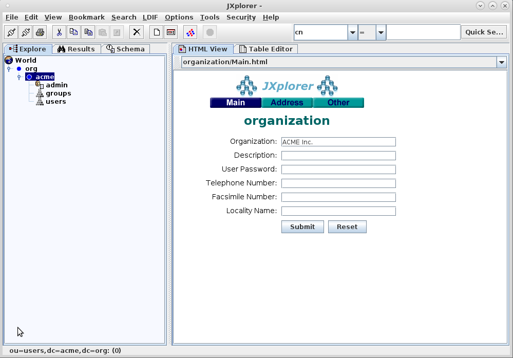
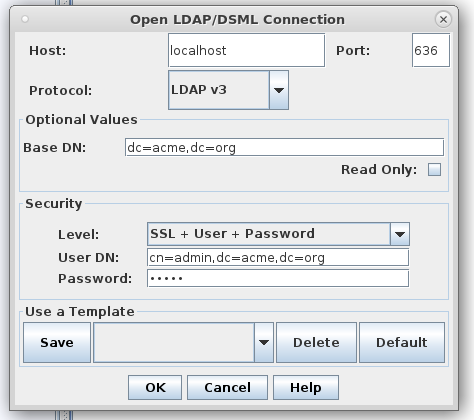
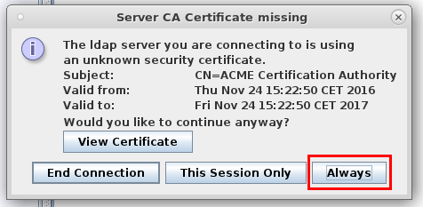
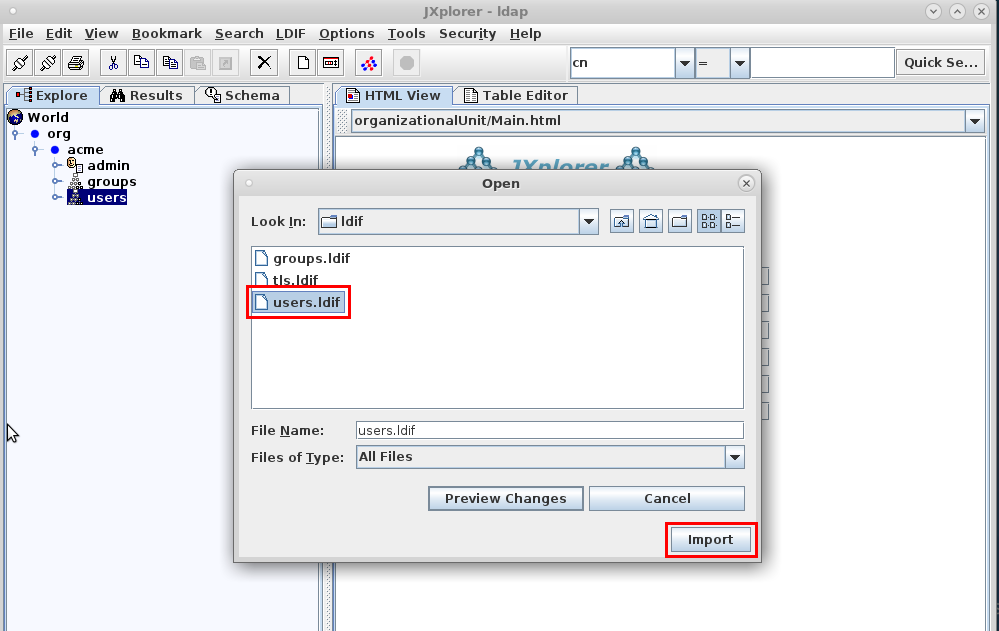
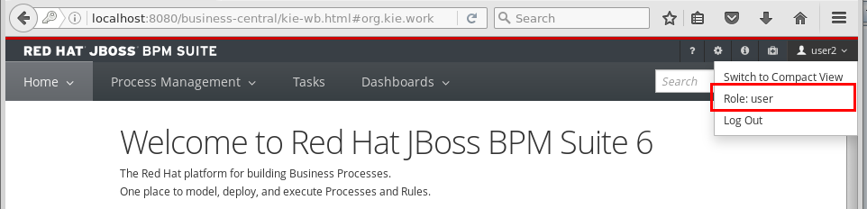

:scrollbar:
:data-uri:
:toc2:

== LDAP Lab

The out-of-the-box installation of Business Central and Process Server use properties files for the management of users and roles. Although this effectively reduces the barrier to getting started with the JBoss BPM Suite platform, it is not suitable for an enterprise deployment.

In most enterprises, users and roles are managed centrally, using a central user directory such as LDAP. You can configure both Business Central and Process Server to use a central user directory for authentication and authorization. Both components delegate the handling of authentication and authorization to the security subsystem of the underlying application server, which is based on JAAS.

As a result, if you want to use, for example, an LDAP server for authentication and authorization, you must configure the application server to use a login module implementation for LDAP rather than for the default server.

.Goal

* Configure Business Central and Process Server to use a LDAP server for authentication and authorization.

:numbered:

== Configure the LDAP server

OpenLDAP, an open-source LDAP server, is installed and enabled on the virtual machine (VM). It has been configured as follows:

* Bind CN: admin
* Base DN: dc=acme,dc=org
* Bind password: admin
* Organizational Units `users` and `groups`.

The virtual machine also contains JXplorer, an open-source LDAP browser.

We first will configure the LDAP server to use secure communications with TLS, and add users and groups.

=== Verify the LDAP installation

To verify that OpenLDAP is correctly installed and running, use the JXplorer tool to connect to OpenLDAP.

. On the VM, open a terminal window and change to the lab directory. Launch JXplorer:
+
[source,text]
----
$ cd /home/jboss/lab
$ ./start-jxplorer.sh
----
. On the JXplorer main window, click on the *Connect* button on the right of the menu bar, and enter the following values in the pop-up window:
* *Host:* localhost
* *Port:* 389
* *Protocol:* LDAP v3
* *Base DN:* dc=acme,dc=org
* *Security Level:* User + Password
* *User DN:* cn=admin,dc=acme,dc=org
* *Password:* admin
+
image::images/jxplorer-login.png[]
+
Click `OK`.
. Expect to see the base structure of the LDAP tree. Note that the _users_ and _groups_ groups are empty for the moment.
+

. Close the JXplorer tool.

=== Configure OpenLDAP for TLS

In a real world environment, the LDAP server will most certainly require secure communication over TLS/SSL. In the next section you set up the OpenLDAP server to use TLS. This involves creating certificates, including your own CA certificate, and importing these into the OpenLDAP certification store.

. On the VM, open a terminal window, and change to the `ssl` directory in the lab folder:
+
----
$ cd /home/jboss/lab/ssl
----
+
The `ssl` directory contains an openssl configuration file and the required directories and supporting files to sign certificate requests with your own CA.
. Using the `openssl` tool, generate a private key and a CA certificate.
+
----
$ openssl genrsa -out private/acme-ca.key -des3 2048
$ openssl req -new -x509 -key private/acme-ca.key -days 365 -out acme-ca.crt -subj "/CN=ACME Certification Authority"
----
* When prompted for a passphrase, enter one, and remember it. You use it again later in the lab.
* Note: if you change the names or location of the private key and CA certificate, you need to adapt the corresponding values in the `ca.cnf` configuration file.
. Create a private key and a certificate signing request for the OpenLDAP server. It is important that the CN of the certificate matches the hostname of the LDAP server. In your lab environment, you use `localhost`.
+
----
$ openssl genrsa -out ldap.key 2048
$ openssl req -new -key ldap.key -out ldap.csr -subj "/CN=localhost"
----

. Sign the Certificate Signing Request with the CA certificate:
+
----
$ openssl ca -config ca.cnf -out ldap.crt -infiles ldap.csr
----
. Create a _pkcs12_ certificate archive from the signed certificate and the private key.
+
----
$ openssl pkcs12 -inkey ldap.key -in ldap.crt -export -out ldap.p12 -nodes -name 'LDAP-Certificate'
----
* When prompted for a passphrase, enter one, and remember it. You use it again later in the lab.

. Import the LDAP server certificate into the certificate directory of the OpenLDAP server. This involves creating a certificate database, and a file that holds the password to the database.
+
Execute the following commands with sudo. When prompted for your password, enter the password for the `jboss` user. Replace <pkcs12 pasphrase> with the passphrase of the pkcs12 certificate archive.
+
----
$ sudo rm -rf /etc/openldap/certs/*
$ sudo sh -c "echo <pkcs12 passphrase> > /etc/openldap/certs/password"
$ sudo chown root:ldap /etc/openldap/certs/password
$ sudo chmod 640 /etc/openldap/certs/password
$ sudo modutil -force -create -dbdir /etc/openldap/certs
$ sudo chmod 644 /etc/openldap/certs/cert8.db /etc/openldap/certs/key3.db /etc/openldap/certs/secmod.db
$ sudo certutil -d /etc/openldap/certs -A -n "CA Certificate" -t TCu,Cu,Tuw -a -i /home/jboss/lab/ssl/ldap.crt
$ sudo modutil -dbdir /etc/openldap/certs -force -changepw 'NSS Certificate DB' -newpwfile /etc/openldap/certs/password
$ sudo pk12util -i /home/jboss/lab/ssl/ldap.p12 -d /etc/openldap/certs -k /etc/openldap/certs/password -w /etc/openldap/certs/password
----
. Configure the OpenLDAP server to use the certificate directory
.. The `/home/jboss/ldap/ldif` directory contains a file named `tls.ldif`. Review the file. Pay attention to the value of the `olcTLSCertificateFile` attribute, which matches the name of the certificate in the pkcs12 certificate file.
.. Apply the ldif file to the OpenLDAP server:
+
----
$ sudo ldapmodify -H ldapi:// -Y EXTERNAL -f /home/jboss/lab/ldif/tls.ldif
----
. Restart the OpenLDAP server
+
----
$ sudo systemctl restart sldapd
----
. Verify the LDAP configuration with JXplorer
.. Start JXplorer
.. Click the `Connect` button, and fill in the following values in the connecton pop-up window:
* *Host:* localhost
* *Port:* 636
* *Protocol:* LDAP v3
* *Base DN:* dc=acme,dc=org
* *Security Level:* SSL + User + Password
* *User DN:* cn=admin,dc=acme,dc=org
* *Password:* admin
+

+
.. Click `OK`. In the next pop-up window, choose `Always`. This will import the CA certificate in the truststore of the JXplore tool.
+

.. Check that you can login into the LDAP server.

=== Import users and roles into the LDAP server.

Users and Groups can be imported into the LDAP server with JXplorer.

. If necessary, start the JXplorer tool and connect to the LDAP server using the connection settings as detailed in the previous section.
. In the JXplorer menu, click on the *LDIF -> Import File* menu, and select the `home/jboss/ldap/ldif/users.ldif` file. Click *Import*.
+

. Repeat the same procedure to import the `home/jboss/ldap/ldif/groups.ldif` file.
. The result is a LDAP schema where both users and groups exist on the LDAP server as first-class entries, and group membership is stored in attributes on the group. This schema follows to RFC 2307 and is widely used in UNIX/Linux environments. Active Directory typically uses an alternative schema, where group membership is stored as attributes on the user.

== Business Central configuration

Now you configure Business Central to use LDAP rather than the default properties files for authentication and authorization.

The steps include configuring a security domain on the underlying EAP application server pointing to the LDAP server, and configuring the Business Central application to use this security domain rather than the default one.

. If needed, shut down the BPM Suite instance running Business Central.
. Start the server in _admin_ mode. +
Open a terminal window, change to the `bin` directory of the Business Central installation, and start the server:
+
----
$ cd ~/lab/bpms/bc/bin
$ ./standalone.sh --admin-only
----
. Open a second terminal window, navigate to the `bin` directory of the Business Central installation, and start the EAP CLI.
+
----
$ cd ~/lab/bpms/bc/bin
$ ./jboss-cli.sh --connect
[standalone@localhost:9999 /]
----
. At the EAP CLI prompt, enter the following commands:
+
----
[standalone@localhost:9999 /]/subsystem=security/security-domain=bpms:add(cache-type=default)
----
+
----
[standalone@localhost:9999 /]/subsystem=security/security-domain=bpms/authentication=classic:add(login-modules=[{"code"=>"org.jboss.security.auth.spi.LdapExtLoginModule","flag"=>"required","module-options"=>[("java.naming.provider.url"=>"ldaps://localhost:636"),("java.naming.factory.initial"=>"com.sun.jndi.ldap.LdapCtxFactory"),("java.naming.security.authentication"=>"simple"),("bindDN"=>"cn=admin,dc=acme,dc=org"),("bindCredential"=>"admin"),("baseCtxDN"=>"dc=acme,dc=org"),("baseFilter"=>"(uid={0})"),("rolesCtxDN"=>"dc=acme,dc=org"),("roleFilter"=>"(member={1})"),("roleNameAttributeID"=>"cn"),("roleRecursion"=>"0"),("roleAttributeIsDN"=>"true"),("searchScope"=>"SUBTREE_SCOPE")]}])
----

* These commands create a new security domain named `bpms`, which uses the `org.jboss.security.auth.spi.LdapExtLoginModule` JAAS login module implementation. This class is part of the login modules shipped with EAP. It uses searches for locating both the user to bind as for authentication as well as the associated roles. Note that roles correspond to groups in LDAP.

* The login module has a number of properties to configure to match the LDAP schema structure. These properties are fully documented in the JavaDocs of the class. Pay particular attention to the following properties, and try to relate them to the LDAP schema:

** _baseFilter_: the search filter to locate the user to authenticate. The input username is substituted in the filter anywhere an "{0}" expression is seen. For the lab, you use `(uid={0})`, which means that the username used to log in corresponds to the uid attribute of the user.
** _roleNameAttributeID_ : the role attribute that contains the name of the role. In the LDAP schema this is the `cn` attribute. Requires the _roleAttributeIsDN_ to be set to `true`.
** _roleFilter_ : A search filter used to locate the roles associated with the authenticated user. The input username will be substituted into the filter anywhere a "{0}" expression is seen. The authenticated user DN will be substituted into the filter anywhere a "{1}" is seen. In the LDAP schema group memberships uses the `member` attribute which contains one or more DNs. Hence the role filter to use is `(member={1})`.
** _roleRecursion_ : recursion level for role searches. The LDAP schema does not contain subgroups, so you can leave this value to `0`.

. Exit from the CLI prompt (type `exit`), and shut down the application server. +
If you want to review the changes you made to the server configuration file, open `/home/jboss/lab/bpms/bc/standalone/configuration/standalone.xml` in a text editor, and review the `security` subsystem.
. Shut down the Business Central application server.
. Configure the Business Central application to use the `bpms` security domain. By default the application uses the `other` domain, which uses properties files for users and roles. +
Open a terminal window and enter the following command:
+
----
$ sed -i "s'<security-domain>other</security-domain>'<security-domain>bpms</security-domain>'" /home/jboss/lab/bpms/bc/standalone/deployments/business-central.war/WEB-INF/jboss-web.xml
----
. If you completed the Single Sign-On lab, you have to revert the authentication method used by the Business Central application to _BASIC_:
+
----
$ sed -i "s'<auth-method>KEYCLOAK</auth-method>'<auth-method>BASIC</auth-method>'" /home/jboss/lab/bpms/bc/standalone/deployments/business-central.war/WEB-INF/web.xml
----
. Using the JDK _keytool_ utility, create a certificate truststore containing the CA certificate. Store the truststore in the application server configuration directory.
+
----
$ keytool -importcert -file /home/jboss/lab/ssl/acme-ca.crt -alias acme-ca -keystore /home/jboss/lab/bpms/bc/standalone/configuration/truststore.jks
----

* When prompted for a passphrase, enter one, and remember it. You use it again later in the lab.

. Configure the application server to use the truststore. Replace `<truststore password>` with the password for your truststore.
+
----
$ echo 'JAVA_OPTS="$JAVA_OPTS -Djavax.net.ssl.trustStore=/home/jboss/lab/bpms/bc/standalone/configuration/truststore.jks"' >> /home/jboss/lab/bpms/bc/bin/standalone.conf
$ echo 'JAVA_OPTS="$JAVA_OPTS -Djavax.net.ssl.trustStorePassword=<truststore password>"' >> /home/jboss/lab/bpms/bc/bin/standalone.conf
----
. Start the Business Central application:
+
----
$ cd /home/jboss/lab/bpms/bc/bin
$ ./standalone.sh
----
+
. Once the server is started up, open a web browser, and navigate to localhost:8080/business-central. Log in with the `admin1/admin` user. Expect to be able to log in successfully.
. Log out and try to login with one of the users created in the LDAP directory, e.g. `user2/user`. Expect to be able to login successfully. Check the role of the user in Business Central. The user has only the `user` role, in line with the group definitions defined in the LDAP server (only roles pertinent to Business Central security are shown, so `group2` and `kie-server` are not displayed).
+

You have configured Business Central to use LDAP for user authentication and authorization. +
You don't need Business Central for the remainder of this lab, so you can shut it down.

== Process Server configuration

The steps to configure Process Server to use LDAP instead of the default properties file for authentication and authorization are nearly identical to those for Business Central.

Note that the Process Server instance on the virtual machine uses a port offset of 150, so to connect to it through the EAP CLI, you should use the command:

----
$ ./jboss-cli.sh --connect --controller=127.0.0.1:10149
----

Also make sure you make the adjustments to the correct installation. The home of the Process Server instance on the virtual machine is `/home/jboss/lab/bpms/kieserver`.

Once all steps to configure Process Server have been completed, start the Process Server instance:

----
$ cd /home/jboss/lab/bpms/kieserver/bin
$ ./standalone.sh
----

Check that you can log in successfully to Process Server with the user `admin1:admin` with the following curl command:

----
$ curl -X GET -H "Accept: application/json" --user admin1:admin 'http://localhost:8230/kie-server/services/rest/server/'
----

Feel free to try with other users created in the LDAP server (e.g. `user2:user`). Note that when using `jboss:bpms`, you receive a 401 error.

== Process Server and _bypass authenticated user_

In JBoss BPM Suite, user information and relationships ("what groups does the user belong to"), are not stored in the database. Instead BPM Suite uses a callback mechanism to fetch this information whenever it is required, which is basically whenever an operation against the User Task service is performed. By default, BPM Suite uses a callback implementation that obtains the user information from the security system of the application server. In other words, it uses the user and role information as stored in the security principal of the authenticated user. As a result, BPM Suite is still able to resolve users and groups, even if the underlying security mechanism used by the application server is changed to another implementation.

Process Server can be configured to bypass the authenticated user. In this case you login with a _system user_, and pass the username on which behalf an operation needs to be executed as a query parameter to the remote API. In this case, the default callback implementation won't work, as it would return the data for the system user (which is the authenticated user), instead of the _proxied_ user.

In this section ofd the lab you setup Process Server to bypass the authenticated user, and use LDAP to resolve user and group information for the _proxied_ users.

BPM Suite comes out of the box with a number of implementations of the usergroup callback. One of these implementations uses LDAP to retrieve user and group information.

. If needed, shut down the Process Server.
. Revert the Process instance to use the default authentication mechanism. You will use the `jboss` user defined in the user properties files as our system user.
+
----
$ sed -i "s'<security-domain>bpms</security-domain>'<security-domain>other</security-domain>'" /home/jboss/lab/bpms/kieserver/standalone/deployments/kie-server.war/WEB-INF/jboss-web.xml
----
. Configure the Process Server to use _bypass_authenticated_user_. This is done by passing a system property to the server at start-up.
+
----
$ sed -i "s'^.*org\.kie\.server\.bypass\.auth\.user.*$''g" /home/jboss/lab/bpms/kieserver/bin/standalone.conf #remove existing setting
$ echo 'JAVA_OPTS="$JAVA_OPTS -Dorg.kie.server.bypass.auth.user=true"' >> /home/jboss/lab/bpms/kieserver/bin/standalone.conf
----
. Configure the Process Server to use the LDAP usergroup callback implementation. We can use the same implementation for the userinfo callback, which is used to obtain email addresses from users (needed when using User Tasks with notifications).
+
----
$ sed -i "s'^.*org\.jbpm\.ht\.callback.*$''g" /home/jboss/lab/bpms/kieserver/bin/standalone.conf #remove existing setting
$ sed -i "s'^.*org\.jbpm\.ht\.userinfo.*$''g" /home/jboss/lab/bpms/kieserver/bin/standalone.conf #remove existing setting
$ echo 'JAVA_OPTS="$JAVA_OPTS -Dorg.jbpm.ht.callback=ldap"' >> /home/jboss/lab/bpms/kieserver/bin/standalone.conf
$ echo 'JAVA_OPTS="$JAVA_OPTS -Dorg.jbpm.ht.userinfo=ldap"' >> /home/jboss/lab/bpms/kieserver/bin/standalone.conf
----
. The LDAP usergroup callback requires configuration which is quite similar to the configuration of the login module you used earlier in this lab. This configuration is maintained in a properties file. Configure the Process Server to use this properties file.
+
----
$ sed -i "s'^.*jbpm\.usergroup\.callback\.properties.*$''g" /home/jboss/lab/bpms/kieserver/bin/standalone.conf #remove existing setting
$ sed -i "s'^.*jbpm\.user\.info\.properties.*$''g" /home/jboss/lab/bpms/kieserver/bin/standalone.conf #remove existing setting
$ echo 'JAVA_OPTS="$JAVA_OPTS -Djbpm.usergroup.callback.properties=file:/home/jboss/lab/bpms/kieserver/standalone/configuration/jbpm-usergroup-callback.properties"' >> /home/jboss/lab/bpms/kieserver/bin/standalone.conf
$ echo 'JAVA_OPTS="$JAVA_OPTS -Djbpm.user.info.properties=file:/home/jboss/lab/bpms/kieserver/standalone/configuration/jbpm-usergroup-callback.properties"' >> /home/jboss/lab/bpms/kieserver/bin/standalone.conf
----
. Finally create the configuration file for the usergroup callback implementation. Create a text file called `jbpm-usergroup-callback.properties` in the `/home/jboss/lab/bpms/kieserver/standalone/configuration` directory.
+
----
$ touch /home/jboss/lab/bpms/kieserver/standalone/configuration/jbpm-usergroup-callback.properties
$ pluma /home/jboss/lab/bpms/kieserver/standalone/configuration/jbpm-usergroup-callback.properties
----
+
Set the contents of the file to:
+
----
ldap.bind.user=cn=admin,dc=acme,dc=org
ldap.bind.pwd=admin
ldap.user.ctx=dc=acme,dc=org
ldap.role.ctx=dc=acme,dc=org
ldap.user.roles.ctx=dc=acme,dc=org
ldap.user.filter=(uid={0})
ldap.role.filter=(cn={0})
ldap.user.roles.filter=(member={0})
ldap.user.attr.id=uid
ldap.roles.attr.id=cn
ldap.user.id.dn=false
ldap.search.scope=SUBTREE_SCOPE

java.naming.provider.url=ldaps://localhost:636
java.naming.security.authentication=simple
java.naming.factory.initial=com.sun.jndi.ldap.LdapCtxFactory
----
+
The configuration settings are nearly the same as the login-module, but note these subtle differences:
+
* _ldap.role.filter_: search filter used to determine the existence of a role (or group). In the LDAP schema, the name of the group is the `cn`.
* _ldap.user.roles.filter_: search filter to find the groups to which the user belongs. Note that the implementation does not support recursion. So in the case of nested groups, only the groups which actually contains the user (not the super groups) will be returned.
+
Save the file.
. Start the Process Server:
+
----
$ cd /home/jboss/lab/bpms/kieserver/bin
$ ./standalone.sh
----
. Verify that you can login successfully with the user `jboss:bpms`:
+
----
$ curl -X GET -H "Accept: application/json" --user jboss:bpms 'http://localhost:8230/kie-server/services/rest/server/'
----
+
In contrast, you should not be able to login with any of the users defined in LDAP (e.g. `admin1/admin`, `user2/user`).
. To test that the settings for the usergroup callback work as expected, use the ticket application used in the Single Sign-On lab. If you completed that lab, the ticket appplication should still be deployed. Verify this with the following curl command:
+
----
$ curl -X GET -H "Accept: application/json" --user jboss:bpms 'http://localhost:8230/kie-server/services/rest/server/containers'
----
+
If the ticket app is deployed, expect to get the following response:
+
----
{
  "type" : "SUCCESS",
  "msg" : "List of created containers",
  "result" : {
    "kie-containers" : {
      "kie-container" : [ {
        "status" : "STARTED",
        "messages" : [ {
          "severity" : "INFO",
          "timestamp" : 1480149038808,
          "content" : [ "Container ticket-app successfully created with module com.redhat.gpte.bpms-advanced-infrastructure:ticket-kjar:1.0." ]
        } ],
        "container-id" : "ticket-app",
        "release-id" : {
          "version" : "1.0",
          "group-id" : "com.redhat.gpte.bpms-advanced-infrastructure",
          "artifact-id" : "ticket-kjar"
        },
        "resolved-release-id" : {
          "version" : "1.0",
          "group-id" : "com.redhat.gpte.bpms-advanced-infrastructure",
          "artifact-id" : "ticket-kjar"
        },
        "config-items" : [ ]
      } ]
    }
  }
}
----
+
If the ticket app is not deployed, build it locally (`mvn install`), and deploy with:
+
----
$ curl -X PUT 'http://localhost:8230/kie-server/services/rest/server/containers/ticket-app' \
-H "Accept: application/json" \
-H "Content-type: application/json" \
--user jboss:bpms
-d '{"release-id" : {"group-id" : "com.redhat.gpte.bpms-advanced-infrastructure", "artifact-id" : "ticket-kjar", "version" : "1.0" } }'
----
. Start a process instance of the ticket process, and assign the task in the process to `group2`.
+
----
$ curl -X POST 'http://localhost:8230/kie-server/services/rest/server/containers/ticket-app/processes/ticket/instances' \
-H "Accept: application/json" \
-H "Content-type: application/json" \
--user jboss:bpms
-d '{"project" : "my project", "subject" : "important ticket", "description" : "very important ticket", "groups" : "group2"}'
----
. Verify that user2 is a potential owner for the task that was just created. Note that you log in with the `jboss` user, and pass `user2` as a query parameter.
+
----
$ curl -X GET 'http://localhost:8230/kie-server/services/rest/server/queries/tasks/instances/pot-owners?page=0&pageSize=10&user=user2' \
-H "Accept: application/json" \
-H "Content-type: application/json" \
--user jboss:bpms
----
+
The response:
+
----
{
  "task-summary" : [ {
    "task-id" : 1,
    "task-name" : "TicketTask",
    "task-subject" : "",
    "task-description" : "my project::important ticket",
    "task-status" : "Ready",
    "task-priority" : 0,
    "task-is-skipable" : true,
    "task-created-on" : 1480149662573,
    "task-activation-time" : 1480149662573,
    "task-proc-inst-id" : 1,
    "task-proc-def-id" : "ticket",
    "task-container-id" : "ticket-app",
    "task-parent-id" : -1
  } ]
}
----
+
Execute the same command for user1 or user3. Expect to get an empty list back.
. The task can now be claimed by user2. Again, log in as user `jboss`, and pass `user2` as query parameter.
+
----
$ curl -X GET 'http://localhost:8230/kie-server/services/rest/server/containers/ticket-app/tasks/1/states/claimed?user=user2' \
-H "Accept: application/json" \
-H "Content-type: application/json" \
--user jboss:bpms
----
. Try to start the task as user1. Expect to get an error back.
+
----
$ curl -X GET 'http://localhost:8230/kie-server/services/rest/server/containers/ticket-app/tasks/1/states/started?user=user1' \
-H "Accept: application/json" \
-H "Content-type: application/json" \
--user jboss:bpms
----
+
----
Unexpected error during processing: User '[UserImpl:'user1']' does not have permissions to execute operation 'Start' on task id 1
----
+
You should be able to start the task as user2.
. Finally, complete the task to complete the process instance.
+
----
$ curl -X GET 'http://localhost:8230/kie-server/services/rest/server/containers/ticket-app/tasks/1/states/completed?user=user2' \
-H "Accept: application/json" \
-H "Content-type: application/json" \
--user jboss:bpms
----

This concludes the JBoss BPM Suite with LDAP lab. You have successfully integrated JBoss BPM Suite (Business Central and Process Server) with a LDAP server for authentication and authorization, and for resolving of users and groups.

ifdef::showscript[]
endif::showscript[]
