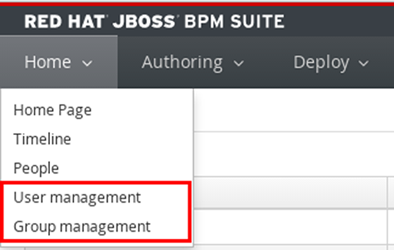

:scrollbar:
:data-uri:
:noaudio:

== Authentication and Authorization

[.noredheader,cols="3,2"]
|===
a|* Delegated to underlying application server
* By default, JBoss EAP uses property files to manage users, passwords, roles
* Can be replaced by other mechanisms, such as LDAP and Database
** Requires configuration of security domain in JBoss EAP security subsystem
** Change `<security-domain>` element in `jboss-web.xml` of Business Central and `kie-server.war` to point to new security domain
* Business Central UI for user and role management:
** Disabled by default
** Works only when using property files to manage users and roles
| 
|===
