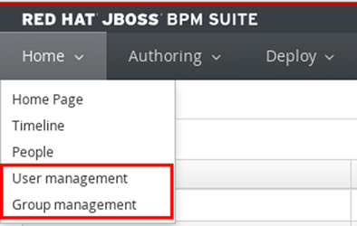

:scrollbar:
:data-uri:

== Authentication and Authorization

[.noredheader,cols="<,^"]
|======
a|* Delegated to underlying application server
* By default, JBoss EAP uses property files to manage users, passwords, roles
* Can be replaced by LDAP, database, others
** Requires configuration of security domain in JBoss EAP security subsystem:
** Change `<security-domain>` element in `jboss-web.xml` of Business 
|
|======

ifdef::showscript[]

Transcript:

Authentication and authorization in JBoss BPM suite is delegated to the underlying application server.

When using JBoss EAP as the application server, JBoss EAP uses property files to manage users, passwords and roles. The JBoss EAP default usage of property files can be replaced by other authentication and authorization mechanisms such as LDAP or a database.

To replace the authentication and authorization method, you  must configure a JBoss EAP security subsystem. Once the security subsystem is configured, change the `<security-domain>` element of the `jboss-web.xml` file of the `business-central.war` and the `kie-server.war` to point to the new security domain.

endif::showscript[]
