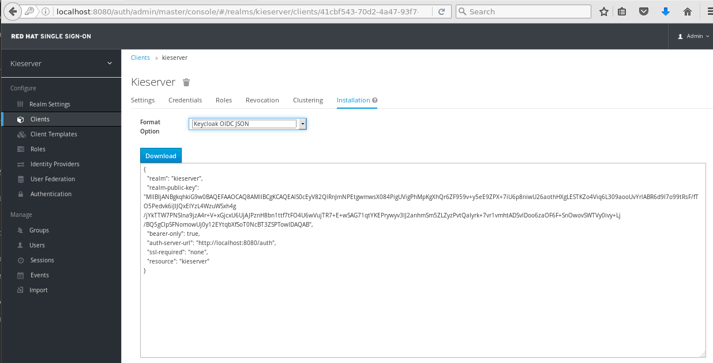
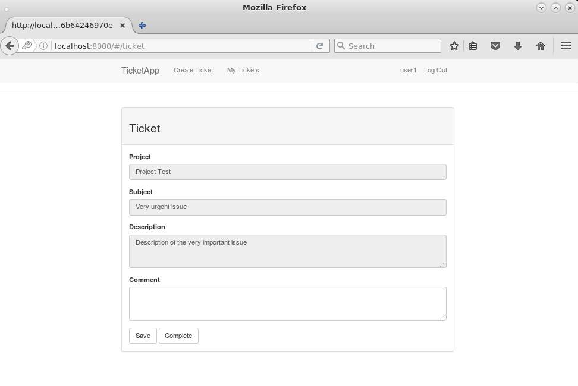

:scrollbar:
:data-uri:
:toc2:

= BxMS SSO Lab

.Goals

{empty} +

The out-of-the-box installation of BPMS Business-Central and Kie-server use properties files for the management of users and roles. This effectively reduces the barrier to get started with the BPMS platform, but is not suitable for an enterprise deployment.

In most enterprises, users and roles are managed centrally, using a central user directory such as LDAP. Both Business-Central and Kie-server can be configured to use a central user directory for authentication and authorization. Business-Central as well as Kie-server delegate the handling of authentication and authorization to the security subsystem of the underlying application server, which is based on JAAS (Java Authentication and Authorization Service). +
To use e.g. an LDAP server for authentication and authorization requires configuration of the application server to use a login module implementation for LDAP rather than the default one.

But especially in the case of Kie-server, a couple of issues remain. Kie-server is a runtime component, meant to be used as a remote business rules and process execution engine. It will typically be accessed over the REST/HTTP remote API (note that there is also a JMS based API, which can be useful in integration scenario's). The REST/HTTP API uses basic authentication. That means the Kie-server client (e.g. a front-end GUI application) needs to include the username/password combination of the user with every request. The client application(s) need to know or have access to the user names and passwords. Moreover, with BASIC authentication, the username and password are passed in clear, base64 encoded text.

Kie-server allows for authentication as a _system user_, so as to perform operations on behalf of the real user. In this case the username is passed in as a query parameter in the REST calls. So if Kie-server is configured to bypass the real user, only the username and password of the system user needs to be known by the front-end. +
This is already more practical, but still not a very good solution: you would still need to somehow hard-code the system user password in the client application, and you cannot really restrict access to the Kie-server based on the real user.

A way better solution to this problem is to use a Single Sign On solution (SSO).

In this case the user, when accessing the front-end application, is redirected to the SSO server, where authentication occurs. On successful login, a token is issued by the SSO server. This token contains the username and the roles attributed to this user. Whenever the front-end application accesses the Kie-server backend, the token is passed to the Kie-server as a HTTP header. On the Kie-server, the token is verified, and if valid, access is granted to the user.

Red Hat SSO is an integrated SSO and IDM solution for browser apps and RESTful web services. It is built on top of the OAuth 2.0, Open ID Connect, JSON Web Token (JWT) and SAML 2.0 specifications.
The upstream project of Red Hat SSO is Keycloak (http://keycloak.jboss.org/).

In this lab we will configure Kie-server to use Red Hat SSO for authentication and authorization.

:numbered:

== Installation of Red Hat SSO

The virtual machine comes with a script that will:

* Install a Red Hat SSO instance.
* Configure Red Hat SSO to use MariaDB for persistence.
* Create the database schema in MariaDB.
* Create an initial `admin` user.
* Configure Red Hat SSO to use a port offset of 300, to avoid port conflicts with the BPMS instances.

To install and start the Red Hat SSO server:

. In the virtual machine, open a terminal and change to the `/home/jboss/lab` directory.
. Execute the `install-rhsso.sh` script as user `jboss`.
. Review the `install-rhsso.sh` script. The script itself delegates to the `install-rhsso-instance.sh` script in the `/opt/install/scripts/bpms` directory.
. Change to the `/home/jboss/lab/rhsso/bin` directory, and launch the server:
+
----
$ cd /home/jboss/lab/rhsso/bin
$ ./standalone.sh
----
. When the RH SSO server is started, open a browser and navigate to `localhost:8380/auth/admin`. Login with user `admin:admin`. +
You should see something like:
+
image::images/rhsso-server-start-screen.png[]

== Red Hat SSO configuration

=== Create a Realm

First step is to create a SSO realm for our application.

. On the RH SSO start screen, hover over the Realm dropdown. Click on the `Add Realm` button.
. In the `Name` field, type `kieserver`. Leave `Enabled` to `ON`.
+
image::images/rhsso-server-create-realm.png[]
+
Click `Create`.
. On the `Kieserver` realm page, select the `Login` tab. Set the `Require SSL` dropdown box to `none`. Click `Save`.
+
image::images/rhsso-server-login-tab.png[]
+
Note: on a production system it is strongly recommended to use SSL for all communication between the applications and the RH SSO server.

=== Create Clients

For each of the applications involved (Kie-server back-end, front-end application) we need to create a client configuration in our realm. We will also create a client for curl to be able to access the Kie-server REST API from the command line.

. On the `Kieserver` realm page, select the `Clients` menu option. +
A number of client configurations are predefined. Leave these as-is.
. Click the `Create` button on the top right to create a new client.
. Fill in the following values:
* Client Id : `frontend`
* Client Protocol : leave to `openid-connect`
* Client Template : leave blank
* Root URL : leave blank
+
Click `Save`.
. On the `Settings` tab of the client page for the `frontend` client, enter the following values:
* Access type : `public`
* Valid Redirect URIs : Add `http://localhost:8000/*`
* Web Origins : Add `http://localhost:8000`
+
Click `Save`. +
_http://localhost:8000_ is the URI of the AngularJS frontend application that we will use to test our setup.
+

. Create the `kieserver` client. +
On the settings page, enter the following values:
* Access type: `bearer only`
+
Click `Save` +
A `bearer only` client is used for web services that will not initiate a login, but require a valid token to grant access.

. Finally, create the `curl` client. +
On the settings page, enter the following values:
* Access type: `public`
* Valid Redirect URIs : `http://localhost`
+
Click `Save` +
The _curl_ client will allow us to obtain a valid token from the RH SSO server using curl. This token can then be used to access the Kie-server REST API. This is probably something you will not allow on a production system, or at least restricted to select users.

=== Create Roles

Authorization is determined by the roles of the user. To be able to access the Kie-server REST APIs, a user must have the role `kie-server`.

We will also create some application-specific roles for use within Kie-server.

. On the `Kieserver` realm page, select the `Roles` menu option.
. Click the `Add Role` button on the top right to create a new user.
. Set Role name `kie-server`
. Click `Save`.
. Repeat to create application roles (e.g. `group1, group2`).

=== Create Users

Next step is to create some users.

. On the `Kieserver` realm page, select the `Users` menu option.
. Click the `Add User` button on the top right to create a new user.
. On the `Add user` page, enter a username, e.g. `user1`. +
Leave the other fields as-is. +
Click `Save`.
+
image::images/rhsso-server-create-user.png[]
. On the `Credentials` tab for the newly created user, enter a value for the user password (e.g. `user`) and confirm. Set the `Temporary` switch to off. +
The `Temporary` switch determines whether the user will have to change his password at first login.
+
Click `Reset password`
+

. Click on the `Role Mappings` tab to associate the user with roles. +
Make sure the user has the `kie-server` role, and one or more application roles. +
Click `Save`.
+
image::images/rhsso-server-user-roles.png[]

. Repeat to create some more users.

=== Import the RH SSO configuration

Rather than entering the RH SSO assets (realms, clients, users, roles) by hand, they can be imported at startup from one or more JSON files.

In the `/opt/install/scripts/rhsso/import` directory of the virtual machine you'll find the JSON files for the `kieserver` realm and the users defined for this realm.

All users have the password `user`.

To import the files in to the RH SSO server:

. Shutdown the RH SSO server. +
Hit `Ctrl-C` in the terminal window where you started RH SSO.
. Start the RH SSO server with the following environment variables :
+
----
$ ./standalone.sh -Dkeycloak.migration.action=import -Dkeycloak.migration.provider=dir -Dkeycloak.migration.strategy=OVERWRITE_EXISTING -Dkeycloak.migration.dir=/opt/install/scripts/rhsso/import
----
. Log into the RH SSO server with user `admin:admin`, and verify that the import of the `kieserver` realm has been successful.

== Kie-server configuration

=== RH SSO Client Adapter for EAP 6 installation

The first thing we need to do is to install the RH SSO client adapter on the Kie-server instance. The installation adds a new security domain that we will be used by Kie-server in lieu of the the out-of-the-box security domain that uses property files for user and role configuration.

. If needed, shut down the Kie-server instance +
Hit `Ctrl-c` in the terminal window where you started BPMS.
. Unzip the `/opt/install/scripts/rhsso/adapter/keycloak-eap6-adapter-dist-1.9.7.Final-redhat-1.zip` archive to the `/home/jboss/lab/bpms/kieserver` directory.
+
----
$ unzip /opt/install/scripts/rhsso/resources/rh-sso-7.0.0-eap6-adapter.zip -d /home/jboss/lab/bpms/kieserver/
----
. Start the kie-server instance in admin-only mode. +
In a terminal window, `cd` to `/home/jboss/lab/bpms/kieserver/bin`, and execute the following command:
+
----
$ ./standalone.sh --admin-only
----
. Using the EAP CLI, execute the RH SSO adapter installation script. +
In a new terminal window, `cd` to `/home/jboss/lab/bpms/kieserver/bin`, and execute the following command:
+
----
$ ./jboss-cli.sh -c --controller=localhost:10149 --file=adapter-install.cli
{"outcome" => "success"}
{"outcome" => "success"}
{"outcome" => "success"}
{"outcome" => "success"}
$ ./jboss-cli.sh -c --controller=localhost:10149 ":shutdown"
{"outcome" => "success"}
----

=== Kie-server war web.xml configuration

Next we need to configure the Kie-server application to use the RH SSO security domain.

. Open the `/home/jboss/lab/bpms/kieserver/standalone/depoyments/kie-server.war/WEB-INF/web.xml` file for editing. +
Replace:
+
----
<login-config>
  <auth-method>BASIC</auth-method>
  <realm-name>KIE Server</realm-name>
</login-config>
----
+
With:
+
----
<login-config>
  <auth-method>KEYCLOAK</auth-method>
  <realm-name>KIE Server</realm-name>
</login-config>
----
+
Save the file.
. Log into the RH SSO server with user `admin:admin`, select the `Kieserver` realm. Go the `Clients` section, open the `kieserver` client, and click on the `Installation` tab. +
Select the `Keycloak OIDC JSON` format, and click on the Download button.
+

+
Save the file on your filesystem.
. Copy the downloaded JSON configuration file to the `/home/jboss/lab/bpms/kieserver/standalone/depoyments/kie-server.war/WEB-INF/` directory.
. Open the `/home/jboss/lab/bpms/kieserver/standalone/depoyments/kie-server.war/WEB-INF/keycloak.json` file for editing.
.. Replace the IP address of the server in the `auth-server-url` element with `127.0.0.1`.
.. Add the following block after `"resource": "kieserver"`. Don't forget to add a comma after `"resource": "kieserver"`:
+
----
  "enable-cors" : true,
  "cors-max-age" : 1000,
  "cors-allowed-methods" : "POST, PUT, DELETE, GET",
  "principal-attribute" : "preferred_username"
----
+
After the changes the file contents should look like:
+
----
{
  "realm": "kieserver",
  "realm-public-key": "MIIBIjANBgkqhkiG9w0BAQEFAAOCAQ8AMIIBCgKCAQEAlS0cEyV82QlRnJmNPEtgwmwsX084PigUVigPhMpKgXhQr6ZF959v+y5eE9ZPX+7iU6p8niwU26aothHXgLESTKZo4Viq6L309aooUvYrlABR6d9I7o99tRsF/fTO5Pedvk6iJIJQxElYzL4WzuWSxh4g/jYkTTW7PNSIna9jzA4r+V+xGjcxU6UjAJPznH8bn1ttf7tFO4U6wVujTR7+E+wSAG71qtYKEPrywyv3lJ2anhmSm5ZLZyzPvtQaIyrk+7vr1vmhtADSvlDoo6zaOF6F+SnOwovSWTVy0ivy+Lj/BQ5gCIpSFNomowUj0y12EYtqbXfSoT0NcBT3ZSPTowIDAQAB",
  "bearer-only": true,
  "auth-server-url": "http://127.0.0.1:8380/auth",
  "ssl-required": "none",
  "resource": "kieserver",
  "enable-cors" : true,
  "cors-max-age" : 1000,
  "cors-allowed-methods" : "POST, PUT, DELETE, GET",
  "principal-attribute" : "preferred_username"
}
----
+
The `enable-cors` setting enables CORS support by the RH SSO adapter. It will handle preflight requests and set the required HTTP headers. This is expecially important when accessing the Kie-server APIs through Javascript in a browser, as is the case for our AngularJS client app. For a good overview of  CORS, refer to http://www.html5rocks.com/en/tutorials/cors/
+
The `principal-attribute` defines what user attribute should be used for the principal name of the logged in user. By default this will be the (generated) user ID. When set to `preferred_username`, the user name will be used instead.
. Restart the Kie-server instance. +
In a terminal window, `cd` to `/home/jboss/lab/bpms/kieserver/bin`, and execute the following command:
+
----
$ ./standalone.sh
----
. To test that basic authentication does not longer work, in a browser, try to navigate to `localhost:8230/kie-server/services/rest/server`. +
You should receive a _HTTP Status 401_ error (not authorized).
. To verify the correct setup, open a terminal window and execute the following commands:
+
----
$ export TKN=$(curl -X POST 'http://127.0.0.1:8380/auth/realms/kieserver/protocol/openid-connect/token' \
 -H "Content-Type: application/x-www-form-urlencoded" \
 -d "username=user1" \
 -d 'password=user' \
 -d 'grant_type=password' \
 -d 'client_id=curl'| sed 's/.*access_token":"//g' | sed 's/".*//g')
----
+
----
$ echo $TKN
----
+
You should see the value of the token received from the RH SSO server. +
Next execute:
+
----
$ curl -X GET 'http://127.0.0.1:8230/kie-server/services/rest/server' \
-H "Accept: application/json" \
-H "Authorization: Bearer $TKN"
----
+
You should see the response received by the Kie-server:
+
----
{
  "type" : "SUCCESS",
  "msg" : "Kie Server info",
  "result" : {
    "kie-server-info" : {
      "version" : "6.4.0.Final-redhat-3",
      "name" : "kie-server-127.0.0.1",
      "location" : "http://127.0.0.1:8230/kie-server/services/rest/server",
      "capabilities" : [ "BRM", "BPM-UI", "BPM", "KieServer" ],
      "messages" : [ {
        "severity" : "INFO",
        "timestamp" : 1471471094671,
        "content" : [ "Server KieServerInfo{serverId='kie-server-127.0.0.1', version='6.4.0.Final-redhat-3', location='http://127.0.0.1:8230/kie-server/services/rest/server'}started successfully at Wed Aug 17 23:58:14 CEST 2016" ]
      } ],
      "id" : "kie-server-127.0.0.1"
    }
  }
}
----
+
The first `curl` command obtains a token from the RH SSO for _user1_, using the curl client, and extracts the token value from the response. The second `curl` command calls the Kie-server REST API passing the token as an authorization header. The RH SSO security subsystem on Kie-server verifies the validity of the token, and extracts the user id and roles. If the user in the token has the correct roles (`kie-server`), access is granted.

=== Deploy the test archive on Kie-server.

To demonstrate how a client application can interact with Kie-server using RH SSO to manage security, we have included a process archive in the lab project (which you have cloned in the previous module), in the `ticket-kjar` folder.

This process has a simplistic ticket handling process definition, with one human task. Users can create ticket process instances, and assign them to one or more groups. This will create a human task that can be claimed and completed by users belonging to the assigned groups.

image::images/ticket-process-definition.png[]

To deploy this process archive, we need first to build it with maven, and to deploy it to the local maven repository.

. In a terminal window, `cd` to the `/home/jboss/lab/bxms-advanced-infrastructure-lab/process-kjar` directory and build and install the project in the local maven repository.
+
----
$ cd ~/lab/bxms-advanced-infrastructure-lab/ticket-kjar
$ mvn clean install
----
. Deploy the ticket process kjar on Kie-server. +
Execute the following commands
+
To obtain a token:
+
----
$ export TKN=$(curl -X POST 'http://localhost:8380/auth/realms/kieserver/protocol/openid-connect/token' \
 -H "Content-Type: application/x-www-form-urlencoded" \
 -d "username=user1" \
 -d 'password=user' \
 -d 'grant_type=password' \
 -d 'client_id=curl'| sed 's/.*access_token":"//g' | sed 's/".*//g')
----
+
To deploy the process kjar:
+
----
$ curl -X PUT 'http://localhost:8230/kie-server/services/rest/server/containers/ticket-app' \
-H "Accept: application/json" \
-H "Content-type: application/json" \
-H "Authorization: Bearer $TKN" \
-d '{"release-id" : {"group-id" : "com.redhat.gpte.bpms-advanced-infrastructure", "artifact-id" : "ticket-kjar", "version" : "1.0" } }'
----
+
Expected response:
+
----
{
  "type" : "SUCCESS",
  "msg" : "Container ticket-app successfully deployed with module com.redhat.gpte.bpms-advanced-infrastructure:ticket
-kjar:1.0.",
  "result" : {
    "kie-container" : {
      "status" : "STARTED",
      "messages" : [ ],
      "container-id" : "ticket-app",
      "release-id" : {
        "version" : "1.0",
        "group-id" : "com.redhat.gpte.bpms-advanced-infrastructure",
        "artifact-id" : "ticket-kjar"
      },
      "resolved-release-id" : {
        "version" : "1.0",
        "group-id" : "com.redhat.gpte.bpms-advanced-infrastructure",
        "artifact-id" : "ticket-kjar"
      },
      "config-items" : [ ]
    }
  }
}
----

=== Testing with an AngularJS client application

To test the integration of Kie-server with RH SSO, in the lab project (which you have cloned in the previous module), contains an AngularJS application, in the `angularjs-ticket-app` folder.

This application allows to:

* Create process instances of the ticket handling process model described in the previous chapter, and assign the tasks to groups.
* Get the list of tasks assigned to the logged in user or a group the user belongs to.
* Claim, start and complete tasks.

To run this application, we can use the built in Python HTTP server.

. In the virtual machine, open a terminal window. Change to the `/home/jboss/lab/bxms-advanced-infrastructure-lab/angularjs-ticket-app/` directory. +
Start the Python HTTP server.
+
----
$ cd `~/lab/bxms-advanced-infrastructure-lab/angularjs-ticket-app/`
$ python -m SimpleHTTPServer
Serving HTTP on 0.0.0.0 port 8000 ...
----
. To use the application, open a browser window, and go to `http://localhost:8080`.
. As part of the application bootstrap, a login sequence is initiated with the RH SSO server, using the RH SSO Javascript adapter (which in installed as a dependency in the AngularJS app). +
The user is redirected to the RH SSO login screen.
+
image::images/rhsso-server-login-screen.png[]
. Log in with one of the users that were created in the `Kieserver` realm on the RH SSO server, e.g. `user1:user`.
. The browser window is redirected to the AngularJS application, and access is granted to `user1`.
+
image::images/angular-client-screen.png[]
. From there on, you can start interacting with processes and tasks. +
_Create Ticket_ will launch a new process instance of the ticket process. +
_My Tickets_ will show a paginated list of tasks assigned to the logged in user.
. For example, click on `Create Ticket`, and fill in some values for `Project`, `Subject` and `Description` (these will be passed as process variables to the process instance). Assign the ticket to `group1` (to which user1 belongs). Click `Create the ticket`. +
You should see a confirmation screen, with a ticket reference, which corresponds to the process instance id of the created process.
. Click on `My Tickets`. You should see the new ticket in the list.
+
image::images/angular-mytickets-screen.png[]
. Click on `Claim`, and then on `Start` to claim and start the task. +
Click on `View` to view the task. From there you can add comments, save the task, or complete it.
+

To login as another user, click the `Log out` link in the navigation bar. This will force a logout on the RH SSO server, and cause a redirect to the RH SSO login page.

If interested, more details on how the AngularJS works can be found at https://github.com/jboss-gpe-ref-archs/bpms_rhsso.

== Business-Central configuration

The steps required to integrate Business-Central are very much similar to the steps performed in the previous chapter of this lab.

. On the RH SSO server, create a new client for the Business-Central application in the `Kieserver` realm, with the following properties:
* Access type : confidential
* Root URL : http://127.0.0.1:8080
* Base URL : /business-central
* Valid redirection URIs : /business-central/*
. On the RHO SSO server, create a user `jboss` with password `bpms`, and assign the role `admin` to this user.
. On the BPMS Business-Central server, install the RH SSO EAP 6 adapter.
. As an alternative to configuring the web application with a `keycloak.json` JSON file in the web app WEB-INF directory, the configuration settings can be added to the `keycloak` subsystem in the `standalone.xml` configuration file.
.. Download the settings from the `Installation` tab of the client definition on the RH SSO server. Choose the `Keycloak OIDC JBoss Subsystem XML` format.
.. Add the xml snippet to the `keycloak` subsystem definition in the `standalone.xml` configuration file of the BPMS app server.
.. Change the name of the `secure-deployment` name to `business-central.war`
.. Change the `auth-server-url` value to `http://127.0.0.1:8380/auth`.
.. Add the `<principal-attribute>preferred_username</principal-attribute>` element.
.. When done, the subsystem definition should look like:
+
----
<subsystem xmlns="urn:jboss:domain:keycloak:1.1">
  <secure-deployment name="business-central.war">
    <realm>kieserver</realm>
    <realm-public-key>MIIBIjANBgkqhkiG9w0BAQEFAAOCAQ8AMIIBCgKCAQEAr7vKaD7ghaWdfy/TxCUfE95+CWkf+Gb01Qjj+SXDrpHPCgH47LMLnoS4oIG5X/L8MP6LUtl+fxxW2bRX2JMnfmKOqrAl9mngsZOycVFHdruHysLmK8UK4FgD6J2yJ9LtVyHgK43tWkGYcm4zYAwqbgRSYdZqY/exFMhsiYVHmHinwoIB7eR0Q8b846kmqI79ZcrhZmYANgCCcte4g1foPzG7TSHTJ/qfktBXt8QYW/OuXB0pt+It4XbsaXyhYukfdkHdBlgyHS9j7tDWRXQhZK/YjKzSb/u3rw3lG9LojnXEf5cNLyunNakvRfWmhmpSUfc6svhv9eugzRSFfBFBwwIDAQAB</realm-public-key>
    <auth-server-url>http://127.0.0.1:8380/auth</auth-server-url>
    <ssl-required>NONE</ssl-required>
    <resource>bc</resource>
    <credential name="secret">138f6660-2ba0-4d95-9061-d0932157c02f</credential>
    <principal-attribute>preferred_username</principal-attribute>
  </secure-deployment>
</subsystem>
----
. Start the BPMS Business-Central instance, and in a browser window navigate to `http://127.0.0.1:8080/business-central`. +
You will be redirected to the RH SSO login screen. Login with the `jboss:bpms` user. After successful login you are redirected to the Business-Central home page.

ifdef::showscript[]
endif::showscript[]
