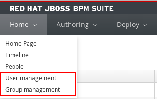

:scrollbar:
:data-uri:
:noaudio:

== Authentication and authorization mechanisms

* Delegated to underlying application server
* By default, EAP uses property files to manage users, passwords, roles.
* Can be replaced by other mechanisms (LDAP, Database, ...)
** Requires configuration of a security domain in the security subsystem of EAP
** Change the `<security-domain>` element in `jboss-web.xml` of Business-Central and Kie-server war file tp point to the new security domain.
* Business Central has GUI to manage users and roles
+

** Disabled by default
** Works only when using property files to manage users and roles.
