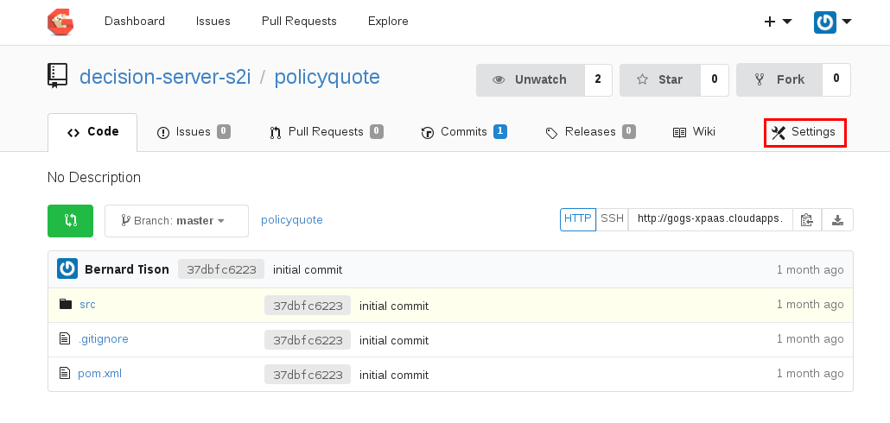

:scrollbar:
:data-uri:
:linkattrs:
:toc2:
:ocdownload: link:https://access.redhat.com/downloads/content/290/ver=3.5/rhel---7/3.5.5.31/x86_64/product-software[OpenShift CLI client^]

== Realtime Decision Server S2I Deployment Lab

This lab covers the JBoss BRMS Realtime Decision Server for OpenShift. The Realtime Decision Server for OpenShift runtime is configured for deployment on OpenShift Container Platform. Realtime Decision Server for OpenShift supports source-to-image (S2I) builds, as well as binary deployments starting from prebuilt KJARs.

In this lab, you explore the S2I functionality of Realtime Decision Server for OpenShift.

.Goals

* Provision Realtime Decision Server for OpenShift
* Deploy a rules-based `kie-project` to Realtime Decision Server for OpenShift
* Automate the build and redeployment processes when code changes are made to `kie-project`
* Investigate various OpenShift deployment strategies to reduce downtime

.Requirements

* Completion of a course covering application development with Red Hat OpenShift
* Familiarity with the `kie-server` API of the JBoss BPM Suite product
* Experience using Git and Maven
* Access to GitHub to clone the projects used in this lab

.Lab Environment
Most of the software utilized in this lab executes in a remote OpenShift Container Platform environment. Some client-side tooling is needed for this lab. In particular:

* {ocdownload} (`oc`)
* Git
* Maven 3.3.* (or more recent)
* cURL
+
NOTE: If you are using the course VM, this tooling is already installed and you do not need to do anything. If you are not using the course VM, you need to install the tooling now.

== Lab Component Topology

This lab involves quite a few components that support the build, deployment, and execution of a rules application running in OpenShift Container Platform.

The following graphic illustrates the component topology and workflow of this lab:

image::images/dserver1_lab_topology.gif[]

:numbered:

== Set Up OpenShift Lab Environment

=== Register

In this section of the lab, you register for the authorization to create a project in your remote OpenShift lab environment.

. In your browser, navigate to the link:https://labs.opentlc.com/[OPENTLC lab portal^].
. Enter your OPENTLC username and password and click *Login*:
+
image::images/cf_login.png[]
. Navigate to *Services -> Catalogs -> All Services -> OPENTLC OpenShift Labs -> OPENTLC OpenShift 3.9 Shared Access*:

. Click *Order*.

. On the next screen, click *Submit* in the lower right corner.
+
. Check your email for a message from Red Hat similar to the following:
+
-----
You have been enrolled in the OPENTLC OpenShift environment.
You can access your environment by going to https://master.na39.openshift.opentlc.com:443 and logging in as jbride-test.

NOTICE: Your environment will expire and be deleted in 14 day(s) at 2017-02-07 00:00:00 -0500. In order to conserve resources we cannot archive or restore any data in this environment. All data will be lost upon expiration.
-----
* This email confirms that your OpenShift project was created. Please save this email.
. Make a note of the URL of the OpenShift Container Platform master node referenced in the email.
* You use this URL throughout the remainder of this course.

=== Use Your OpenShift Container Platform Project

. At the command line of your workstation (pre-installed with the `oc` utility), log in to the OpenShift environment:
+
[source,text]
----
$ oc login <URL of OCP Master node listed in the confirmation email>
----

. When prompted, enter your OPENTLC SSO credentials.

. Observe that an OpenShift Container Platform project has already been created for you:
+
[source,text]
-----
$ oc project
Using project "jbride-test-bxms-infra" on server "https://xxx.xxx.openshift.opentlc.com:443".
-----
* Going forward, all CLI commands target this project.

. Make sure you can access your project using the OpenShift Container Platform web console:
.. Open a browser.
.. Navigate to the OpenShift Container Platform master node using the URL that was provided to you in the confirmation email.

.. Log in using your OPENTLC SSO credentials:
+

=== Clone Lab Assets

If you did not clone the lab assets for this course to your VM in a previous lab, you must do so now:

. In a terminal window, change to the `lab` directory of your VM.
. Run the following command:
+
[source,text]
-----
$ git clone https://github.com/gpe-mw-training/bxms-advanced-infrastructure-lab.git
-----

== Configure Gogs Git Server

=== Install Server

For all of the xPaaS labs in this course, you need a Git server to host the code that you build and deploy on Realtime Decision Server and Intelligent Process Server. For this, you use link:https://gogs.io/[Gogs^], a GitHub-like Git server written in Go.

. In the VM, open a terminal window.
. Change to the directory in the cloned lab project that contains the common templates for the xPaaS labs:
+
[source,text]
----
$ cd /home/jboss/lab/bxms-advanced-infrastructure-lab/xpaas/common
----
. Review the `xpaas-gogs-persistent.yaml` template.
* This is a template for an installation of Gogs backed by a PostgreSQL database that defines the following:
** A Service for the Gogs server and the PostgreSQL server
** A Route for the Gogs server
** An ImageStream for the Gogs image that is hosted on DockerHub
** A DeploymentConfig for the Gogs pod
** A DeploymentConfig for the PostgreSQL pod
*** The data directory of PostgreSQL is mounted as a volume
** A PersistentVolumeClaim for the Gogs volume
** A PersistentVolumeClaim for the PostgreSQL volume
** Parameters:
*** `APPLICATION_NAME`: The name for the application (default is `gogs`)
*** `POSTGRESQL_USER`: The generated name of the user for the PostgreSQL database
*** `GOGS_POSTGRESQL_PASSWORD`: The generated password of the user for the PostgreSQL database
*** `VOLUME_CAPACITY`: The volume capacity for the `PersistentVolumeClaim`, in MB (default is `512`)

. Create an application based on the template and specify values for the parameters if you do not want to use the defaults:
+
[source,text]
----
$ oc process -f xpaas-gogs-persistent.yaml APPLICATION_NAME=gogs POSTGRESQL_USER=gogs GOGS_POSTGRESQL_PASSWORD=gogs VOLUME_CAPACITY=512Mi | oc create -f -
----

. Wait a few minutes for the `gogs` and `postgresql-gogs` containers to build and deploy.
.. Confirm that only these two containers display a status of `Running`:
+
[source,text]
-----
$ oc get pods
NAME                      READY   STATUS    RESTARTS   AGE
gogs-1-89oy3              1/1     Running   0          3m
postgresql-gogs-1-ctngm   1/1     Running   0          4m
-----

=== Understand the Code

. Research and make sure you can answer the following questions:

* What is the full URL that indicates where the Gogs image used in this lab is hosted?
** How did you determine this URL?
** What information does the home page of the Gogs image provide?
* What is the port exposed by the service to the `postgresql` container to which the Gogs application connects?

ifdef::showscript[]
Answers:

* https://hub.docker.com/r/openshiftdemos/gogs/
  - ImageStream of DockerImage is:  openshiftdemos/gogs:latest    ..... which implies DockerHub.
  - URL provides link to source code of Gogs image used for OpenShift Container Platform.
*  5432

endif::showscript[]

=== Set Up Server

After you have set up all of the OpenShift resources, you need to set up the Gogs server. First you modify the entries in `/etc/gogs/conf/app.ini` and then you make the changes permanent.

==== Modify Entries in `/etc/gogs/conf/app.ini`

The Gogs configurations are stored in a file within the running container at  `/etc/gogs/conf/app.ini`. You make the initial configuration changes via a web UI.

. Determine the URL of your Gogs server:
+
[source,text]
-----
$ oc get route
-----
.  Open a browser and navigate to the `gogs` route URL.
* The Gogs installation screen appears:
+
image::images/gogs-installation-screen.png[]

. Complete the form as follows:
* *Database Type*: *PostgreSQL*
* *Host*: `postgresql-gogs:5432`
* *User*: `gogs`
* *Password*: `gogs`
* *Database Name*: `gogs`
* *SSL Mode*: `disable`
* *Application Name*: `Gogs: Go Git Service`
* *Application URL*: `http://<gogs route>`
* Leave all other settings as is.

. Click *Install Gogs*.
* The *Sign in* screen appears. Leave the browser window open for now.

. Find the name of the Gogs pod:
+
[source,text]
----
$ gogspod=$(oc get pod | grep "^gogs" | awk '{print $1}')
----
. Review the changes made to the Gogs configuration file in the existing container:
+
[source,text]
-----
$  oc exec $gogspod -- cat /etc/gogs/conf/app.ini | more

...

ROOT_URL = http://gogs-bxmsadvdserver.cloudapps.test-ml.opentlc.com/

...

DB_TYPE  = postgres
HOST     = postgresql-gogs:5432
NAME     = gogs
USER     = gogs
PASSWD   = gogs

...

-----

==== Make Gogs Configuration Changes Permanent

Next you make sure that the changes you made are permanent, so that any new Gogs container replacing the existing one continues to use your configuration changes.

To do so, you extract the configuration file from the Gogs pod and mount it as a ConfigMap in the container to make it persistent.

. Create a local file with the contents of the `/etc/gogs/conf/app.ini` file:
+
[source,text]
----
$ oc exec $gogspod -- cat /etc/gogs/conf/app.ini > /tmp/gogs-app.ini
----
. Configure Gogs to work with the default self-signed OpenShift certificates:
+
[source,text]
----
$ sed -i 's/SKIP_TLS_VERIFY = false/SKIP_TLS_VERIFY = true/g' /tmp/gogs-app.ini
----
. Create a ConfigMap from the saved file:
+
[source,text]
----
$ oc create configmap gogs --from-file=/tmp/gogs-app.ini
----
. Mount the ConfigMap as a volume in the Gogs pod:
+
[source,text]
----
$ oc set volume dc/gogs --add --overwrite --name=config-volume -m /etc/gogs/conf/ --source='{"configMap":{"name":"gogs","items":[{"key":"gogs-app.ini","path":"app.ini"}]}}'
----
* This causes a redeployment of the Gogs pod.

. Wait for the Gogs pod to be created, then verify that it has a `RUNNING` status.

. Create an account and repository on the Gogs server:
.. Go back to the Gogs *Sign In* screen in your browser.
.. Click *Register*:
+
image::images/gogs_register.png[]
.. Create an account. Be sure to note the username and password.
.. Log in with your username and password.

=== Configure `decision-server-s2i` Organization in Gogs

. Create an organization named `decision-server-s2i`:
.. In the top right, click image:images/gogs_add_icon.png[] (*Add*) and select *New Organization*.

.. For *Organization Name*, enter `decision-server-s2i`, then click *Create Organization*:
+

.. Verify that you are a member of the new organization and listed as the owner.
.. From the `decision-server-s2i` dashboard, click *View decision-server-s2i*:
+
image::images/view_dserver.png[]
.. Click the *Owners* link and confirm that your user ID is affiliated with this Owners group.

. Create a `policyquote` repository in the `decision-server-s2i` organization:
.. In the top right, click image:images/gogs_add_icon.png[] (*Add*) and select *New Repository*.
.. Complete the *New Repository* form as follows:
** *Owner*: *decision-server-s2i*
** *Repository Name*: `policyquote`
** *Visibility*: Unchecked
** *Initialize this repository with selected files and template*: Unchecked
+

+
.. Click *Create Repository*.

* Later in the lab, you push your JBoss BRMS project to this repository.

== Configure Nexus Maven Repository Server

The S2I build of Realtime Decision Server relies heavily on Maven to build and deploy the JBoss BRMS project source code. To avoid needing to download the Maven dependencies at every build cycle, you can configure a Nexus repository as a proxy. The Maven build downloads the dependencies it needs from the Nexus proxy rather than the Internet, which speeds up the build considerably.

In this section, you install and configure a Nexus server in your OpenShift project.

=== Install Server

. In the VM, open a terminal window and change to the directory in the cloned lab project that contains the common templates for the xPaaS labs:
+
[source,text]
----
$ cd /home/jboss/lab/bxms-advanced-infrastructure-lab/xpaas/common
----

. Review the `xpaas-nexus-persistent.yaml` template.
* This is a template for the installation of Nexus that defines the following:
** A Service for the Nexus server
** A Route for the Nexus server
** An ImageStream for the Nexus docker image, which is hosted on DockerHub
** A DeploymentConfig for the Nexus pod
** A PersistentVolumeClaim for the Nexus volume, which holds the Nexus configuration and storage
** Parameters:
*** `APPLICATION_NAME`: The name for the application (default is `nexus`)
*** `VOLUME_CAPACITY`: The volume capacity for the `PersistentVolumeClaim`, in MB (default is `512`)

. Create an application based on the template and specify values for the parameters if you do not want to use the defaults:
+
[source,text]
----
$ oc process -f xpaas-nexus-persistent.yaml APPLICATION_NAME=nexus VOLUME_CAPACITY=512Mi | oc create -f -
----

=== Configure Server

Once all of the components of your application are up, you are ready to configure the Nexus server. More specifically, you need to add the Red Hat Enterprise Maven repository to the list of proxied repositories.

. In a browser window, navigate to the URL of the Nexus route.
. Log in with the username `admin` and password `admin123`.
. In the menu on the left, click *Repositories*.
.. Click the *Add* icon at the top to access the list of options.
.. Select *Proxy Repository*.
.. On the *New Proxy Repository* screen, enter the following values:
* *Repository ID*: `redhat-ga`
* *Repository Name*: `Red Hat GA`
* *Remote Storage Location*: `https://maven.repository.redhat.com/ga/`
* Leave the other fields as is.
.. Click *Save*.

. Add the Red Hat GA repository to the public repository group:
.. In the menu on the left, click *Repositories*.
.. Select *Public Repositories*.
.. In the *Public Repositories* section at the bottom of the screen, click the *Configuration* tab.
.. Make sure that the *Red Hat GA* repository is in the *Ordered Group Repositories* list:
+

+
.. Click *Save*.

== Add `policyquote` Sample Application

This lab uses a sample application called `policyquote`. The `policyquote` application is a fairly simple JBoss BRMS application that calculates the price of a car insurance policy based on driver and car data. The project consists of a number of rules (including a ruleflow process) and a domain model in a single Maven project.

[NOTE]
The S2I build mechanism imposes certain limitations on the project structure. Multi-module Maven projects are not well supported. Specifically for KJARs, all dependencies (like a domain model JAR) need to be available in a Maven repository before the build kicks off.

When using binary deployments, you have more flexibility on how to structure your project.

In this part of the lab, you clone the `policyquote` project from GitHub, and push it into the Gogs server on OpenShift to act as the source for your S2I builds.

. In the VM, open a terminal window and change to the lab `home` folder:
+
[source,text]
----
$ cd /home/jboss/lab
----
. Clone the `policyquote` project from this course's GitHub site:
+
[source,text]
----
$ git clone https://github.com/gpe-mw-training/bxms-xpaas-policyquote
----
. Add a remote repository to the cloned project that points to your Gogs Git server:
+
[source,text]
----
$ cd bxms-xpaas-policyquote
$ git remote add gogs-s2i http://<gogs username>:<gogs password>@<url of the gogs route>/decision-server-s2i/policyquote.git
----
+
NOTE: Replace `<gogs username>`, `<gogs password>`, and `<url of the gogs route>` with the appropriate values for your environment.

. Push the code to the Gogs server:
+
[source,text]
----
$ git push gogs-s2i master
----
. In your browser, return to the home page of your `decision-server-s2i` repository hosted in your `gogs` container:
+
image::images/seeded_gogs_repo.png[]
* Note that your repository is now seeded with the `policyquote` project.

. Review the code and rules in this application.
* Note that the project includes a Drools `ruleflow` artifact, `PolicyQuote.rf`.
* If you view this ruleflow file in JBoss Developer Studio installed with the _Integration Stack_ of plug-ins, you can see that the ruleflow looks like this:
+
image::images/policy-quote-rule-flow.png[]
.. Study each of the rule files found in this project.
*** What are the names of the rules affiliated with the calculation `ruleflow-group`?
*** What are the names of the rules affiliated with the surcharge `ruleflow-group`?

== Import Realtime Decision Server S2I Templates

To create Realtime Decision Server applications on OpenShift, you can start from a template that you import into your OpenShift project. Because you can have several templates using the same Realtime Decision Server image, you can create an image stream for that image so that you can reuse it in several templates.

. In the VM, open a terminal window, and change to the directory in the cloned lab project that contains the templates for the Realtime Decision Server lab:
+
[source,text]
----
$ cd /home/jboss/lab/bxms-advanced-infrastructure-lab/xpaas/decision-server
----

. Review the `decisionserver-63-is.yaml` definition file.
* This file defines the ImageStream for the Realtime Decision Server 6.3 image, hosted in Red Hat's Docker registry.
* The latest version of this image is 1.3.

. Create the ImageStream for the Realtime Decision Server image:
+
[source,text]
----
$ oc create -f decisionserver-63-is.yaml
----

. Review the `decisionserver-basic-s2i.yaml` template.
* The template defines the following:

** A BuildConfig for the S2I build. The BuildConfig defines a source build that points to a Git repository, as well as the builder image, through the ImageStream you defined earlier. The build is triggered through a webhook whenever you push new code to the Git repository, or by a change in the builder image.
** An ImageStream for the image created as a result of the build.
** A DeploymentConfig for the pods running the image created as result of the build. The number of replicas is set to `1`.
** A Service for the Realtime Decision Server.
** A Route for the Realtime Decision Server.
** Parameters:
*** `KIE_CONTAINER_DEPLOYMENT`: Describes which KJARs need to be deployed on the Realtime Decision Server, in the format `containerId=groupId:artifactId:version|c2=g2:a2:v2`.
*** `KIE_CONTAINER_REDIRECT_ENABLED`: Enables redirect functionality for KIE containers. This should be set to `true` when different versions of the same KJAR are to be deployed side-by-side. The default is `true`.
*** `KIE_SERVER_USER`: The username to access the Realtime Decision Server REST or JMS interface. The default is `kieserver`.
*** `KIE_SERVER_PASSWORD`: The password to access the Realtime Decision Server REST or JMS interface. The default is a generated value.
*** `APPLICATION_NAME`: The name for the application.
*** *`HOSTNAME_HTTP`: The custom hostname for the HTTP service route. Leave blank to use the default hostname generated by OpenShift.
*** `SOURCE_REPOSITORY_URL`: The Git source URI for application. A value is required.
*** `SOURCE_REPOSITORY_REF`: The Git branch/tag reference to build. The default is `master`.
*** `CONTEXT_DIR`: The path within the Git project to build. Leave blank to use the root project directory.
*** `GITHUB_WEBHOOK_SECRET`: The GitHub trigger secret. This is added to the webhook URL. The default is a generated value.
*** `GENERIC_WEBHOOK_SECRET`: The generic build trigger secret. This is added to the webhook URL. The default is a generated value.
*** `IMAGE_STREAM_NAMESPACE`: The namespace in which the ImageStreams for Red Hat xPaaS images are installed. These ImageStreams are normally installed in the `openshift` namespace. You need to modify this only if you have installed the ImageStreams in a different namespace or project (which is the case in this lab).
*** `MAVEN_MIRROR_URL`: The URL of the Maven mirror--that is, the Nexus server.
* This template does not contain a database service.
** Realtime Decision Server does not use persistence.
* Realtime Decision Server uses an insecure route--HTTP, not HTTPS.

. Import the template into your OpenShift project:
+
[source,text]
----
$ oc create -f decisionserver-basic-s2i.yaml
----

== Create Realtime Decision Server for OpenShift Container

Everything is now in place to create a Realtime Decision Server container for your JBoss BRMS project.

. In the VM, open a terminal window and run the following:
+
[source,text]
----
$ export application_name=policyquote-app
$ export source_repo=http://gogs:3000/decision-server-s2i/policyquote.git
$ export nexus_url=http://nexus:8081
$ export kieserver_password=kieserver1!
$ export is_namespace=$(oc project | awk '{gsub(/"/,"",$3); print $3}')
$ export kie_container_deployment="policyquote=com.redhat.gpte.xpaas:policyquote:1.0-SNAPSHOT"
$ oc new-app --template=decisionserver63-basic-s2i -p KIE_SERVER_PASSWORD=$kieserver_password -p APPLICATION_NAME=$application_name -p SOURCE_REPOSITORY_URL=$source_repo -p IMAGE_STREAM_NAMESPACE=$is_namespace -p KIE_CONTAINER_DEPLOYMENT=$kie_container_deployment -p KIE_CONTAINER_REDIRECT_ENABLED=false -p MAVEN_MIRROR_URL=$nexus_url/content/groups/public/
----

* Note that the `KIE_CONTAINER_REDIRECT_ENABLED` environment variable is set to `false`. This means that the name of the KIE container for your application is `policyquote`, as defined in `KIE_CONTAINER_DEPLOYMENT`.

. Check the progress of the build by locating the builder pod (named `policyquote-app-1-build`) and checking the logs either in the OpenShift Container Platform web console or via the OpenShift CLI:
+
[source,text]
----
$ oc logs -f policyquote-app-1-build
----
+
* Because this is the first build, it takes quite some time. The builder image needs to be downloaded from Red Hat's Docker repository, and the Nexus Maven proxy needs to be seeded with the build dependencies.
* The S2I build takes place in a builder pod named `policyquote-app-1-build`. Check the logs for this pod in the web console, or use the OpenShift CLI.
* At the end of the build cycle, expect to see the following in the builder pod log:
+
[source,text]
----
I0908 06:48:48.042137       1 sti.go:334] Successfully built xpaas/policyqote-app-1:a0ec7e20
I0908 06:48:48.118123       1 cleanup.go:23] Removing temporary directory /tmp/s2i-build455291570
I0908 06:48:48.118178       1 fs.go:156] Removing directory '/tmp/s2i-build455291570'
I0908 06:48:48.139557       1 sti.go:268] Using provided push secret for pushing 172.30.1.250:5000/xpaas/policyqote-app:latest image
I0908 06:48:48.139575       1 sti.go:272] Pushing 172.30.1.250:5000/xpaas/policyqote-app:latest image ...
I0908 06:51:52.519695       1 sti.go:288] Successfully pushed 172.30.1.250:5000/xpaas/policyqote-app:latest
----
+
* The image built by the builder pod is pushed to the OpenShift internal registry. This triggers the deployment of the image.

. Monitor the deployment of the application by locating the pod (named `policyquote-app-1-xxxxx`) and checking the logs either in the OpenShift Container Platform web console or via the OpenShift CLI.
+
* After some time, expect to see something like the following:
+
[source,text]
----
06:53:27,949 INFO  [org.kie.server.services.impl.KieServerImpl] (EJB default - 1) Container policyquote (for release id com.redhat.gpte.xpaas:policyquote:1.0-SNAPSHOT) successfully started
----
+
* By that time, the service and the route have started, and your Realtime Decision Server application is ready to serve requests.
+
image::images/policyquote-application-ose.png[]

== View Realtime Decision Server Status

. Before you execute your deployed `policyquote` application, investigate the details of the API exposed by the Realtime Decision Server:

.. Determine the route to the `policyquote` application deployed to a decision-server container in OpenShift:
+
[source,text]
-----
$ oc get route | grep policyquote
-----
.. In your browser, navigate to `<policyquote app route>/kie-server/docs`.
.. Pay particular attention to the API that accepts an HTTP POST at the `server/containers/instances/{id}` URI:
+
image::images/kie-server-api-post.png[]
+
NOTE: Notice the use of the term _containers_ in the URI of this resource. The word "container" is highly overused in the world of software. In this specific context, it refers to the Realtime Decision Server construct, _KIE Container_. It does not refer to an OpenShift/Kubernetes container.

* This resource URI drives the stateless rules engine of the decision-server application.

* The ID specified in the resource URI refers to the identifier of the container to invoke. In this case it is called `policyquote`.

. Use `curl` to test your application via the REST API exposed by the Realtime Decision Server:
.. In a terminal window, run the following:
+
[source,text]
----
$ export policyquote_app=<URL of the policyquote app route>
$ export kieserver_password=kieserver1!
----
.. Check the health of the server:
+
[source,text]
----
$ curl -X GET -H "Accept: application/json" --user kieserver:$kieserver_password "$policyquote_app/kie-server/services/rest/server"
----
+
.Sample Output
[source,text]
----
{
  "type" : "SUCCESS",
  "msg" : "Kie Server info",
  "result" : {
    "kie-server-info" : {
      "version" : "6.4.0.Final-redhat-3",
      "name" : "kieserver-policyquote-app-1-xlgac",
      "location" : "http://policyquote-app-1-xlgac:8080/kie-server/services/rest/server",
      "capabilities" : [ "BRM", "KieServer" ],
      "messages" : [ {
        "severity" : "INFO",
        "timestamp" : 1473333794748,
        "content" : [ "Server KieServerInfo{serverId='kieserver-policyquote-app-1-xlgac', version='6.4.0.Final-redhat-3', location='http://policyquote-app-1-xlgac:8080/kie-server/services/rest/server'}started successfully at Thu Sep 08 07:23:14 EDT 2016" ]
      } ],
      "id" : "kieserver-policyquote-app-1-xlgac"
    }
  }
}
----
.. Check which KIE containers are deployed on the server:
+
[source,text]
----
$ curl -X GET -H "Accept: application/json" --user kieserver:$kieserver_password "$policyquote_app/kie-server/services/rest/server/containers"
----
+
.Response
[source,text]
----
{
  "type" : "SUCCESS",
  "msg" : "List of created containers",
  "result" : {
    "kie-containers" : {
      "kie-container" : [ {
        "status" : "STARTED",
        "messages" : [ {
          "severity" : "INFO",
          "timestamp" : 1473333804577,
          "content" : [ "Container policyquote successfully created with module com.redhat.gpte.xpaas:policyquote:1.0-SNAPSHOT." ]
        } ],
        "container-id" : "policyquote",
        "release-id" : {
          "version" : "1.0-SNAPSHOT",
          "group-id" : "com.redhat.gpte.xpaas",
          "artifact-id" : "policyquote"
        },
        "resolved-release-id" : {
          "version" : "1.0-SNAPSHOT",
          "group-id" : "com.redhat.gpte.xpaas",
          "artifact-id" : "policyquote"
        },
        "config-items" : [ ]
      } ]
    }
  }
}
----

=== Test `policyquote` Application

To test your application, you need to send a correctly formatted payload. The `/xpaas/decision-server` directory of the lab contains an example, formatted as JSON.

. Open the `policyquote-payload.json` payload file and study its contents.

* Note how the various batch commands found in this JSON payload file correspond to similar Java _Command_ objects found in the `rule` and `process` directories described in the following links:
**  link:https://github.com/droolsjbpm/drools/tree/master/drools-core/src/main/java/org/drools/core/command/runtime/rule[Rule commands^]
** link:https://github.com/droolsjbpm/drools/tree/master/drools-core/src/main/java/org/drools/core/command/runtime/process[Process commands^]
. Make sure you are in the `xpaas/decision-server` directory, and run the following:
+
[source,text]
----
$ curl -s -X POST -H "Content-Type: application/json" -H "Accept: application/json" --user kieserver:$kieserver_password -d @policyquote-payload.json "$policyquote_app/kie-server/services/rest/server/containers/instances/policyquote"
----
+
.Response
[source,text]
----
{
  "type": "SUCCESS",
  "msg": "Container policyquote successfully called.",
  "result": {
    "execution-results": {
      "results": [
        {
          "key": "driver",
          "value": {
            "com.redhat.gpte.policyquote.model.Driver": {
              "id": "1",
              "driverName": "John Doe",
              "age": 26,
              "ssn": "789456",
              "dlNumber": "123456",
              "numberOfAccidents": 2,
              "numberOfTickets": 1,
              "creditScore": 0
            }
          }
        },
        {
          "key": "policy",
          "value": {
            "com.redhat.gpte.policyquote.model.Policy": {
              "requestDate": null,
              "policyType": "AUTO",
              "vehicleYear": 1999,
              "price": 300,
              "priceDiscount": 0,
              "driver": "1"
            }
          }
        }
      ],
      "facts": [
        {
          "key": "driver",
          "value": {
            "org.drools.core.common.DefaultFactHandle": {
              "external-form": "0:1:725414105:725414105:1:DEFAULT:NON_TRAIT:com.redhat.gpte.policyquote.model.Driver"
            }
          }
        },
        {
          "key": "policy",
          "value": {
            "org.drools.core.common.DefaultFactHandle": {
              "external-form": "0:2:1271576022:1271576022:3:DEFAULT:NON_TRAIT:com.redhat.gpte.policyquote.model.Policy"
            }
          }
        }
      ]
    }
  }
}
----
+
NOTE: In the response, pay particular attention to the policy's `price` field. This is set as a result of the execution of the rules in your application.

. Filter out the `price` field using `grep`:
+
[source,text]
----
$ curl -s -X POST -H "Content-Type: application/json" -H "Accept: application/json" --user kieserver:$kieserver_password -d @policyquote-payload.json "$policyquote_app/kie-server/services/rest/server/containers/instances/policyquote" | grep '"price"'
----
+
.Sample Output
[source,text]
----
  "price" : 300,
----
. Experiment by changing some values in the `policyquote-payload.json` payload file for the driver and policy objects and seeing if you get another result from the server.
. Review the rules in the project to get an idea of the fields you need to change to influence the calculated price.

== Observe Application Life Cycle

In this section, you introduce a change in one of the rules of your application, and observe what happens when you push the change to the Git repository.

=== Configure Webhook to OpenShift BuildConfig Object

First you need to define a webhook in your `policyquote` repository on Gogs. This webhook is triggered by a push of new code. The webhook calls the OpenShift API to start a new S2I build.

. In a terminal window, run the following:
+
[source,text]
----
oc describe bc policyquote-app
----

. From the response, copy the URL of the GitHub webhook, which looks similar this:
+
[source,text]
----
https://<OpenShift URL>:8443/oapi/v1/namespaces/xpaas/buildconfigs/policyquote-app/webhooks/<secret>/github
----
. Open a browser window and navigate to the `policyquote` repository on Gogs.
. Click *Settings*:
+

. On the *Settings* screen, select *Webhooks -> Add Webhook*.
. Click *Gogs* and complete the form as follows:
* *Payload URL*: Paste the webhook URL obtained from the BuildConfig
* *Content Type*: *application/json*
* *Secret*: Leave blank
* *Just the push event*: Selected
* *Active*: Checked
. Click *Add Webhook*.

=== Change Rules and Test

. In a terminal window, change to the root of the cloned `bxms-xpaas-policyquote` project.

. Open the `src/main/resources/RiskyAdults.drl` file for editing.
. Change the price in the rule action to `350`:
+
[source,text]
----
package com.redhat.gpte.policyquote;

import com.redhat.gpte.policyquote.model.Driver
import com.redhat.gpte.policyquote.model.Policy

rule "RiskyAdults"

    ruleflow-group "calculation"

    when
        //conditions
        $driver : Driver(age > 24, numberOfAccidents >= 1 || numberOfTickets >=2, $id : id)
        $policy : Policy(price == 0, policyType == "AUTO", driver == $id)
    then
        //actions
        modify($policy) {setPrice(350)};

end
----
. Open the `src/test/java/com/redhat/gpte/policyquote/rules/RiskyAdultsTest.java` file for editing.
* As the project contains some unit tests for your rules, you need to make a change here as well.
. Change the assert around line 62 to the following:
+
[source,text]
----
Assert.assertEquals(350, policy.getPrice().intValue());
----
. Test if the project builds successfully by doing a local Maven build:
+
[source,text]
----
$ mvn clean package
----
. After the build has completed, push the changes to the Gogs Git server:
+
[source,text]
----
$ git add --all
$ cat << EOF > ~/.gitconfig
[user]
email = gptestudent@gptestudent.com
name = gptestudent
EOF
$ git commit -m "raised the price for risky adults"
$ git push gogs-s2i master
----
. In the OpenShift Container Platform web console, check that a new build is triggered by the code push:
+
image::images/openshift-s2i-new-build.png[]
+
* Note that this build does not take as long as the first one.
* After the new build is completed, the original application pod is torn down, while the new build pod is being deployed:
+

. Test the new deployment:
.. Change to the `~/lab/bxms-advanced-infrastructure-lab/xpaas/decision-server` directory.
.. Run the following:
+
[source,text]
----
curl -s -X POST -H "Content-Type: application/json" -H "Accept: application/json" --user kieserver:$kieserver_password -d @policyquote-payload.json "$policyquote_app/kie-server/services/rest/server/containers/instances/policyquote" | grep '"price"'
----
+
.Sample Output
[source,text]
----
  "price" : 350,
----
* Expect the price to be `350` instead of `300`.

=== Scale-Out and Define Rolling Deployment

As you have noticed during the build and deployment triggered by a code change, there is a time span during which the application is unavailable. This happens roughly between the moment that the S2I build is finished and the new deployment becomes active. This includes the time needed by Realtime Decision Server to start up.

This downtime is not that serious in a development phase, but it is probably not acceptable in a production environment.

By scaling out your application and defining a rolling upgrade strategy, you can ensure that your application remains available--even if that means that during a limited time span both the old and new versions are deployed concurrently.

In this section, you introduce the required changes directly in your application's DeploymentConfig. Alternatively, you can create the changes in the template, load the template into the OpenShift project, tear down the existing application, and create a new one based on the modified template.

. Select one of the following methods for editing the DeploymentConfig:
.. If you are comfortable using vi, run the following command in a terminal window:
+
[source,text]
----
$ oc edit dc policyquote-app
----
+
** This opens the DeploymentConfig definition in YAML format in vi.

.. Alternatively, if you are unfamiliar with vi, you can also edit the DeploymentConfig directly in the OpenShift Container Platform web console:
+
... Navigate to the `policyquote` deployment.
... Click *Actions*.
... Click *Edit YAML*.
*** This opens a window in which you can edit the YAML file.
. Change the `spec/replicas` and the `spec/strategy` sections to match the following content, keeping in mind that YAML is indentation-sensitive:
+
[source,text]
----
spec:
  replicas: 2
[...]
  strategy:
    recreateParams:
      timeoutSeconds: 600
    resources: {}
    rollingParams:
      maxSurge: 1
      maxUnavailable: 1
      timeoutSeconds: 600
    type: Rolling
[...]
----
+
* These changes raise the number of required pods for your application to two and define a rolling deployment strategy.
* During deployment, one pod at most is made unavailable (as defined in `maxUnavailable`), and one pod at most is created on top of the replica count (as defined in `maxSurge`).

. Save the file.
* A new policy quote application pod is deployed, bringing the number of pods to 2:
+
image::images/policyquote-deployment-scaled.png[]
+
* Requests to the application are now balanced between the two pods.

. Use cURL to test that your application is working correctly by repeating the steps to make a change in the application's code:
.. This time, change the price in the `Risky Adult` rule to `400`.
.. Remember to change the unit test accordingly.
.. Build locally, commit, and push the change.

. To monitor the availability of the application, use the cURL command in a loop:
+
[source,text]
----
$ while [ true ]; do curl -s -X POST -H "Content-Type: application/json" -H "Accept: application/json" --user kieserver:$kieserver_password -d @policyquote-payload.json "$policyquote_app/kie-server/services/rest/server/containers/instances/policyquote" | grep '"price"'; sleep 2; done
----
* When the build is finished, the rolling deployment starts deploying the new application pods.
* As long as at least one of the new pods is not active, the old pod is not torn down:
+

+
* Because you launched the cURL command in a loop, expect to see no interruption in the responsiveness of the application.
. When the new application pods become active, confirm that the application responds with a price of `400` rather than `350`.

== Clean Up Lab Environment

This concludes the first lab of this module. To save resources on OpenShift, you can tear down the `policyquote` application.

. In a terminal window, run the following:
+
[source,text]
----
$ oc delete dc policyquote-app
$ oc delete service policyquote-app
$ oc delete route policyquote-app
$ oc delete is policyquote-app
$ oc delete bc policyquote-app
$ for pod in `oc get pod | grep "\-build" | awk '{print $1}'`; do oc delete pod $pod; done
----
. Leave the Nexus and Gogs applications running, as you need them for the next lab.

ifdef::showscript[]

Nice job with decision server lab.  Still going through it.  Really like the use of the ConfigMap object for the Gogs server.
I think it would be valuable to point out the following:
1)  There are existing decision server templates in the OpenShift namespace.
2)  Our rationale for not leveraging those templates directly as is.  Sounds like one reason is the desire to isolate and re-use the decision server image stream (edited)

Actually there are a couple of reasons to use our own template and image stream:
* The image stream and templates are not installed by default on OpenShift Container Platform < 3.3 (at least not the latest versions)
* The templates in the OpenShift namespace miss the MAVEN_MIRROR parameter, which makes it a lot harder to leverage nexus as a maven proxy
* The templates in the OpenShift namespace have a lot of parameters (especially the process server templates) that are not required and might confuse students
* In general I think in real life most people will come up with templates customized to their needs, rather than using the provided ones.
These should be considered as examples or blueprints.

3)  Study and elaborate on:
  - KIE_CONTAINER_DEPLOYMENT
  - KIE_CONTAINER_REDIRECT_ENABLED

endif::showscript[]
