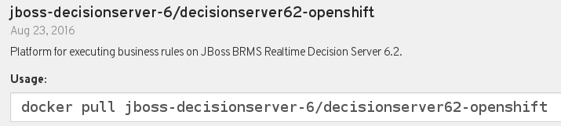

:scrollbar:
:data-uri:
:noaudio:

== Red Hat JBoss BRMS in Cloud

* Red Hat JBoss BRMS available as containerized xPaaS image:
+

* Official name: xPaaS Image for Red Hat JBoss BRMS ([blue]#Decision Server#)
* JBoss BRMS _stateless_ KIE Server in Red Hat OCP &equiv; Decision Server

ifdef::showscript[]

endif::showscript[]
