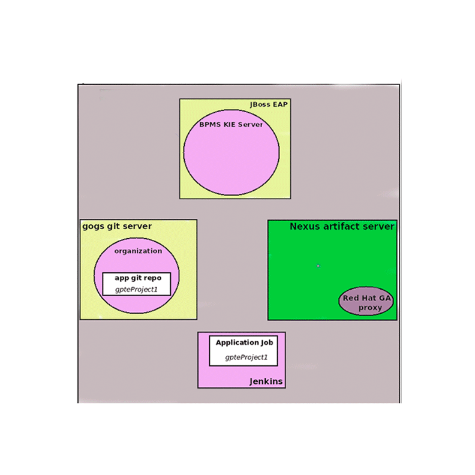

:scrollbar:
:data-uri:

== CI/CD KIE Container Deployment

ifdef::showscript[]

Transcript:

A KIE container can be configured for continuous integration and delivery deployment:

. A Git source code control server presents its changes to a Jenkins orchestrator.
. Jenkins generates the binary files that are stored in a Nexus Maven repository and executes the pipeline that generates a KIE container in a JBoss EAP installation.
. The Nexus Maven repository hosts the binary files so that the JBoss BPM Suite Realtime Decision Server can find them.
. The Realtime Decision Server web application, hosted in a JBoss EAP instance, receives the notification from the Jenkins pipeline to start a new container. The `start new container` request contains information about the binary that the JBoss Realtime Decision Server web application must find in the Nexus repository. Then the Realtime Decision Server starts the KIE container with the requested binary.

endif::showscript[]
