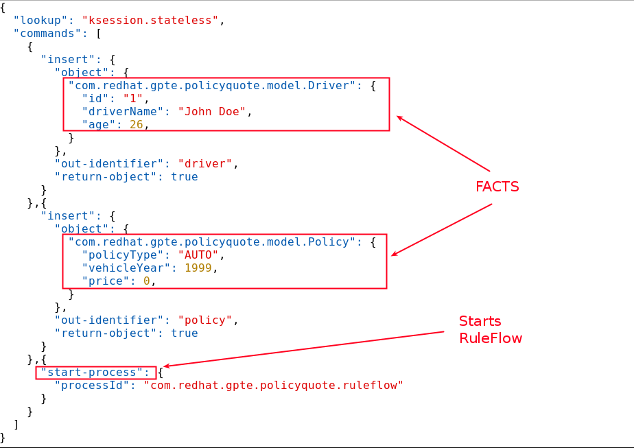

:scrollbar:
:data-uri:
:noaudio:

== Batch Execution

.*Server Batch Payload Example*

ifdef::showscript[]

Transcript:

This code sample shows a payload with information about the facts to be inserted in the execution context and a ruleflow to be executed with the given input.

endif::showscript[]
