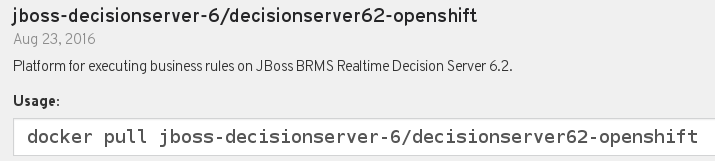

:scrollbar:
:data-uri:

== Realtime Decision Server for OpenShift

* Red Hat JBoss BRMS available as containerized OpenShift Container Platform image:
+

* Realtime Decision Server official image name: xPaaS Image for Red Hat JBoss BRMS

ifdef::showscript[]

Transcript:

The stateless Realtime Decision Server is available as an image for Red Hat JBoss BRMS. It is officially called xPaaS Image for Red Hat JBoss BRMS.  

endif::showscript[]
