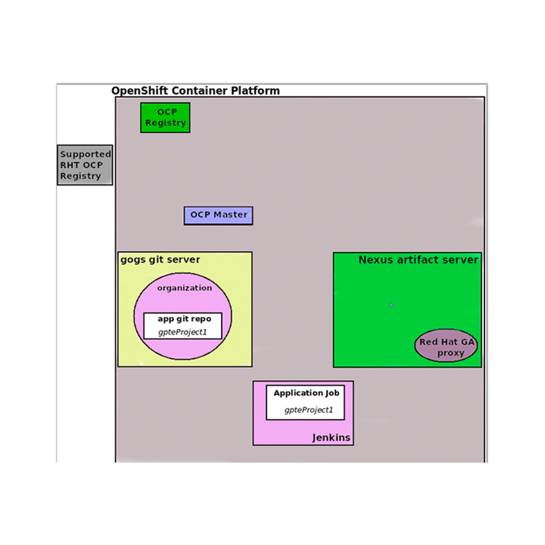

:scrollbar:
:data-uri:
:noaudio:

== xPaaS Decision Server

.Binary Deployment

ifdef::showscript[]

When using the Binary Deployment: The Decision Server topology for the deployment works in this way:
1. A git server receives the changes to rules and ruleflows source code.
2. When the change is detected by web-hooks, those changes are pulled in a Jenkins server that will perform 2 tasks in the pipeline: first the Jenkins pipeline will generate binaries to be uploaded to a Nexus Maven Repository, and second, the Jenkins pipeline executes the `oc new-app` command with the required parameters to trigger an OCP container creation.
3. The OCP master receives the parameters from the `oc new-app` command and retrieves the required information from the Red Hat OCP Registry and from the Maven repository to create a Container Node.
4. A new container is started in OCP with the given Docker image and the Maven binaries.

endif::showscript[]
