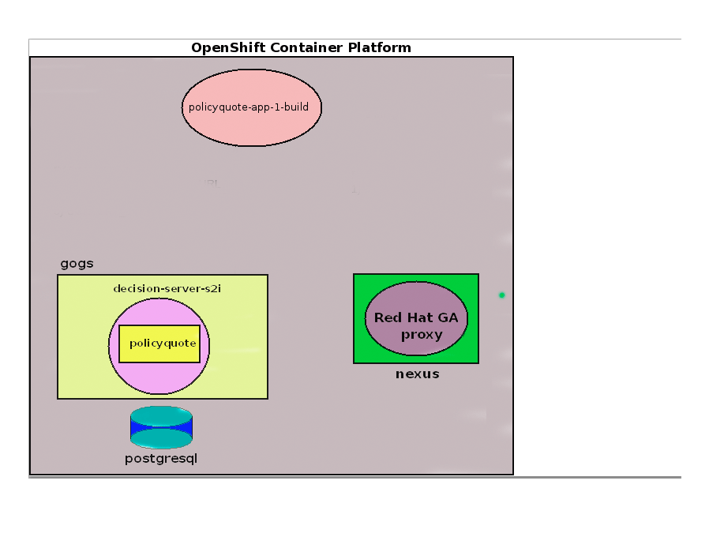

:scrollbar:
:data-uri:
:noaudio:

== xPaaS Decision Server Parameters

ifdef::showscript[]

When using the S2I Deployment: The Decision Server topology for the deployment works in this way:
1. The command to create a new container is received in the OCP Master node with the following parameters:
  * SOURCE_REPOSITORY_URL
  * SOURCE_REPOSITORY_REF
  * CONTEXT_DIR
2. The base image is retrieved from the Red Hat OCP Registry.
3. The source code is retrieved from the given source repository parameters.
4. If given, the MAVEN_MIRROR_URL is used to retrieve additional dependencies from a Maven Nexus repository.
5. All this information is put together by OCP and a new container is generated with the given resources.

endif::showscript[]
