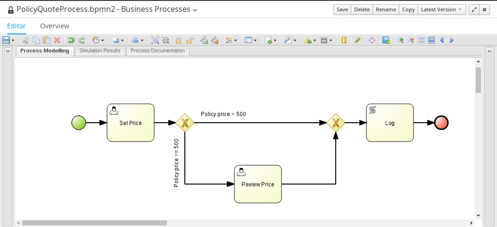
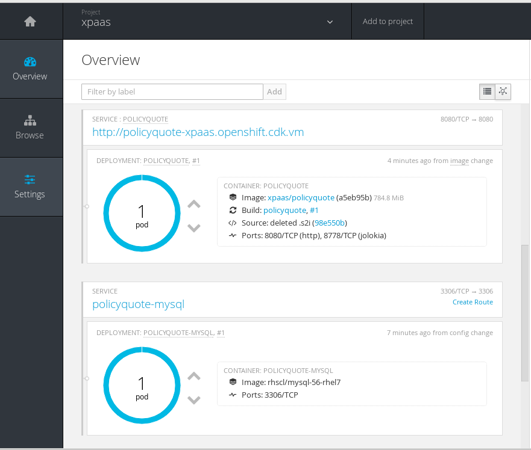

:scrollbar:
:data-uri:
:toc2:
:numbered:

= xPaaS Process Server Lab: S2I Deployments

.*Goals*

In this lab we will explore the Red Hat xPaaS Process Server. The Process Server runtime is a BPMS KIE Server configured for deployment on OpenShift. The Process Server supports source-to-image builds, as well as binary deployments starting from pre-built kjars.

The lab consists of three parts:

* exploring the source-to-image (S2I) functionality of the OpenShift xPaaS Process Server.
* example of binary deployment with the OpenShift xPaaS Process Server. This scenario also leverages side-by-side deployment of different versions of the same kjar, using aliases to make this transparent to application clients.
* example of integration of the Process Server with Red Hat SSO.

== Prerequisites and setup

In order to do this lab you will need

* access to a project on a Openshift V3 (OSE) hosted environment.
* required tools on your local workstation: OpenShift CLI client (`oc`), git, maven, curl. +
The lab virtual machine used in this course has these tools installed.
* access to Github to clone the projects used in this lab.

Before starting the lab, log into the OpenShift environment using the OpenShift CLI tool. If using a hosted environment, use the credentials provided to you:

----
$ oc login https://master.na.openshift.opentlc.com
----

On the environment provided to you, a project has been created. After logging in, all CLI commands will target this project.

Also, make sure you can access the OpenShift Web Console. Open a browser, and navigate to the OpenShift V3 URL. Login using the same credentials as used for the CLI.

Some tasks in this lab are identical to the xPaaS Decision Server Lab, for example setting up the Git and Nexus repositories. Detailed instructions for these parts will not be repeated here. Please refer to the xPaaS Decision Server Lab instructions if needed.

=== Gogs Git Server

If you did the xPaaS Decision Server Lab, the Gogs server should be up and running. If not, refer to the xPaaS Decision Server Lab for detailed instructions to install the Gogs server on OpenShift.

. Log in into the Gogs server with your username/password combination.
. Create an organization called `process-server-s2i`. +
Make sure that you are a member of the new organization. You should be listed as `owner`.
. Create a repository in the `process-server-s2i` organization the with name `policyquote`. Make sure the repository is not private. Make sure the checkbox `Initialize this repository with selected file and template` is unchecked. Click `Create repository`. +
Later in the lab we will push our BPMS project to this repository.

=== Nexus Maven Repository Server

If you did the xPaaS Decision Server Lab, the Nexus server should be up and running. If not, refer to the xPaaS Decision Server Lab for detailed instructions to install the Nexus server on OpenShift.

== Process Server Image Stream and S2I Template

The image stream for the Process Server image will be reused by different templates in this lab.

. In the virtual machine, open a terminal, and change to the directory in the cloned lab project that contains the templates for the Process Server lab.
+
----
$ cd /home/jboss/lab/bxms-advanced-infrastructure-lab/xpaas/process-server
----
. Review the `processserver-63-is.yaml` definition file. This file defines the ImageStream for the Process Server 6.3 image, hosted in the Red Hat docker registry. The latest version of this image is 1.3.
. Create the ImageStream for the Process Server image:
+
----
$ oc create -f processserver-63-is.yaml
----

The Process Server requires a database. For this lab we will use MySQL, with the MySql data directory attached to persistent storage.

. Review the `processserver-mysql-persistent-s2i.yaml` template. +
This template defines:
* A BuildConfig for the S2I build. +
The BuildConfig defines a source build, pointing to a git repo, as well as the builder image, through the ImageStream we defined earlier. +
The build will be triggered through a webhook (triggered whenever we push new code to the git repository), or by a change in the builder image.
* An ImageStream for the image created as a result of the build.
* A DeploymentConfig for the pod(s) running the image created as result of the build. The number of replica's is set to one.
* A Service for the Process Server.
* A Route for the Process Server.
* A DeploymentConfig for the MySQL database pod. The source image is the MySQL Docker image shipped as part of OpenShift. The MySQL data directory is mounted as a volume.
* A PersistentVolumeClaim for the MySQL data volume.
* A Service for the MySQL database, to expose the MySQL database to the Process Engine pods.
* Parameters:
** APPLICATION_NAME : the name for the application.
** KIE_CONTAINER_DEPLOYMENT : describes what kjar(s) needs to be deployed on the Decision Server, in the format `containerId=groupId:artifactId:version|c2=g2:a2:v2`
** KIE_CONTAINER_REDIRECT_ENABLED : Enable redirect functionality for KIE containers. Defaults to true. Should be true when different versions of the same kjar are to be deployed side-by-side.
** KIE_SERVER_USER : the user name to access the KIE Server REST or JMS interface. Defaults to `kieserver`.
** KIE_SERVER_PASSWORD : The password to access the KIE Server REST or JMS interface. Defaults to a generated value.
** KIE_SERVER_BYPASS_AUTH_USER : Whether to bypass the authenticated user. This allows to use a system user account to perform task operations on behalf of the real user. Defaults to false.
** KIE_SERVER_HT_CALLBACK : Callback implementation to resolve users and groups. Defaults to `jaas`.
** KIE_SERVER_PERSISTENCE_DIALECT : Hibernate persistence dialect. Defaults to `org.hibernate.dialect.MySQL5Dialect`.
** DB_USERNAME : Database user name. Defaults to a generated value.
** DB_PASSWORD : Database user password. Defaults to a generated value.
** DB_JNDI : JNDI name of the datasource. Defaults to `java:jboss/datasources/ExampleDS`.
** DB_DATABASE : Database schema name. Defaults to `bpms`.
** MYSQL_LOWER_CASE_TABLE_NAMES : Sets how the table names are stored and compared. Defaults to `1` (true).
** HOSTNAME_HTTP : Custom hostname for the http service route. Leave blank for default hostname generated by OpenShift.
** SOURCE_REPOSITORY_URL : Git source URI for application. Required.
** SOURCE_REPOSITORY_REF : the Git branch/tag reference to build. Defaults to `master`.
** CONTEXT_DIR : The path within the Git project to build. Leave blank for the root project directory.
** GITHUB_WEBHOOK_SECRET : GitHub trigger secret. Will be added to the webhook URL. Defaults to a generated value.
** GENERIC_WEBHOOK_SECRET : Generic build trigger secret. Will be added to the webhook URL. Defaults to a generated value.
** IMAGE_STREAM_NAMESPACE : Namespace in which the ImageStreams for Red Hat xPaaS images are installed. These ImageStreams are normally installed in the openshift namespace. You should only need to modify this if you've installed the ImageStreams in a different namespace/project (which is the case in our lab).
** MAVEN_MIRROR_URL : The URL of the maven mirror (Nexus server)
** VOLUME_CAPACITY : the volume capacity for the PersistentVolumeClaim for the database, defaults to 512 Mi.
* Note: The Process Server uses an insecure route (http, no https).
. Import the template into your OpenShift project:
+
----
$ oc create -f processserver-mysql-persistent-s2i.yaml
----

== Policyquote-process sample application

The Policyquote-process sample application is a very simple BPMS application, consisting of a single process model and a data model with a Driver and a Policy object. A process is started with an instance of these objects as process variables. The process consists of a User task assigned to the group `agent`, and potentially a review task assigned to the group `reviewer` if the price set by the `agent` user is more than 500.

The application has been developed in Business-Central, and can be imported into Business-Central if you want to review, extend or modify it.

In this part of the lab, we will clone the Policyquote-process project from Github, and push it to the Gogs server on OpenShift to act as source for the S2I build.

. In the virtual machine, open a terminal and change to the lab home folder.
+
----
$ cd /home/jboss/lab
----
. Clone the Policyquote-process project from the GPTE Github site:
+
----
$ git clone https://github.com/gpe-mw-training/bxms-xpaas-policyquote-process
----
. Add a remote repository to the cloned project pointing to our Gogs git server:
+
----
$ cd bxms-xpaas-policyquote-process
$ git remote add gogs http://<gogs username>:<gogs password>@<url of the gogs route>/process-server-s2i/policyquote.git
----
+
Replace `<gogs password>`,`<url of the gogs route>` and `<gogs username>` with the appropriate values for your environment.
. Push the code to the Gogs server:
+
----
$ git push gogs master
----
. We need to define users and roles for our application. By default the Process Server uses properties files to define users and roles, and we are going to use the same mechanism for our lab. +
The Process Server image comes with empty properties files for application users and roles, so we need to add them as part of the S2I build. This can be done by adding the properties files to a folder called `configuration` in the build root folder of our project. As part of the S2I build, the contents of the `configuration` folder is copied to the `$JBOSS_HOME/standalone/configuration` folder on the image. The user defined in the template (`KIE_SERVER_USER/KIE_SERVER_PASSWORD`) will also be added to the properties files during the S2I build.
.. Change to the `policyquote-process` directory of the cloned Policyquote-process project. This is the directory that contains the POM file for the application.
+
----
$ cd policyquote-process
----
.. Create a directory called `configuration`, and create two files, called `application-users.properties` and `application-roles.properties`.
+
----
$ mkdir configuration
$ touch configuration/application-users.properties
$ touch configuration/application-roles.properties
----
.. Using a text editor, open the `configuration/application-users.properties` file. Paste the following contents in the file and save:
+
----
user1=e6e3515c498a9dd0d3f9ff109a563d70
user10=aab70ed7128574f33830762d5a7706b8
user11=d52988665526b974adda93cbd3af9657
user2=60a186310ff25f5eaf61371df513e9dd
user20=63b620eaa18caf1df6a29891a24f5338
user21=37e033fbd7f1398e9897b7bba355338b
----
+
All users have the password `user`.
.. Open the `configuration/application-roles.properties` file. Paste the following contents in the file and save:
+
----
user1=kie-server,agent
user10=kie-server,agent
user11=kie-server,agent
user2=kie-server,reviewer
user21=kie-server,reviewer
user22=kie-server,reviewer
----
+
Note that all users require the `kie-server` role in order to be able to use the REST API of the Process Server.
.. Add to git, commit and push to Gogs
+
----
$ git add configuration/application-users.properties
$ git add configuration/application-roles.properties
$ git commit -m "users and roles for the application"
$ git push gogs master
----

== OpenShift Process Server Application

. In the virtual machine, open a terminal, change to the directory in the cloned lab project that contains the templates for the Process Server lab:
+
----
$ cd /home/jboss/lab/bxms-advanced-infrastructure-lab/xpaas/process-server
----
. Issue the following commands (replace expressions between `<>` with correct values for your environment) to create the application:
+
----
$ application_name=policyquote
$ source_repo=http://gogs:3000/process-server-s2i/policyquote.git
$ context_dir=policyquote-process
$ nexus_url=http://nexus:8081
$ kieserver_password=kieserver1!
$ is_namespace=<name of your OpenShift project>
$ kie_container_deployment="policyquote-process=com.redhat.gpte.xpaas.process-server:policyquote-process:1.0-SNAPSHOT"
$ oc new-app --template=processserver63-mysql-persistent-s2i -p APPLICATION_NAME=$application_name,SOURCE_REPOSITORY_URL=$source_repo,CONTEXT_DIR=$context_dir,KIE_SERVER_PASSWORD=$kieserver_password,IMAGE_STREAM_NAMESPACE=$is_namespace,KIE_CONTAINER_DEPLOYMENT=$kie_container_deployment,KIE_CONTAINER_REDIRECT_ENABLED=false,MAVEN_MIRROR_URL=$nexus_url/content/groups/public/
----
+
* Note that the KIE_CONTAINER_REDIRECT_ENABLED environment variable is set to false. This means that the name of the KIE-Container for our application will be `policyquote-process`, as defined in KIE_CONTAINER_DEPLOYMENT. +
Also note that we need to specify the context directory for the build, which corresponds to the directory containing the POM file. This will be the base directory for the S2I build.

. Check the progress of the build and deployment of the application in the OpenShift console.
* If you finished the Decision Server Lab, the build will be fairly fast, as the Nexus maven proxy is already seeded with the build dependencies. Actually most of the build time is spent pushing the built Docker image to the internal registry.
* The S2I build is happening in a builder pod, named `policyquote-1-build`. Check the logs for this pod in the web console, or use the Openshift CLI:
+
----
$ oc logs -f policyquote-1-build
----
* At the end of the build cycle, you should see the following in the builder pod log:
+
----
E1028 12:48:05.162259       1 util.go:91] INFO: KieModule was added: ZipKieModule[releaseId=com.redhat.gpte.xpaas.process-server:policyquote-process:1.0-SNAPSHOT,file=/home/jboss/.m2/repository/com/redhat/gpte/xpaas/process-server/policyquote-process/1.0-SNAPSHOT/policyquote-process-1.0-SNAPSHOT.jar]
E1028 12:48:05.449644       1 util.go:91] Oct 28, 2016 12:48:05 PM org.openshift.kieserver.common.server.ContainerVerifier main
E1028 12:48:05.449660       1 util.go:91] INFO: com.redhat.gpte.xpaas.process-server:policyquote-process:1.0-SNAPSHOT verified.
I1028 12:48:10.711522       1 sti.go:268] Using provided push secret for pushing 172.30.22.135:5000/xpaas/policyquote:latest image
I1028 12:48:10.712003       1 sti.go:272] Pushing 172.30.22.135:5000/xpaas/policyquote:latest image ...
I1028 12:49:46.470266       1 sti.go:288] Successfully pushed 172.30.22.135:5000/xpaas/policyquote:latest
----
* The image built by the builder pod is pushed to the OpenShift internal registry. This will trigger the deployment of the image.
* To check the logs of the application pod, locate the pod (name `policyquote-1-xxxxx`), and check the logs in the OpenShift console or with the CLI.
+
----
$ oc logs -f policyquote-1-xxxxx
----
* After some time, you will see something like:
+
----
12:50:36,611 INFO  [org.jboss.as] (Controller Boot Thread) JBAS015874: JBoss EAP 6.4.11.GA (AS 7.5.11.Final-redhat-1) started in 27356ms - Started 391 of 483 services (132 services are lazy, passive or on-demand)
12:50:39,462 INFO  [org.drools.compiler.kie.builder.impl.KieRepositoryImpl] (EJB default - 1) KieModule was added: ZipKieModule[releaseId=com.redhat.gpte.xpaas.process-server:policyquote-process:1.0-SNAPSHOT,file=/home/jboss/.m2/repository/com/redhat/gpte/xpaas/process-server/policyquote-process/1.0-SNAPSHOT/policyquote-process-1.0-SNAPSHOT.jar]
12:50:40,157 INFO  [org.quartz.core.SchedulerSignalerImpl] (EJB default - 1) Initialized Scheduler Signaller of type: class org.quartz.core.SchedulerSignalerImpl
12:50:40,158 INFO  [org.quartz.core.QuartzScheduler] (EJB default - 1) Quartz Scheduler v.1.8.5 created.
12:50:40,159 INFO  [org.quartz.impl.jdbcjobstore.JobStoreCMT] (EJB default - 1) Using db table-based data access locking (synchronization).
12:50:40,161 INFO  [org.quartz.impl.jdbcjobstore.JobStoreCMT] (EJB default - 1) JobStoreCMT initialized.
12:50:40,162 INFO  [org.quartz.core.QuartzScheduler] (EJB default - 1) Scheduler meta-data: Quartz Scheduler (v1.8.5) 'jBPMClusteredScheduler' with instanceId 'policyquote-1-21js61477673440134'
  Scheduler class: 'org.quartz.core.QuartzScheduler' - running locally.
  NOT STARTED.
  Currently in standby mode.
  Number of jobs executed: 0
  Using thread pool 'org.quartz.simpl.SimpleThreadPool' - with 5 threads.
  Using job-store 'org.quartz.impl.jdbcjobstore.JobStoreCMT' - which supports persistence. and is clustered.

12:50:40,163 INFO  [org.quartz.impl.StdSchedulerFactory] (EJB default - 1) Quartz scheduler 'jBPMClusteredScheduler' initialized from specified file: '/opt/eap/bin/quartz.properties'
12:50:40,163 INFO  [org.quartz.impl.StdSchedulerFactory] (EJB default - 1) Quartz scheduler version: 1.8.5
12:50:40,186 INFO  [org.kie.server.services.jbpm.JbpmKieServerExtension] (EJB default - 1) Container policyquote-process created successfully
12:50:40,189 INFO  [org.kie.server.services.impl.KieServerImpl] (EJB default - 1) Container policyquote-process (for release id com.redhat.gpte.xpaas.process-server:policyquote-process:1.0-SNAPSHOT) successfully started
12:50:42,194 INFO  [org.quartz.core.QuartzScheduler] (Thread-93) Scheduler jBPMClusteredScheduler_$_policyquote-1-21js61477673440134 started.
----
* By that time, the service and the route will be started, and our Process Server application is ready to serve requests.
+

== Testing the sample application

We can test the application using `curl` and the REST API of the Process Server.

. In a terminal window, issue the following commands:
+
----
$ policyquote_app=<URL of the policyquote app route>
$ kieserver_password=kieserver1!
----
. To check the health of the Process Server:
+
----
$ curl -X GET -H "Accept: application/json" --user kieserver:$kieserver_password "$policyquote_app/kie-server/services/rest/server"
----
+
Response:
+
----
{
  "type": "SUCCESS",
  "msg": "Kie Server info",
  "result": {
    "kie-server-info": {
      "version": "6.4.0.Final-redhat-3",
      "name": "kieserver-policyquote-1-21js6",
      "location": "http://policyquote-1-21js6:8080/kie-server/services/rest/server",
      "capabilities": [
        "BRM",
        "BPM",
        "KieServer"
      ],
      "messages": [
        {
          "severity": "INFO",
          "timestamp": 1477673436299,
          "content": [
            "Server KieServerInfo{serverId='kieserver-policyquote-1-21js6', version='6.4.0.Final-redhat-3', location='http://policyquote-1-21js6:8080/kie-server/services/rest/server'}started successfully at Fri Oct 28 12:50:36 EDT 2016"
          ]
        }
      ],
      "id": "kieserver-policyquote-1-21js6"
    }
  }
}
----
+
Note that the server location returned by this call does correspond to the URL of the pod, which is not accessible from the outside world.
. To check which KIE-Containers are deployed on the server:
+
----
$ curl -X GET -H "Accept: application/json" --user kieserver:$kieserver_password "$policyquote_app/kie-server/services/rest/server/containers"
----
+
Response:
+
----
{
  "type": "SUCCESS",
  "msg": "List of created containers",
  "result": {
    "kie-containers": {
      "kie-container": [
        {
          "status": "STARTED",
          "messages": [
            {
              "severity": "INFO",
              "timestamp": 1477673440202,
              "content": [
                "Container policyquote-process successfully created with module com.redhat.gpte.xpaas.process-server:policyquote-process:1.0-SNAPSHOT."
              ]
            }
          ],
          "container-id": "policyquote-process",
          "release-id": {
            "version": "1.0-SNAPSHOT",
            "group-id": "com.redhat.gpte.xpaas.process-server",
            "artifact-id": "policyquote-process"
          },
          "resolved-release-id": {
            "version": "1.0-SNAPSHOT",
            "group-id": "com.redhat.gpte.xpaas.process-server",
            "artifact-id": "policyquote-process"
          },
          "config-items": []
        }
      ]
    }
  }
}
----
+
There is 1 KIE-Container deployed, named `policyquote-process`, which resolves to the maven GAV of our project. This corresponds to the value of the `KIE_CONTAINER_DEPLOYMENT` parameter we passed in when creating the application.
. To start a process, we need to send a correctly formatted payload representing a Driver and a Policy object instance marshalled to JSON. The `/xpaas/process-server` directory of the lab contains an example. Make sure you are in that directory, and execute:
+
----
$ curl -X POST -H "Accept: application/json" -H "Content-Type: application/json" --user kieserver:$kieserver_password -d @policyquote-start-process-payload.json "$policyquote_app/kie-server/services/rest/server/containers/policyquote-process/processes/policyquote.PolicyQuoteProcess/instances"
----
+
NOTE: `policyquote-process` is the name of the KIE-Container we target, `policyquote.PolicyQuoteProcess` is the id of the process in our app.
+
The response of this call is the process instance id of the process that was created.
. To check that we have a running process instance, we can issue the following REST call:
+
----
$ curl -X GET -H "Accept: application/json" --user kieserver:$kieserver_password "$policyquote_app/kie-server/services/rest/server/queries/containers/policyquote-process/process/instances"
----
+
You should have (at least) one running process instance.
. The process instance we started is waiting in a User task node, assigned to the `agent` group. User `user1` is a member of that group, so we can query for the tasks which have `user1` as potential owner:
+
----
$ curl -X GET -H "Accept: application/json" --user user1:user "$policyquote_app/kie-server/services/rest/server/queries/tasks/instances/pot-owners"
----
+
Response:
+
----
{
  "task-summary": [
    {
      "task-id": 1,ki
      "task-name": "Set Price",
      "task-subject": "",
      "task-description": "",
      "task-status": "Ready",
      "task-priority": 0,
      "task-is-skipable": true,
      "task-created-on": 1477679120000,
      "task-activation-time": 1477679120000,
      "task-proc-inst-id": 1,
      "task-proc-def-id": "policyquote.PolicyQuoteProcess",
      "task-container-id": "policyquote-process",
      "task-parent-id": -1
    }
  ]
}
----
. As `user1`, we can claim and start the task.
+
----
$ curl -X PUT -H "Accept: application/json" --user user1:user "$policyquote_app/kie-server/services/rest/server/containers/policyquote-process/tasks/1/states/claimed"
$ curl -X PUT -H "Accept: application/json" --user user1:user "$policyquote_app/kie-server/services/rest/server/containers/policyquote-process/tasks/1/states/started"
----
. Still as `user1`, the task can be completed. We specify the policy price as payload of this call, using the `task_price` task output variable.
+
----
$ curl -X PUT -H "Accept: application/json" --user user1:user -d '{ "task_price" : 300 }' "$policyquote_app/kie-server/services/rest/server/containers/policyquote-process/tasks/1/states/completed"
----
+
. The tasks definitions in our process, including the input and output data associations, can be obtained through the following REST call:
+
----
$ curl -X GET -H "Accept: application/json" --user kieserver:$kieserver_password "$policyquote_app/kie-server/services/rest/server/containers/policyquote-process/processes/definitions/policyquote.PolicyQuoteProcess/tasks/users"
----
. In the logs of the Process Server pod you should see the following line, indicating that the process instance has been completed:
+
----
10:35:41,115 INFO  [stdout] (http-172.17.0.7:8080-1) Driver 1234: Policy price after calculation and review = 300
----

== Application lifecycle

Managing changes in a Process Server application is more complex than with Decision Server applications, because of the state involved with processes versus the stateless nature of business rules invocations.

With Decision Server applications, we can simply build new pods with the new version of the rules application and do a rolling upgrade of the existing application pods.

With Process Servers this is not possible. If there are still process instances in a wait state for the old version, chances are high that these will not execute correctly with a new process definition (depending of course on the nature of the changes introduced). +
In a development or test environment we could recreate a complete new application, including the database pods, as we are probably less interested in dangling process instances from previous versions. But in a production environment this is of course unacceptable.

In that case, we need to be able to retain the previous process deployments next to the new ones, at least as long as we have running process instances for these previous versions.

The Process Server xPaaS images provide a mechanism to achieve this, by using KIE-Container aliases and redirects. We will explore this mechanism in the second part of this lab.

Before proceeding with the second part of the lab, tear down the `policyquote` application:

----
$ oc delete all -l "application=policyquote"
$ oc delete pvc policyquote-mysql-pvc
----

ifdef::showscript[]
endif::showscript[]
