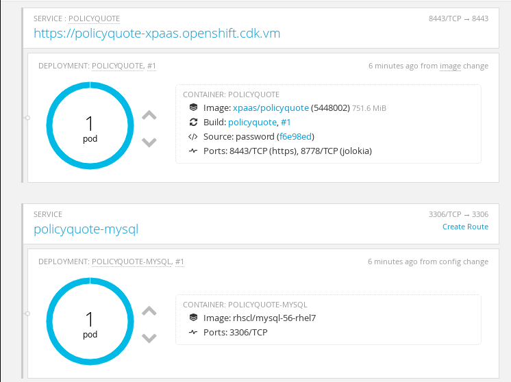

:scrollbar:
:data-uri:
:linkattrs:
:toc2:

== Intelligent Process Server and Red Hat Single Sign-On Integration Lab

In the previous labs, you added users and roles in properties files to the projects you built. This allowed your project to log in to the Intelligent Process Server and interact with business processes. While this is adequate for a proof-of-concept application, a centrally managed repository of users and roles is more practical for a production environment.

Intelligent Process Server Docker images are built on JBoss EAP xPaaS images, which have built-in support for integration with Red Hat Single Sign-On. This allows applications deployed on the JBoss EAP application server to use Red Hat Single Sign-On for user authentication and authorization. You can use the same mechanism to integrate the Intelligent Process Server with Red Hat Single Sign-On.

In this lab, you use SSL for all communication with and between the Intelligent Process Server and the Red Hat Single Sign-On server.

.Goal
* Review an example of integration of Intelligent Process Server with Red Hat Single Sign-On

.Requirements
* Completion of the previous labs in this course
** In particular, you need the `gogs` and `nexus` pods you provisioned in previous labs in your OpenShift Container Platform lab environment.
* Workstation with the following additional tools installed:
** `openssl`
** `keytool`

:numbered:

== Prepare Certificates, Keystores, and Truststores

In this section of the lab, you generate and import SSL certificates. These SSL certificates are used to support link:https://en.wikipedia.org/wiki/Mutual_authentication["two-way mutual authentication^"] between the Intelligent Process Server and the Red Hat Single Sign-On server.

. In the lab VM, change to the `ssl` directory:
+
[source,text]
----
$ cd /home/jboss/lab/ssl
----

. Generate a certificate authority (CA) certificate.
.. If you completed the second lab in module 2, you already have a private key and a certificate created, and can skip this step.
.. If not, run the following commands to generate a CA certificate:
+
[source,text]
----
$ openssl genrsa -out private/acme-ca.key -des3 2048
$ openssl req -new -x509 -key private/acme-ca.key -days 365 -out acme-ca.crt -subj "/CN=ACME Certification Authority"
----
.. When prompted for a passphrase, enter one, and remember it.
** You use it again later in the lab.

. Set some shell variables related to your OpenShift environment:
+
[source,text]
----
$ export OCP_PROJECT=oc project | sed 's/Using project \"//g' | sed 's/\".*//g'
$ export OCP_DOMAIN=<name of your OCP domain>
----
* Expect your domain name to be similar to `cloudapps.na.openshift.opentlc.com`.

. Generate a certificate for the SSL keystore to be used on the Red Hat Single Sign-On server:
+
----
$ keytool -genkeypair -keyalg RSA -keysize 2048 \
          -dname "CN=rhsso-$OCP_PROJECT.$OCP_DOMAIN" \
          -alias xpaas-https-key -keystore xpaas-sso-https.jks
----
. When prompted for a keystore password, use the same password that you used for the key.

. Generate a certificate for the SSL keystore to be used on the Intelligent Process Server:
+
[source,text]
----
$ keytool -genkeypair -keyalg RSA -keysize 2048 \
          -dname "CN=policyquote-$OCP_PROJECT.$OCP_DOMAIN" \
          -alias xpaas-https-key -keystore xpaas-ps-https.jks
----
. When prompted for a keystore password, use the same password that you used for the key.

. Create certificate signing requests (CSRs) for the keys in the keystores:
+
[source,text]
----
$ keytool -certreq -keyalg rsa -alias xpaas-https-key -keystore xpaas-sso-https.jks -file xpaas-sso.csr
$ keytool -certreq -keyalg rsa -alias xpaas-https-key -keystore xpaas-ps-https.jks -file xpaas-ps.csr
----

. Sign the CSRs with the CA certificate:
+
[source,text]
----
$ openssl ca -config ca.cnf -out xpaas-sso.crt -infiles xpaas-sso.csr
$ openssl ca -config ca.cnf -out xpaas-ps.crt -infiles xpaas-ps.csr
----
* This is similar to what a legitimate Certificate Authority does.

. Import the CA into the SSL keystores:
+
[source,text]
----
$ keytool -import -file acme-ca.crt -alias acme.ca -keystore xpaas-sso-https.jks
$ keytool -import -file acme-ca.crt -alias acme.ca -keystore xpaas-ps-https.jks
----

. Import the signed certificates into their respective SSL keystores:
+
[source,text]
----
$ keytool -import -file xpaas-sso.crt -alias xpaas-https-key -keystore xpaas-sso-https.jks
$ keytool -import -file xpaas-ps.crt -alias xpaas-https-key -keystore xpaas-ps-https.jks
----

. Import the self-signed CA into a truststore:
+
[source,text]
----
$ keytool -import -file acme-ca.crt -alias xpaas.ca -keystore truststore.jks
----

== Create Red Hat Single Sign-On Server

The xPaaS collection of images for OpenShift includes an image for Red Hat Single Sign-On 7.0. An ImageStream for this image is installed by default in OpenShift.

The SSO image uses a secret to hold the keystore and truststore created in the previous section. Within these images, the secret is mounted as a volume on the image file system, so that it can be used by the Red Hat Single Sign-On server.

. Create a service account to hold the secret:
+
[source,text]
----
$ oc create serviceaccount sso-service-account
----

. Create the secret with the keystore and truststore:
+
[source,text]
----
$ oc create secret generic sso-app-secret --from-file=xpaas-sso-https.jks --from-file=truststore.jks
----

. Add the secret to the service account:
+
[source,text]
----
$ oc secret add sa/sso-service-account secret/sso-app-secret
----

. Change to the directory in the cloned lab project that contains the common lab templates:
+
[source,text]
----
$ cd /home/jboss/lab/bxms-advanced-infrastructure-lab/xpaas/common
----

. Review the `xpaas-sso-mysql-persistent.yaml` template's definitions, which illustrate how to configure a Red Hat Single Sign-On server with a MySQL database:
* A Service for the Red Hat Single Sign-On server, bound to port `8443`
* A Route for the Red Hat Single Sign-On server that is configured with TLS, and is exposed using the HTTPS protocol.
* A DeploymentConfig for the Red Hat Single Sign-On server pod that uses the `redhat-sso70-openshift` ImageStream.
** It is configured to use the service account you created previously.
** The keystore and truststore are mounted in `/etc/eap-secret-volume` and `/etc/sso-secret-volume`.
* A DeploymentConfig for the MySQL pod.
* A PersistentVolumeClaim for the MySQL data volume.

* Parameters:
** `HTTPS_KEYSTORE`: Name of the keystore file within the secret
** `HTTPS_PASSWORD`: Password for the keystore
** `SSO_TRUSTSTORE`: Name of the truststore file within the secret
** `SSO_TRUSTSTORE_PASSWORD`: Password for the truststore

* For other parameters, you can use the default or generated values.

. Create an application based on the `xpaas-sso-mysql-persistent.yaml` template:
+
[source,text]
----
$ export https_keystore=xpaas-sso-https.jks
$ export https_password=<keystore password>
$ export sso_truststore=truststore.jks
$ export sso_truststore_password=<truststore password>
$ oc process -f xpaas-sso-mysql-persistent.yaml HTTPS_KEYSTORE=$https_keystore HTTPS_PASSWORD=$https_password SSO_TRUSTSTORE=$sso_truststore SSO_TRUSTSTORE_PASSWORD=$sso_truststore_password | oc create -f -
----
* Once all of the components are up, expect to see the Red Hat Single Sign-On application in the OpenShift Container Platform web console:
+
image::images/ocp-sso-application.png[]

* Note that the `rhsso` route is exposed over HTTPS.

. Open a web browser and navigate to the URL retrieved from the following:
+
[source,text]
-----
$ echo -en "\nhttps://"$(oc get route/rhsso -o template --template {{.spec.host}})"/auth/admin\n\n"
-----

. Log in with the username `admin` and the password `admin`.
* Because the SSL certificate is not signed by a trusted CA, expect to see a warning that the connection is unsafe.

== Create Realm

. On the home page of the Red Hat Single Sign-On Admin Console, hover over the `Master` realm and click *Add realm* to create a new realm:
+

. Click *Select file*, and select the `processserver-realm.json` file in the `xpaas/common/export` directory of the lab project.

. Click *Create*.

* This creates the realm, a client for cURL, and a number of roles that can be used for the `policyquote-process` application.

. On the `Processserver` realm page, click *Manage -> Import*.
. Select the `processserver-users-0.json` file in the `xpaas/common/export` directory of the lab project and click *Import* to import user definitions.
* All users have the password `user`.

. On the `Processserver` realm page, select *Clients*, and click *Create*  to create an `openid-connect` client for the Intelligent Process Server.

. Name the client `process-server`, make sure the *Protocol* is set to `openid-connect`, leave the other fields blank, and click *Save*.
. On the *Settings* tab of the `process-server` client, for the *Access Type* select *bearer-only*, and click *Save*.
. Test that the realm is working correctly:
+
[source,text]
----
$ export rhsso_url=https://"$(oc get route/rhsso -o template --template {{.spec.host}})"
$ export cacert=<path to the acme-ca.crt certificate file>
$ TKN=$(curl -X POST "$rhsso_url/auth/realms/processserver/protocol/openid-connect/token" \
 -H "Content-Type: application/x-www-form-urlencoded" \
 -d "username=user1" \
 -d "password=user" \
 -d "grant_type=password" \
 -d "client_id=curl" \
  --cacert $cacert \
| sed 's/.*access_token":"//g' | sed 's/".*//g')
$ echo $TKN
----
+
.Sample Output
[source,text]
----
$ echo $TKN
eyJhbGciOiJSUzI1NiJ9.eyJqdGkiOiIyNWIwYjc1MS0yNGQxLTQ2MmUtYjBlMy0yYmYyZjc0YmM3ZWIiLCJleHAiOjE0NzgzNzA4MzAsIm5iZiI6MCwiaWF0IjoxNDc4MzcwNTMwLCJpc3MiOiJodHRwczovL3Joc3NvLXhwYWFzLm9wZW5zaGlmdC5jZGsudm0vYXV0aC9yZWFsbXMvcHJvY2Vzc3NlcnZlciIsImF1ZCI6ImN1cmwiLCJzdWIiOiI4NDUxZjk0MC0yYjgzLTQ3YjMtYWM3ZC04ZjQwMGUwMDE1OTciLCJ0eXAiOiJCZWFyZXIiLCJhenAiOiJjdXJsIiwic2Vzc2lvbl9zdGF0ZSI6IjliYzUzZjViLTQ0NDUtNDE0OS04MGEyLTgxY2ZiYTJjNDljNyIsImNsaWVudF9zZXNzaW9uIjoiY2JjNmEyZDgtMDk2MC00ZjQ1LWE2ZTctNzU2M2E1ODI1ODBlIiwiYWxsb3dlZC1vcmlnaW5zIjpbXSwicmVhbG1fYWNjZXNzIjp7InJvbGVzIjpbImFnZW50Iiwia2llLXNlcnZlciIsImdyb3VwMSJdfSwicmVzb3VyY2VfYWNjZXNzIjp7ImFjY291bnQiOnsicm9sZXMiOlsibWFuYWdlLWFjY291bnQiLCJ2aWV3LXByb2ZpbGUiXX19LCJuYW1lIjoiIiwicHJlZmVycmVkX3VzZXJuYW1lIjoidXNlcjEifQ.Lpo3ztry9C6Zz4XLMRmZzMzYOWa0Mvh2FOFSgze1RWnb_GaK02qpHD2stcoehFOysERbPi2kC0RVGT1sAhQNa8FeLXd4gOjxeasrlyP8WlvcVkCJaBE2bdXOi_juQMqVEAymFgsDEI9JciJvuOsB8lWM8pdPan5JnrxWSi4b0-TTsUt4gibDjFZGO0eUbHeEbRFvSnYZeGp2CpzjB60r3k3xjAi5umTiUih8KSjZWfWOHbp7BFrcFT6gFpqI2aznEpPhWAh8Jiedj1ZbRamqW8BE6mja-cOywx-5taY9vD7vbWuW42HCgmQbilbZ8SHMlG2yhpJO7joSX4CRSsxWrw
----
* Expect your encoded _access token_ to be different.

== Create Intelligent Process Server Deployment Project

. Open a browser window, navigate to the Gogs server on OpenShift, and log in with your username and password.
. Create a `process-server-sso` organization.
. Create a `policyquote-process-sso-ocp` repository in the `process-server-sso` organization.

. In the lab VM, open a terminal window and change to the lab home folder:
+
[source,text]
----
$ cd /home/jboss/lab
----

. Create the `policyquote-process-sso-ocp` directory and change to this directory:
+
[source,text]
----
$ mkdir policyquote-process-sso-ocp
$ cd policyquote-process-sso-ocp
----

. Create the `.s2i` directory and create an `environment` file within that directory:
+
[source,text]
----
$ mkdir .s2i
$ touch .s2i/environment
----

. Open the `environment` file for editing, and set the contents to the following:
+
[source,text]
----
KIE_CONTAINER_DEPLOYMENT_OVERRIDE=policyquote-process=com.redhat.gpte.xpaas.process-server:policyquote-process:1.0.0
----

* This tells the Intelligent Process Server to deploy the `1.0.0` version of the `policyquote-process` project into a KIE container with the `policyquote-process` alias.
* The KJAR is already published in the Nexus repository as part of the earlier lab.

. Save the file.

== Copy Red Hat Single Sign-On Client Adapter Configuration

To configure the Intelligent Process Server to use Red Hat Single Sign-On for authentication, you must copy the Red Hat Single Sign-On client adapter configuration to a file called `secure-deployments`. During the S2I build, the contents of this file are merged into the Intelligent Process Server configuration file.

. In the `policyquote-process-sso-ocp` project, create a directory named `configuration`, and in that directory, create a file called `secure-deployments`:
+
[source,text]
----
$ mkdir configuration
$ touch configuration/secure-deployments
----

. Open the `secure-deployments` file for editing.

. In a browser window, go to the Red Hat Single Sign-On Admin Console, and navigate to the `process-server` client page of the `Processserver` realm.

. Click the *Installation* tab and select the `Keycloak OIDC JBoss Subsystem XML` format:
+
image::images/rh-sso-client-installation.png[]

. Copy the XML fragment and paste it into the `secure-deployments` file.

. Change the `WAR MODULE NAME.war` value of the `secure-deployments` tag to `kie-server.war`.

. Add configuration for CORS, the principal attribute, and the truststore.

* Expect the `secure-deployments` file to look similar to this:
+
[source,xml]
----
<secure-deployment name="kie-server.war">
    <realm>processserver</realm>
    <realm-public-key>MIIBIjANBgkqhkiG9w0BAQEFAAOCAQ8AMIIBCgKCAQEAhAxGFraO+K+5qbpdlEJLG5LppyHtgMLc6EA3+VDrDDAiN0XFr+f4PTiK0Ijv1VrHC61NaVcdQsUilOk2xlV/8z2IZrmutZfPv/vkORfxVhytogykYn8+KbOPVg4KLutbqDdB4HaW2CD9UcBZg4DjzXke6sl9yu/yZVm9Ja07IL2LKsGXKqEPrm/0AlZjUCngn6VDbYEyS4AFtB2PsptQPix427aCqp8VlVo2tkcUCQFNgzYFve95rIks1WieBn+20SIESx2WqclZg2enOy4/4n4Pw+6oNIEuVePaj83dwnc1tgUoE8YtP0AMUfIoqq/CwJaf7pkqls1rxZe2YyahqQIDAQAB</realm-public-key>
    <auth-server-url>https://rhsso-xpaas.openshift.cdk.vm/auth</auth-server-url>
    <bearer-only>true</bearer-only>
    <ssl-required>ALL</ssl-required>
    <resource>process-server</resource>
    <enable-cors>true</enable-cors>
    <cors-max-age>1000</cors-max-age>
    <cors-allowed-methods>POST, PUT, DELETE, GET</cors-allowed-methods>
    <principal-attribute>preferred_username</principal-attribute>
    <disable-trust-manager>false</disable-trust-manager>
    <truststore>/etc/processserver-secret-volume/truststore.jks</truststore>
    <truststore-password>password</truststore-password>
</secure-deployment>
----

* Note that your value for `auth-server-url` and `truststore-password` are different.

. Save the `secure-deployments` file.

== Change Authentication Method

. In the `policyquote-process-sso-ocp` project, create the directory `.s2i/bin`, and in that directory create a `run` file:
+
[source,text]
----
$ mkdir .s2i/bin
$ touch .s2i/bin/run
----

. Open the `.s2i/bin/run` file for editing, and set the contents to the following:
+
[source,text]
----
#!/bin/sh

sed -i "s'<auth-method>.*</auth-method>'<auth-method>KEYCLOAK</auth-method>'g" $JBOSS_HOME/standalone/deployments/kie-server.war/WEB-INF/web.xml

exec $JBOSS_HOME/bin/kieserver-launch.sh
----

* This script uses `sed` to change the value of the authentication method in the `web.xml` of the `kie-server.war` deployment. It then launches the Intelligent Process Server start script.

. Save the file.

* Expect the structure of the `policyquote-process-sso-ocp` project to look like this:
+
image::images/policyquote-process-sso-ocp.png[]

. Push `policyquote-process-sso-ocp` to the Gogs server:
+
[source,text]
----
$ git init
$ git remote add gogs http://<gogs username>:<gogs password>@<url of the gogs route>/process-server-sso/policyquote-process-sso-ocp.git
$ git add --all
$ git commit -m "initial commit"
$ git push gogs master
----

== Deploy Intelligent Process Server Application

In this section, you deploy the Intelligent Process Server application.

. Create a service account to hold the secret with the keystore and truststore for SSL:
+
[source,text]
----
$ oc create serviceaccount processserver-service-account
----

. Navigate to the directory where you created the keystore and truststore files.

. Create the secret with the keystore and truststore:
+
[source,text]
----
$ oc create secret generic processserver-app-secret --from-file=xpaas-ps-https.jks --from-file=truststore.jks
----

. Add the secret to the service account:
+
[source,text]
----
$ oc secret add sa/processserver-service-account secret/processserver-app-secret
----

. Change to the directory in the cloned lab project that contains the templates for the Intelligent Process Server lab:
+
[source,text]
----
$ cd /home/jboss/lab/bxms-advanced-infrastructure-lab/xpaas/process-server
----

. Review the `processserver-sso-mysql-persistent-s2i.yaml` template.

* This template is similar to the Intelligent Process Server application template you used previously, except that it is configured to use HTTPS as the transport protocol.

. Create the application, replacing expressions between `< >` with the correct values for your environment:
+
[source,text]
----
$ export application_name=policyquote
$ export source_repo=http://gogs:3000/process-server-sso/policyquote-process-sso-ocp.git
$ export is_namespace=$(oc project | awk '{gsub(/"/,"",$3); print $3}')
$ export nexus_url=http://nexus:8081
$ export https_keystore=xpaas-ps-https.jks
$ export https_name=xpaas-https-key
$ export https_password=<keystore password>
$ oc process -f processserver-sso-mysql-persistent-s2i.yaml APPLICATION_NAME=$application_name SOURCE_REPOSITORY_URL=$source_repo IMAGE_STREAM_NAMESPACE=$is_namespace MAVEN_MIRROR_URL=$nexus_url/content/groups/public/ HTTPS_KEYSTORE=$https_keystore HTTPS_NAME=$https_name HTTPS_PASSWORD=$https_password | oc create -f -
----

* Once all of the components are up, expect to see the `policyquote-mysql` application in the OpenShift Container Platform web console:
+

* Note that the `policyquote` route is exposed over HTTPS.

== Test Application

Before issuing a `curl` command against the Intelligent Process Server, you must obtain a token from the Red Hat Single Sign-On server, and pass it to the Intelligent Process Server.

. Obtain a token as `user1`:
+
[source,text]
----
$ export rhsso_url=<URL of the RH SSO server>
$ export cacert=<path to the acme-ca.crt certificate file>
$ TKN=$(curl -X POST "$rhsso_url/auth/realms/processserver/protocol/openid-connect/token" \
 -H "Content-Type: application/x-www-form-urlencoded" \
 -d "username=user1" \
 -d "password=user" \
 -d "grant_type=password" \
 -d "client_id=curl" \
  --cacert $cacert \
| sed 's/.*access_token":"//g' | sed 's/".*//g')
----

. Check which KIE containers are deployed on the server:
+
[source,text]
----
$ export policyquote_url=<URL of the Process Server>
$ curl -X GET -H "Accept: application/json" -H "Authorization: Bearer $TKN" --cacert $cacert "$policyquote_url/kie-server/services/rest/server/containers"
----

* Basic authentication (using `--user user1:user` instead of `-H "Authorization: Bearer $TKN"` in the `curl` request) no longer works, and returns an HTTP `401` code.

. Using the `curl` commands from the _Test Sample Application_ section of the first lab in this module, test the `policyquote-process` route.

* For example, to start a new process:
+
[source,text]
----
curl -X POST -H "Accept: application/json" -H "Content-Type: application/json" -H "Authorization: Bearer $TKN" --cacert $cacert -d @policyquote-start-process-payload.json "$policyquote_url/kie-server/services/rest/server/containers/policyquote-process/processes/policyquote.PolicyQuoteProcess/instances"
----
+
[IMPORTANT]
Tokens have a limited lifespan. If the current one has expired, request a new one. When you want to switch users, be sure to get a new token and change the username in the `curl` token request accordingly.
