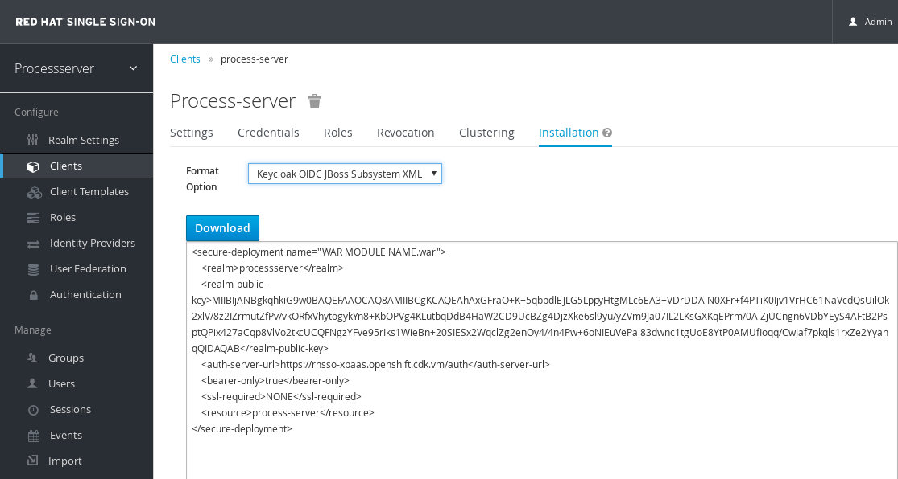
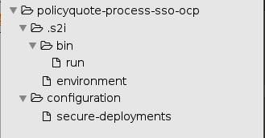

:scrollbar:
:data-uri:
:toc2:
:numbered:

= xPaaS Process Server: Integration with RH SSO Lab

In the previous labs, we had to add users and roles in properties files inside our project to be able to log in into the Process Server and interact with business process. This might be fine for a Proof-of-Concept, but is not an appropriate solution for a real life project.

The xPaaS Process Server Docker images are built on the xPaaS EAP images, which have built-in support for integration with Red Hat SSO. This allows applications deployed on the xPaaS EAP application server to use Red Hat SSO for user authentication and autorization. We can use the same mechanism to integrate the xPaaS Process Server with Red Hat SSO.

In this lab we will also use SSL for all communication with and between the Process Server and the SSO server.

=== Preparation of certificates, keystores and trustsores.

. On the lab virtual machine, create a directory `ssl` in the lab home folder. Change to the `ssl` directory:
+
----
$ mkdir ~/home/jboss/lab/ssl
$ cd ~/home/jboss/lab/ssl
----
. Generate a CA certificate.
+
----
$ openssl req -new -newkey rsa:4096 -x509 -keyout xpaas.key -out xpaas-ca.crt -days 365 -subj "/CN=xpaas-sso.ca"
----
+
Remember the key passphrase.
. Generate a certificate for the SSL keystore to be used on the SSO server:
+
----
$ keytool -genkeypair -keyalg RSA -keysize 2048 -dname "CN=rhsso-<name of your OpenShift project>.<name of your OpenShift domain>" -alias xpaas-https-key -keystore xpaas-sso-https.jks
----
+
Replace <name of your OpenShift project> and <name of your OpenShift domain> with the correct values for your environment.
+
Remember the keystore password. Choose the same password for the key.
. Generate a certificate for the SSL keystore to be used on the Process Server:
+
----
$ keytool -genkeypair -keyalg RSA -keysize 2048 -dname "CN=policyquote-<name of your OpenShift project>.<name of your OpenShift domain>" -alias xpaas-https-key -keystore xpaas-ps-https.jks
----
+
Remember the keystore password. Choose the same password for the key.
. Create Certificate Sign Requests for the keys in our keystores:
+
----
$ keytool -certreq -keyalg rsa -alias xpaas-https-key -keystore xpaas-sso-https.jks -file xpaas-sso.csr
$ keytool -certreq -keyalg rsa -alias xpaas-https-key -keystore xpaas-ps-https.jks -file xpaas-ps.csr
----
. Sign the Certificate Sign Requests with the CA certificate:
+
----
$ openssl x509 -req -CA xpaas-ca.crt -CAkey xpaas.key -in xpaas-sso.csr -out xpaas-sso.crt -days 365 -CAcreateserial
$ openssl x509 -req -CA xpaas-ca.crt -CAkey xpaas.key -in xpaas-ps.csr -out xpaas-ps.crt -days 365 -CAcreateserial
----
. Import the CA into the SSL keystores:
+
----
$ keytool -import -file xpaas-ca.crt -alias xpaas.ca -keystore xpaas-sso-https.jks
$ keytool -import -file xpaas-ca.crt -alias xpaas.ca -keystore xpaas-ps-https.jks
----
. Import the signed Certificate Sign Request into the SSL keystores:
+
----
$ keytool -import -file xpaas-sso.crt -alias xpaas-https-key -keystore xpaas-sso-https.jks
$ keytool -import -file xpaas-ps.crt -alias xpaas-https-key -keystore xpaas-ps-https.jks
----
. Import the CA in a truststore:
+
----
$ keytool -import -file xpaas-ca.crt -alias xpaas.ca -keystore truststore.jks
----

=== Red Hat SSO Server

The xPaaS collection of images for OpensShift includes an image for Red Hat SSO 7.0. An ImageStream for this image is installed by default in OpenShift.

The SSO image uses a secret to hold the keystore and truststore created in the previous chapter. Within these images the secret is mounted as a volume on the image file system, so that they can be used by the SSO server.

. Create a service account to hold the secret.
+
----
$ oc create serviceaccount sso-service-account
----
. Create the secret with the keystore and truststore.
+
----
$ oc create secret generic sso-app-secret --from-file=xpaas-sso-https.jks --from-file=truststore.jks
----
. Add the secret to the service account:
+
----
$ oc secret add sa/sso-service-account secret/sso-app-secret
----
. Change to the directory in the cloned lab project that contains the common templates for the xPaaS lab.
+
----
$ cd /home/jboss/lab/bxms-advanced-infrastructure-lab/xpaas/common
----
. Review the `xpaas-sso-mysql-persistent.yaml` template. This is a template for the installation of Red Hat SSO server, using MySQL as a database. +
The template defines:
* A Service for the Red Hat SSO server, bound to port 8443.
* A Route for the Red Hat SSO Server. The route is configured with TLS, and will be exposed using the HTTPS protocol.
* A DeploymentConfig for the Red Hat SSO server pod. The DeploymentConfig uses the `redhat-sso70-openshift` ImageStream. It is also configured to use the service-account created in the previous paragraph. Also note that the keystore and truststore are being mounted in `/etc/eap-secret-volume` and `/etc/sso-secret-volume`.
* A DeploymentConfig for the MySQL pod.
* A PersistentVolumeClaim for the MySQL data volume.
* Parameters:
** HTTPS_KEYSTORE: The name of the keystore file within the secret.
** HTTPS_PASSWORD: The password for the keystore.
** SSO_TRUSTSTORE: The name of the truststore file within the secret.
** SSO_TRUSTSTORE_PASSWORD: The password for the truststore.
+
For the other parameters we can use the default or generated values.
. Create an application based on the template:
+
----
$ https_keystore=xpaas-sso-https.jks
$ https_password=<keystore password>
$ sso_truststore=truststore.jks
$ sso_truststore_password=<truststore password>
$ oc process -f xpaas-sso-mysql-persistent.yaml -v HTTPS_KEYSTORE=$https_keystore,HTTPS_PASSWORD=$https_password,SSO_TRUSTSTORE=$sso_truststore,SSO_TRUSTSTORE_PASSWORD=$sso_truststore_password | oc create -f -
----
. Once all components are up, you should see the Red Hat SSO application in the OpenShift console.
+
image::images/ocp-sso-application.png[]
+
Note that the `rhsso` route is exposed over HTTPS.
. Open a web browser, and navigate to <URL of the rhsso route>/auth/admin. Login with `admin/admin`. +
Your browser will warn you that the connection is unsafe. This is expected as our SSL certificate has not been signed by a trusted CA.
. Create a new Realm. On the home page, hover over the `Master` realm, and click on the `Add realm` button to create a new realm.
+
image::images/rh-sso-new-realm.png[]
. In the `Add Realm` pane, click on `Select file`, and select the `processserver-realm.json` file in the `xpaas/common/export` directory of the lab project. Click `Create`. +
This creates the realm, a client for curl, as well as a number of roles that can be used for the Policyquote-process application.
. In the `Processserver` realm pane, click on `Import`. Select the `processserver-users-0.json` file in the `xpaas/common/export` directory of the lab project and click `Import` to import user definitions. +
All users have the password `user`.
. Create a `openid-connect` client for the Process Server. +
In the `Processserver` realm pane, select `Clients`, and click the `Create` button.
. Name the client `process-server`, and make sure the protocol is set to `openid-connect`. Leave the other fields blank. Click `Save`.
. On the `Settings` page of the `process-server` client, select `bearer-only` for the Access type. Click `Save`.
. Test that the realm is working correctly with curl:
+
----
$ rhsso_url=<URL of the RH SSO server>
$ cacert=<path to the xpaas-ca.crt certificate file>
$ TKN=$(curl -X POST "$rhsso_url/auth/realms/processserver/protocol/openid-connect/token" \
 -H "Content-Type: application/x-www-form-urlencoded" \
 -d "username=user1" \
 -d "password=user" \
 -d "grant_type=password" \
 -d "client_id=curl" \
  --cacert $cacert \
| sed 's/.*access_token":"//g' | sed 's/".*//g')
$ echo $TKN
----
+
You should obtain an encoded token:
+
----
$ echo $TKN
eyJhbGciOiJSUzI1NiJ9.eyJqdGkiOiIyNWIwYjc1MS0yNGQxLTQ2MmUtYjBlMy0yYmYyZjc0YmM3ZWIiLCJleHAiOjE0NzgzNzA4MzAsIm5iZiI6MCwiaWF0IjoxNDc4MzcwNTMwLCJpc3MiOiJodHRwczovL3Joc3NvLXhwYWFzLm9wZW5zaGlmdC5jZGsudm0vYXV0aC9yZWFsbXMvcHJvY2Vzc3NlcnZlciIsImF1ZCI6ImN1cmwiLCJzdWIiOiI4NDUxZjk0MC0yYjgzLTQ3YjMtYWM3ZC04ZjQwMGUwMDE1OTciLCJ0eXAiOiJCZWFyZXIiLCJhenAiOiJjdXJsIiwic2Vzc2lvbl9zdGF0ZSI6IjliYzUzZjViLTQ0NDUtNDE0OS04MGEyLTgxY2ZiYTJjNDljNyIsImNsaWVudF9zZXNzaW9uIjoiY2JjNmEyZDgtMDk2MC00ZjQ1LWE2ZTctNzU2M2E1ODI1ODBlIiwiYWxsb3dlZC1vcmlnaW5zIjpbXSwicmVhbG1fYWNjZXNzIjp7InJvbGVzIjpbImFnZW50Iiwia2llLXNlcnZlciIsImdyb3VwMSJdfSwicmVzb3VyY2VfYWNjZXNzIjp7ImFjY291bnQiOnsicm9sZXMiOlsibWFuYWdlLWFjY291bnQiLCJ2aWV3LXByb2ZpbGUiXX19LCJuYW1lIjoiIiwicHJlZmVycmVkX3VzZXJuYW1lIjoidXNlcjEifQ.Lpo3ztry9C6Zz4XLMRmZzMzYOWa0Mvh2FOFSgze1RWnb_GaK02qpHD2stcoehFOysERbPi2kC0RVGT1sAhQNa8FeLXd4gOjxeasrlyP8WlvcVkCJaBE2bdXOi_juQMqVEAymFgsDEI9JciJvuOsB8lWM8pdPan5JnrxWSi4b0-TTsUt4gibDjFZGO0eUbHeEbRFvSnYZeGp2CpzjB60r3k3xjAi5umTiUih8KSjZWfWOHbp7BFrcFT6gFpqI2aznEpPhWAh8Jiedj1ZbRamqW8BE6mja-cOywx-5taY9vD7vbWuW42HCgmQbilbZ8SHMlG2yhpJO7joSX4CRSsxWrw
----

=== Process Server deployment project

. Open a browser window and navigate to the Gogs server on OpenShift. Login with your username and password.
. Create an organization `process-server-sso`. Create a repository `policyquote-process-sso-ocp` in the `process-server-sso` organization.
. On the lab virtual machine, open a terminal and change to the lab home folder.
+
----
$ cd /home/jboss/lab
----
. Create a directory `policyquote-process-sso-ocp`. Change to this directory.
+
----
$ mkdir policyquote-process-sso-ocp
$ cd policyquote-process-sso-ocp
----
. Create a directory `.s2i`, and create a file `environment` within that directory.
+
----
$ mkdir .s2i
$ touch .s2i/environment
----
. Open the `environment` file for editing, and set the content to:
+
----
KIE_CONTAINER_DEPLOYMENT_OVERRIDE=policyquote-process=com.redhat.gpte.xpaas.process-server:policyquote-process:1.0.0
----
+
This tells the Process Server to deploy the `1.0.0` version of the policyquote-process project into a KIE-container with alias `policyquote-process`. The kjar should already be published in the Nexus repository as part of the previous lab.
+
Save the file.
. To configure the Process Server to use Red Hat SSO for authentication, we need to copy the Red Hat SSO client adapter configuration to a file called `secure-deployments`. +
During the S2I build, the contents of this file will be merged into the Process Server configuration file.
.. In the `policyquote-process-sso-ocp` project, create a directory `configuration`, and in that directory create a file called `secure-deployments`.
+
----
$ mkdir configuration
$ touch configuration/secure-deployments
----
.. Open the `secure-deployments` file for editing.
.. In a browser window, go to the Red Hat SSO server, and navigate to the `process-server` client page of the `Processserver` realm. +
Click on `Installation`, and select the `Keycloak OIDC JBOss Subsystem XML` format.
+

.. Copy the XML fragment and copy into the `secure-deployments` file.
.. Change the `WAR MODULE NAME.war` value of the `secure-deployments` tag to `kie-server.war`.
.. Add configuration for CORS, the principal attribute and the truststore. The `secure-deployments` file should look like:
+
----
<secure-deployment name="kie-server.war">
    <realm>processserver</realm>
    <realm-public-key>MIIBIjANBgkqhkiG9w0BAQEFAAOCAQ8AMIIBCgKCAQEAhAxGFraO+K+5qbpdlEJLG5LppyHtgMLc6EA3+VDrDDAiN0XFr+f4PTiK0Ijv1VrHC61NaVcdQsUilOk2xlV/8z2IZrmutZfPv/vkORfxVhytogykYn8+KbOPVg4KLutbqDdB4HaW2CD9UcBZg4DjzXke6sl9yu/yZVm9Ja07IL2LKsGXKqEPrm/0AlZjUCngn6VDbYEyS4AFtB2PsptQPix427aCqp8VlVo2tkcUCQFNgzYFve95rIks1WieBn+20SIESx2WqclZg2enOy4/4n4Pw+6oNIEuVePaj83dwnc1tgUoE8YtP0AMUfIoqq/CwJaf7pkqls1rxZe2YyahqQIDAQAB</realm-public-key>
    <auth-server-url>https://rhsso-xpaas.openshift.cdk.vm/auth</auth-server-url>
    <bearer-only>true</bearer-only>
    <ssl-required>ALL</ssl-required>
    <resource>process-server</resource>
    <enable-cors>true</enable-cors>
    <cors-max-age>1000</cors-max-age>
    <cors-allowed-methods>POST, PUT, DELETE, GET</cors-allowed-methods>
    <principal-attribute>preferred_username</principal-attribute>
    <disable-trust-manager>false</disable-trust-manager>
    <truststore>/etc/processserver-secret-volume/truststore.jks</truststore>
    <truststore-password>password</truststore-password>
</secure-deployment>
----
+
Note that your value for `auth-server-url` and `truststore-password` will be different.
.. Save the `secure-deployments` file.
. Finally, we need a way to change the authentication method as defined in the `web.xml` descriptor of the `kie-server.war` deployment of the Process Server. This value needs to change from `BASIC` to `KEYCLOAK` for the Process Server to use SSO authenticaton. +
In the current version of the Process Server image, we cannot achieve this by configuration, so we need to override the S2I script that launches the Process Server.
.. In the `policyquote-process-sso-ocp` project, create the directory `.s2i/bin`, and in that directory create a file `run`.
+
----
$ mkdir .s2i/bin
$ touch .s2i/bin/run
----
.. Open the `.s2i/bin/run` for editing, and set the contents to:
+
----
#!/bin/sh

sed -i "s'<auth-method>.*</auth-method>'<auth-method>KEYCLOAK</auth-method>'g" $JBOSS_HOME/standalone/deployments/kie-server.war/WEB-INF/web.xml

exec $JBOSS_HOME/bin/kieserver-launch.sh
----
+
This script uses `sed` to change the value of the authentication method in the `web.xml` of the `kie-server.war` deployment. It then launches the Process Server start script.
.. Save the file
. At this point, the structure of the `policyquote-process-sso-ocp` project should look like:
+

. Push the `policyquote-process-sso-ocp` to the Gogs server:
+
----
$ git init
$ git remote add gogs http://<gogs username>:<gogs password>@<url of the gogs route>/process-server-sso/policyquote-process-sso-ocp.git
$ git add --all
$ git commit -m "initial commit"
$ git push gogs master
----

=== Process Server application

Now we are ready to deploy the Process Server application.

. Create a service account the hold the secret with the keystore and truststore for SSL:
+
----
$ oc create serviceaccount processserver-service-account
----
+
. Create the secret with the keystore and truststore. Navigate to the directory where you created the keystore and truststore files.
+
----
$ oc create secret generic processserver-app-secret --from-file=xpaas-ps-https.jks --from-file=truststore.jks
----
. Add the secret to the service account:
+
----
$ oc secret add sa/processserver-service-account secret/processserver-app-secret
----
. Change to the directory in the cloned lab project that contains the templates for the Process Server lab:
+
----
$ cd /home/jboss/lab/bxms-advanced-infrastructure-lab/xpaas/process-server
----
. Review the `processserver-sso-mysql-persistent-s2i.yaml` template. +
This template is similar to the Process Server application template we used previously, except that it is configured to use HTTPS as transport protocol.
. Issue the following commands (replace expressions between <> with correct values for your environment) to create the application:
+
----
$ application_name=policyquote
$ source_repo=http://gogs:3000/process-server-sso/policyquote-process-sso-ocp.git
$ is_namespace=<name of your OpenShift project>
$ nexus_url=http://nexus:8081
$ https_keystore=xpaas-ps-https.jks
$ https_name=xpaas-https-key
$ https_password=<keystore password>
$ oc process -f processserver-sso-mysql-persistent-s2i.yaml -v APPLICATION_NAME=$application_name,SOURCE_REPOSITORY_URL=$source_repo,IMAGE_STREAM_NAMESPACE=$is_namespace,MAVEN_MIRROR_URL=$nexus_url/content/groups/public/,HTTPS_KEYSTORE=$https_keystore,HTTPS_NAME=$https_name,HTTPS_PASSWORD=$https_password | oc create -f -
----
. Once all components are up, you should see the Policyquote application in the OpenShift console.
+
image::images/ocp-policyquote-application.png[]
+
Note that the `policyquote` route is exposed over HTTPS.
. We can use curl to test the application. Before issuing a curl command against the Process Server, a token must be obtained from the Red Hat SSO Server, and that token must be passed to the Process Server. +
To obtain a token, as `user1`:
+
----
$ rhsso_url=<URL of the RH SSO server>
$ cacert=<path to the xpaas-ca.crt certificate file>
$ TKN=$(curl -X POST "$rhsso_url/auth/realms/processserver/protocol/openid-connect/token" \
 -H "Content-Type: application/x-www-form-urlencoded" \
 -d "username=user1" \
 -d "password=user" \
 -d "grant_type=password" \
 -d "client_id=curl" \
  --cacert $cacert \
| sed 's/.*access_token":"//g' | sed 's/".*//g')
----
. To check which KIE-Containers are deployed on the server:
+
----
$ policyquote_url=<URL of the Process Server>
$ curl -X GET -H "Accept: application/json" -H "Authorization: Bearer $TKN" --cacert $cacert "$policyquote_url/kie-server/services/rest/server/containers"
----
+
Note that basic authentication (using `--user user1:user` instead of `-H "Authorization: Bearer $TKN"` in the curl request) does not longer work, and returns a HTTP 401 code.
. Using the curl commands from the first chapter of the lab, you can test the policyquote-process. +
For example to start a new process:
+
----
curl -X POST -H "Accept: application/json" -H "Content-Type: application/json" -H "Authorization: Bearer $TKN" --cacert $cacert -d @policyquote-start-process-payload.json "$policyquote_url/kie-server/services/rest/server/containers/policyquote-process/processes/policyquote.PolicyQuoteProcess/instances"
----
+
Remember to get a new token when you want to switch users. Change the username in the curl token request accordingly. Tokens have a limited lifespan. You will have to request a new token if the current one is expired.

ifdef::showscript[]
endif::showscript[]
