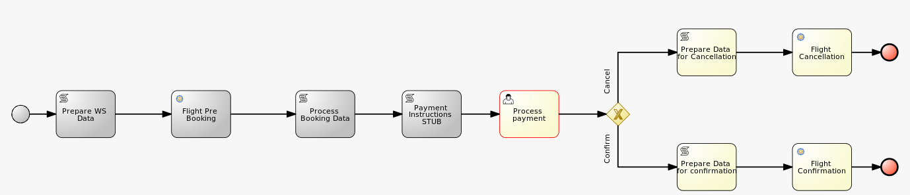

:scrollbar:
:data-uri:
:noaudio:

== BPMS Extensions in KIE Server

* BPM extension : Process, Task, & Asynch Jobs execution.
* BPM-UI: REST API for form definitions and process image.
+

ifdef::showscript[]

endif::showscript[]
