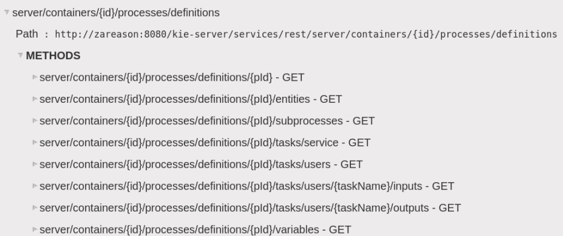

:scrollbar:
:data-uri:
:noaudio:

== REST API

.*Process Definitions*

ifdef::showscript[]

Transcript:

You can confirm that a BPM extension is enabled in the `kie-server/docs` endpoint. You can see that the process definition endpoints are available.

endif::showscript[]
