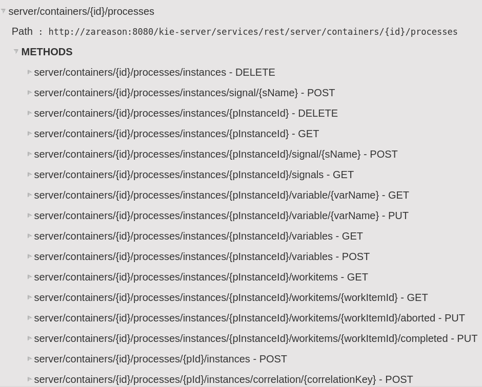

:scrollbar:
:data-uri:
:noaudio:

== REST API

.*Process Instances*

ifdef::showscript[]

Transcript:

Also, when enabling the BPM extension in the `kie-server/docs` endpoint, you can see that the process instance endpoints are available.

endif::showscript[]
