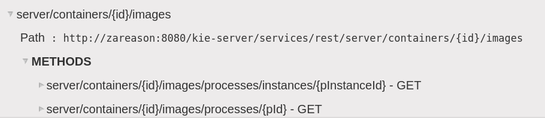

:scrollbar:
:data-uri:
:noaudio:

== REST API

.*Process Images*

{nbsp}

image:images/kie-server-lab-process-instance-svg.png[]

ifdef::showscript[]

Transcript:

You can also confirm that the BPM-UI extension is enabled because in the `kie-server/docs` endpoint you can see that the process image endpoints are available.

The process image endpoints provide access to the process definition or the image state of a process instance.

endif::showscript[]
