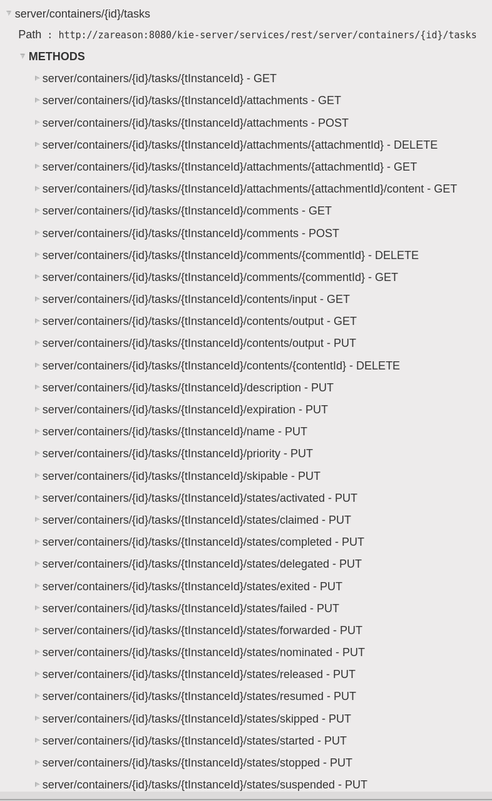

:scrollbar:
:data-uri:

== REST API

.*Tasks*

ifdef::showscript[]

Transcript:

When enabling the BPM extension in the `kie-server/docs` endpoint, you can see that the task endpoints are available.

endif::showscript[]
