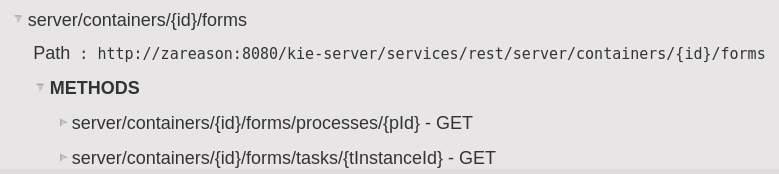
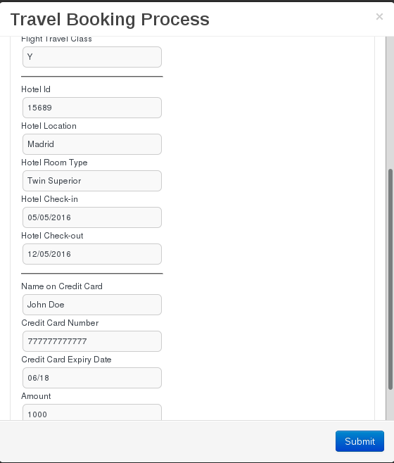

:scrollbar:
:data-uri:

== REST API

.*Forms*

{nbsp}

ifdef::showscript[]

Transcript:

Also, when enabling the BPM-UI extension in the `kie-server/docs` endpoint, you can see that the form endpoints are available.

The form endpoints allows developers to read a form configuration and build translation protocols for different UI technologies and display the form controls in their own ways.

endif::showscript[]
