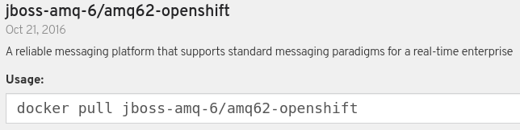

:scrollbar:
:data-uri:
:noaudio:

== OCP Process Server Messaging

OCP Process Server supported messaging brokers:

* Embedded _HornetQ_
** Templates: 
*** _processserver63-mysql-persistent-s2i_
*** _processserver63-postgresql-persistent-s2i_
** Hornetq Broker embedded in process server :
+
image::images/pserver_in_registry.png[]

* JBoss AMQ
** Templates:
*** _processserver63-amq-mysql-persistent-s2i_
*** _processserver63-amq-postgresql-persistent-s2i_
** Support AMQ image:
+

ifdef::showscript[]

endif::showscript[]
