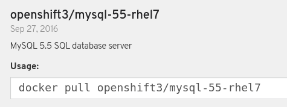
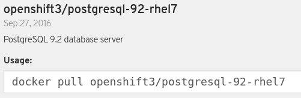

:scrollbar:
:data-uri:
:noaudio:

== OCP Process Server RDBMSs

OCP Process Server supported RDBMSs:

* MariaDB
** Templates: 
*** _processserver63-mysql-persistent-s2i_
*** _processserver63-amq-mysql-persistent-s2i_
** Supported MySQL image:
+

* PostgreSQL
** Templates:
*** _processserver63-postgresql-persistent-s2i_
*** _processserver63-amq-postgresql-persistent-s2i_
** Support PostgreSQL image:
+

ifdef::showscript[]

endif::showscript[]
